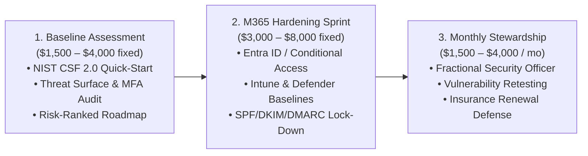
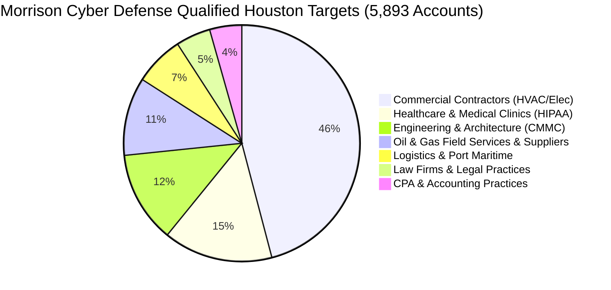

# Morrison Cyber Defense LLC (Houston, TX)
## Father-Son Managed Cybersecurity & Cloud Advisory Practice

```
  __  __                 _                  ____      _               ____        __                      
 |  \/  | ___  _ __ _ __(_)___  ___  _ __  / ___|   _| |__   ___ _ __|  _ \  ___ / _| ___ _ __  ___  ___  
 | |\/| |/ _ \| '__| '__| / __|/ _ \| '_ \| |  | | | | '_ \ / _ \ '__| | | |/ _ \ |_ / _ \ '_ \/ __|/ _ \ 
 | |  | | (_) | |  | |  | \__ \ (_) | | | | |__| |_| | |_) |  __/ |  | |_| |  __/  _|  __/ | | \__ \  __/ 
 |_|  |_|\___/|_|  |_|  |_|___/\___/|_| |_|\____\__, |_.__/ \___|_|  |____/ \___|_|  \___|_| |_|___/\___| 
                                                |___/                                                      
```

**Morrison Cyber Defense LLC** is a boutique cybersecurity consultancy headquartered in the Greater Houston Metropolitan Area. We specialize in providing enterprise-grade cybersecurity architecture, Microsoft 365 cloud defense, and practical regulatory/insurance readiness for Houston-area mid-market commercial contractors, energy suppliers, healthcare clinics, and professional firms.

---

## 👥 Leadership Team & Division of Labor

The firm operates under a strict, defensible two-tier organizational hierarchy that guarantees enterprise rigor while delivering high-touch responsiveness:

| Principal | Role & Focus | Background & Qualifications |
| :--- | :--- | :--- |
| **Senior Partner** | **Principal Cybersecurity Architect & Managing Partner** | 20+ years enterprise architecture, cloud security, Entra ID, ICS/OT operational resilience, executive risk briefings, and final engagement sign-off. |
| **Keenan Morrison** | **Associate Cybersecurity Analyst & Junior Partner** | CompTIA A+, Network+, Security+ certified; B.S. in Cybersecurity student (Class of 2027); SkillsUSA Cybersecurity Finalist; TryHackMe Top-Ranked Labs. Specializes in asset discovery, baseline checks, configuration audits, and evidence collection under senior supervision. |

---

## 📁 Repository Directory Structure

All strategic, operational, sales, and technical assets are organized into standardized functional directories:

```
MorrisonCyberDefense/
├── README.md                                           # Master Firm Index & Executive Dashboard
├── business-plan/
│   ├── purdue_family_cybersecurity_business_plan.md    # 3-Year Strategic Business Plan (Purdue Framework)
│   └── peer_founder_audit_and_gap_analysis.md          # Peer Founder Audit & Strategic Gap Analysis ($5M ARR Managing Partner)
├── sales-and-gtm/
│   └── houston_mssp_sales_playbook.md                  # Sales Battlecard, Outreach Scripts & Packaging
├── market-intelligence/
│   ├── leads/                                          # 5,893 Pre-Sliced High-Consequence Houston Leads
│   │   ├── commercial_contractors.csv                  # 2,705 Accounts (BEC & Insurance Questionnaire Panic)
│   │   ├── healthcare_hipaa.csv                        # 882 Accounts (Mandatory HIPAA Technical Safeguards)
│   │   ├── engineering_cmmc.csv                        # 736 Accounts (CMMC 2.0 & Municipal Contractor Audits)
│   │   ├── oil_gas_energy.csv                          # 631 Accounts (Supermajor Vendor Security Reviews)
│   │   ├── logistics_maritime.csv                      # 400 Accounts (Port of Houston Supply Chain Defense)
│   │   ├── law_firms_legal.csv                         # 280 Accounts (Escrow Wire Fraud & Bar Ethics)
│   │   └── cpa_accounting.csv                          # 259 Accounts (FTC Safeguards Rule Enforcement)
│   └── scraper/                                        # Enterprise Houston Business Intelligence Engine
│       ├── houston_businesses.db                       # 96,334 Active Commercial Businesses (FTS5 SQLite)
│       ├── houston_biz/                                # Python Scraper CLI & Exporter Package
│       ├── run.sh                                      # Automated Pipeline Runner
│       └── README.md                                   # Scraper Technical Documentation
└── deliverables-and-templates/
    ├── rules_of_engagement_and_testing_authorization_template.md # Legal Testing Authorization & CFAA Protection
    ├── nist_csf_baseline_assessment_template.md        # Package 1 Client Deliverable Template
    └── m365_hardening_sprint_checklist.md              # Package 2 Flagship M365 Hardening Checklist
```

---

## 💼 Core Service Portfolio & Pricing

We deliberately lead with high-confidence, non-disruptive, repeatable service packages where our combined credentials shine:



### 🚫 Explicit Scope Boundaries (What We Do NOT Sell Yet)
To protect firm liability and maintain client trust:
* ❌ **No 24/7 Managed SOC / MDR Claims** (avoids liability for missed 3:00 AM alerts; we configure native Defender alerting).
* ❌ **No Independent Penetration Testing by Keenan** (hands-on labs do not replace supervised production testing).
* ❌ **No Guaranteed Compliance Certifications** (we deliver readiness and remediation, not formal CPA/C3PAO audit stamps).
* ❌ **No Absolute Statements** (we never claim "we will make you 100% unhackable").

---

## 🎯 Houston Beachhead Market Intelligence

Our proprietary market intelligence engine has cataloged **96,334 active commercial businesses** in Houston, pre-filtered into **5,893 high-consequence target accounts**:



### Quick Access to Lead Lists:
1. [`commercial_contractors.csv`](file:///home/keenan/Projects/MorrisonCyberDefense/market-intelligence/leads/commercial_contractors.csv) — 2,705 Accounts
2. [`healthcare_hipaa.csv`](file:///home/keenan/Projects/MorrisonCyberDefense/market-intelligence/leads/healthcare_hipaa.csv) — 882 Accounts
3. [`engineering_cmmc.csv`](file:///home/keenan/Projects/MorrisonCyberDefense/market-intelligence/leads/engineering_cmmc.csv) — 736 Accounts
4. [`oil_gas_energy.csv`](file:///home/keenan/Projects/MorrisonCyberDefense/market-intelligence/leads/oil_gas_energy.csv) — 631 Accounts
5. [`logistics_maritime.csv`](file:///home/keenan/Projects/MorrisonCyberDefense/market-intelligence/leads/logistics_maritime.csv) — 400 Accounts
6. [`law_firms_legal.csv`](file:///home/keenan/Projects/MorrisonCyberDefense/market-intelligence/leads/law_firms_legal.csv) — 280 Accounts
7. [`cpa_accounting.csv`](file:///home/keenan/Projects/MorrisonCyberDefense/market-intelligence/leads/cpa_accounting.csv) — 259 Accounts

---

## 🛠️ Quick Command Reference

To search the Houston business database directly:

```bash
cd /home/keenan/Projects/MorrisonCyberDefense/market-intelligence/scraper

# Search businesses by keyword (e.g. electrical contractors)
./run.sh search "electrical" --limit 10

# Search businesses in a specific ZIP code (e.g. 77041 Northwest Houston)
./run.sh search "roofing" --zip 77041

# View database summary statistics
./run.sh stats
```

---

## 🚀 Immediate Launch Checklist for Keenan & Dad

1. [ ] **Legal Formation:** Finalize Texas LLC filing for **Morrison Cyber Defense LLC** via Texas SOSDirect.
2. [ ] **Insurance:** Bind $1M / $2M Technology Errors & Omissions (E&O) and Cyber Liability policy.
3. [ ] **Banking:** Open commercial checking account with Houston-area regional bank.
4. [ ] **Select Beachhead:** Target **Commercial Contractors** (`2,705` leads) or **Medical Clinics** (`882` leads).
5. [ ] **Outreach:** Deploy the Cold Email / Coffee Drop scripts in the [Sales Playbook](file:///home/keenan/Projects/MorrisonCyberDefense/sales-and-gtm/houston_mssp_sales_playbook.md).
6. [ ] **Execution:** Use the [Rules of Engagement](file:///home/keenan/Projects/MorrisonCyberDefense/deliverables-and-templates/rules_of_engagement_and_testing_authorization_template.md) and [NIST Baseline Template](file:///home/keenan/Projects/MorrisonCyberDefense/deliverables-and-templates/nist_csf_baseline_assessment_template.md) for initial client engagements.
