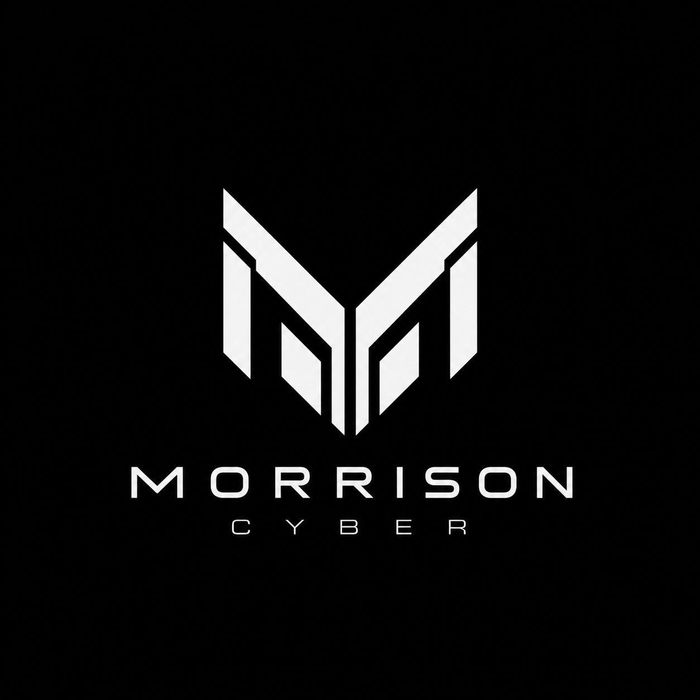
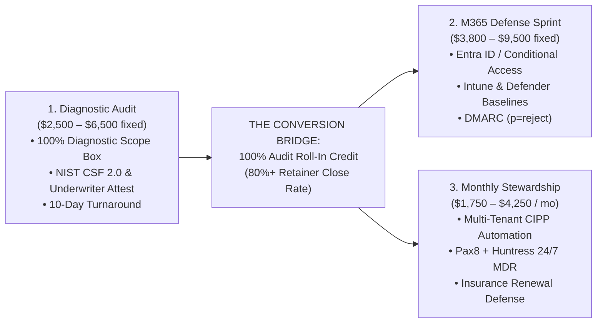
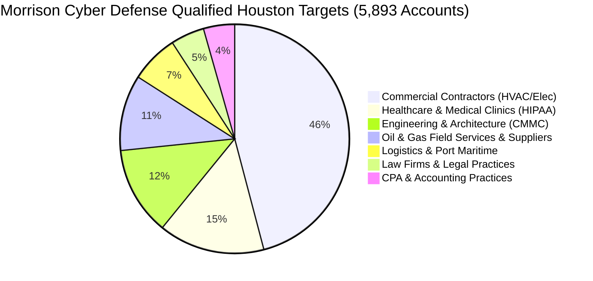

# Morrison Cyber Defense LLC (Houston, TX)
## Father-Son Managed Cybersecurity & Cloud Advisory Practice

<p align="center">
  
</p>

```
  __  __                 _                  ____      _               ____        __                      
 |  \/  | ___  _ __ _ __(_)___  ___  _ __  / ___|   _| |__   ___ _ __|  _ \  ___ / _| ___ _ __  ___  ___  
 | |\/| |/ _ \| '__| '__| / __|/ _ \| '_ \| |  | | | | '_ \ / _ \ '__| | | |/ _ \ |_ / _ \ '_ \/ __|/ _ \ 
 | |  | | (_) | |  | |  | \__ \ (_) | | | | |__| |_| | |_) |  __/ |  | |_| |  __/  _|  __/ | | \__ \  __/ 
 |_|  |_|\___/|_|  |_|  |_|___/\___/|_| |_|\____\__, |_.__/ \___|_|  |____/ \___|_|  \___|_| |_|___/\___| 
                                                |___/                                                      
```

**Morrison Cyber Defense LLC** is a boutique cybersecurity consultancy headquartered in the Greater Houston Metropolitan Area. We specialize in providing enterprise-grade cybersecurity architecture, Microsoft 365 cloud defense, and practical regulatory/insurance readiness for Houston-area mid-market commercial contractors, energy suppliers, healthcare clinics, and professional firms.

* **Domain & Web Presence:** [`https://morrisoncyber.org`](https://morrisoncyber.org)  
* **Central Client Communications:** `security@morrisoncyber.org`  
* **Headquarters:** Greater Houston Metropolitan Area, Texas  

---

## 👥 Leadership Team & Co-Founders

The firm was founded by a father-and-son leadership team combining enterprise architectural authority with high-speed certified technical execution:

| Principal | Role & Focus | Background & Qualifications |
| :--- | :--- | :--- |
| **Senior Partner** | **Co-Founder & Principal Cybersecurity Architect** | 20+ years enterprise architecture, cloud security, Entra ID, ICS/OT operational resilience, executive risk briefings, and final engagement sign-off. |
| **Keenan Morrison** | **Co-Founder & Lead Technical Systems Auditor** | Born October 29, 2007 (18 yrs old, turning 19); B.S. in Cybersecurity student at Western Governors University (WGU); CompTIA Security+, Network+, A+ certified; SkillsUSA Finalist; TryHackMe Top-Ranked. Leads tenant discovery, automated baseline audits, evidence harvesting, and remediation validation. |

---

## 📁 Modular Repository Directory Structure

All strategic, operational, sales, and technical assets are organized into bite-sized, categorized modules with standalone tables of contents:

```
MorrisonCyberDefense/
├── README.md                                           # Master Firm Index & Executive Dashboard
├── business-plan/                                      # Modular 3-Year Strategic Business Plan
│   ├── README.md                                       # Business Plan Table of Contents & Overview
│   ├── 01_executive_summary.md                         # Executive Summary, Bios & WGU Advantage
│   ├── 02_vision_mission_goals.md                      # Vision, Mission & 3-Year MRR Growth Milestones
│   ├── 03_governance_and_wgu_operations.md             # Co-Founder Roles, WGU Flexibility & 5 Contract Clauses
│   ├── 04_services_and_pricing_architecture.md         # Value-Banded Tiers ($2.5k–$9.5k) & 100% Roll-In Credit
│   ├── 05_houston_market_assessment.md                 # 5,893 Target Accounts across 7 Houston Verticals
│   ├── 06_operations_and_tooling_strategy.md           # Pax8, Huntress 24/7 MDR, CIPP.app & Referral Triad
│   ├── 07_financial_projections_and_pnl.md             # 3-Year Pro-Forma P&L ($130k -> $322.5k -> $555k)
│   └── audit/                                          # Peer Founder Audit ($5M ARR Managing Partner)
│       ├── README.md                                   # Audit Executive Memo, Scorecard & Chapter Index
│       ├── 01_legal_and_scope_gap_analysis.md          # 24/7 SOC Contradiction & Scope Box Rules
│       ├── 02_pricing_and_roll_in_credit.md            # Value Tiers & 100% Retainer Credit Script
│       ├── 03_golden_referral_triad.md                 # Insurance Brokers, MSPs & Bank Loan Officers
│       ├── 04_wgu_student_founder_advantage.md         # Why WGU is an Unfair Advantage for Co-Founders
│       ├── 05_multi_tenant_tooling_stack.md            # Pax8, Huntress (~$5/user), CIPP.app & Lighthouse
│       ├── 06_contractual_liability_shields.md         # The 5 Mandatory Contract Protective Clauses
│       └── 07_90_day_tactical_roadmap.md               # 90-Day Tactical Roadmap & Scorecard
├── sales-and-gtm/                                      # Modular Houston Sales & Outreach Playbook
│   ├── README.md                                       # Sales Playbook Table of Contents & Protocol
│   ├── 01_target_verticals_and_leads.md                # 7 Houston Verticals & 5,893 Accounts
│   ├── 02_cold_outreach_scripts.md                     # High-Conversion Email Scripts & Signatures
│   ├── 03_packaging_and_roll_in_credit.md              # 3-Tier Retainer Packaging & Closing Script
│   └── 04_referral_triad_battlecards.md                # Insurance Broker & MSP Co-Marketing Battlecards
├── deliverables-and-templates/                         # Client-Facing Execution & Legal Templates
│   ├── README.md                                       # Template Index & Usage Instructions
│   ├── rules_of_engagement_and_testing_authorization_template.md # CFAA & Texas Penal Code Authorization
│   ├── nist_csf_baseline_assessment_template.md        # Package 1 Client Deliverable Template
│   └── m365_hardening_sprint_checklist.md              # Package 2 Flagship M365 Hardening Checklist
├── infrastructure/                                     # Technical Operations & DNS Security
│   ├── README.md                                       # Infrastructure Index
│   └── domain_and_dns_hardening_guide.md               # morrisoncyber.org DNS, SPF, DKIM, DMARC & M365
└── market-intelligence/
    ├── leads/                                          # 5,893 Pre-Sliced Houston CSV Accounts
    └── scraper/                                        # 96,334 Commercial Houston Database & Search CLI
```

---

## 💼 Core Service Portfolio & Pricing

We deliberately lead with high-confidence, non-disruptive, repeatable service packages with a built-in conversion bridge:



### 🛡️ Operational Guardrails & MDR Architecture
To protect firm liability and ensure sustainable operations:
* 🛡️ **24/7 Threat Isolation Backstop:** Layered 24/7 MDR provided by sublicensing **Huntress Labs Managed EDR + ITDR via Pax8** (human SOC isolates threats at 3:00 AM; zero founder midnight burnout).
* ❌ **No In-House Nocturnal SOC Claims:** We do not operate midnight shifts internally.
* ❌ **No Independent Penetration Testing by Keenan:** Academic labs do not replace supervised production testing.
* ❌ **No Guaranteed Compliance Certifications:** We deliver technical readiness and remediation, not formal CPA/C3PAO audit stamps.
* ❌ **No Absolute Statements:** We never claim "we will make you 100% unhackable."

---

## 🎯 Houston Beachhead Market Intelligence

Our proprietary market intelligence engine has cataloged **96,334 active commercial businesses** in Houston, pre-filtered into **5,893 high-consequence target accounts**:



### Quick Access to Lead Lists:
1. [`commercial_contractors.csv`](file:///home/keenan/Projects/MorrisonCyberDefense/market-intelligence/leads/commercial_contractors.csv) — 2,705 Accounts
2. [`healthcare_hipaa.csv`](file:///home/keenan/Projects/MorrisonCyberDefense/market-intelligence/leads/healthcare_hipaa.csv) — 882 Accounts
3. [`engineering_cmmc.csv`](file:///home/keenan/Projects/MorrisonCyberDefense/market-intelligence/leads/engineering_cmmc.csv) — 736 Accounts
4. [`oil_gas_energy.csv`](file:///home/keenan/Projects/MorrisonCyberDefense/market-intelligence/leads/oil_gas_energy.csv) — 631 Accounts
5. [`logistics_maritime.csv`](file:///home/keenan/Projects/MorrisonCyberDefense/market-intelligence/leads/logistics_maritime.csv) — 400 Accounts
6. [`law_firms_legal.csv`](file:///home/keenan/Projects/MorrisonCyberDefense/market-intelligence/leads/law_firms_legal.csv) — 280 Accounts
7. [`cpa_accounting.csv`](file:///home/keenan/Projects/MorrisonCyberDefense/market-intelligence/leads/cpa_accounting.csv) — 259 Accounts

---

## 🛠️ Quick Command Reference

To search the Houston business database directly:

```bash
cd /home/keenan/Projects/MorrisonCyberDefense/market-intelligence/scraper

# Search businesses by keyword (e.g. electrical contractors)
./run.sh search "electrical" --limit 10

# Search businesses in a specific ZIP code (e.g. 77041 Northwest Houston)
./run.sh search "roofing" --zip 77041

# View database summary statistics
./run.sh stats
```

---

## 🚀 Immediate Launch Checklist for Keenan & Dad

1. [ ] **Legal Formation:** Finalize Texas LLC filing for **Morrison Cyber Defense LLC** via Texas SOSDirect.
2. [ ] **Insurance:** Bind $1M / $2M Technology Errors & Omissions (E&O) and Cyber Liability policy.
3. [ ] **Banking:** Open commercial checking account with Houston-area regional bank.
4. [ ] **Select Beachhead:** Target **Commercial Contractors** (`2,705` leads) or **Medical Clinics** (`882` leads).
5. [ ] **Outreach:** Deploy the Cold Email / Referral scripts in the [Sales Playbook](file:///home/keenan/Projects/MorrisonCyberDefense/sales-and-gtm/README.md).
6. [ ] **Execution:** Use the [Rules of Engagement](file:///home/keenan/Projects/MorrisonCyberDefense/deliverables-and-templates/rules_of_engagement_and_testing_authorization_template.md) and [NIST Baseline Template](file:///home/keenan/Projects/MorrisonCyberDefense/deliverables-and-templates/nist_csf_baseline_assessment_template.md) for initial client engagements.

## Company operating harness

Use the [operating harness](harness/README.md) for project tracking, repeatable company procedures, and reusable engagement templates. Start with `python3 harness/mcd.py init`, then view work with `python3 harness/mcd.py dashboard`.

## Sales launch readiness

Start with the [launch-readiness kit](launch-readiness/README.md) for the repository gap assessment, first-offer draft, calling scripts, proposal outline, and staged checklist. Older sales scripts and outcome claims require review before use.
