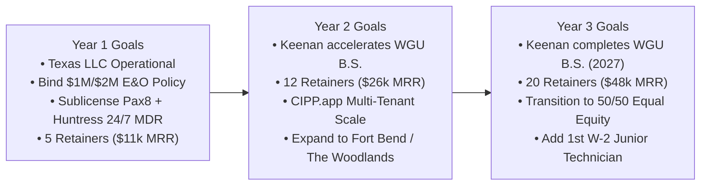

# 2. Vision, Mission Statement, and Goals
## Morrison Cyber Defense LLC: Strategic Business Plan

[← Previous: Executive Summary](01_executive_summary.md) | [Back to Index](README.md) | [Next: Governance & Operations →](03_governance_and_wgu_operations.md)

---

### A. Vision Statement
To become the premier trusted family-owned cybersecurity advisory firm for Houston’s commercial trades, engineering contractors, and essential mid-market businesses—safeguarding regional economic engines through honest, non-inflated, and technically rigorous defenses.

---

### B. Strategic Goals & Growth Milestones

#### Financial Performance Metrics
* **Cash-Flow Breakeven:** Month 2 of operations.
* **Gross Profit Margin Target:** Maintain $>85\%$ margins across advisory services.
* **Monthly Recurring Revenue (MRR):**
  * Month 12 Target: **$11,000 / month** ($132k annualized MRR run rate).
  * Month 24 Target: **$26,000 / month** ($312k annualized MRR run rate).
  * Month 36 Target: **$48,000 / month** ($576k annualized MRR run rate).

#### Professional & Academic Milestones
* **WGU Degree Acceleration:** Leverage self-paced terms at Western Governors University to accelerate course completions through real-world client project artifacts.
* **Target Certifications Prior to Graduation:**
  * CompTIA CySA+ (Cybersecurity Analyst)
  * CompTIA PenTest+
  * Microsoft Certified: Cybersecurity Architect Expert (SC-100)

---

### C. The 3 Core Keys to Success
1. **The Co-Founder Authority & Technical Prodigy Framing:** Never pitch as "two peers" or an "intern helping dad." Pitch as a **Senior Enterprise Architect backed by an elite Co-Founder & Lead Systems Auditor (CompTIA Security+, Network+, A+)**. Clients respect the rare combination of 20+ years of governance and high-speed hands-on technical execution.
2. **Channel-Backed 24/7 Threat Isolation:** Eliminate midnight operational liability by sublicensing **Huntress Labs Managed EDR + ITDR via Pax8**. Clients get legitimate 24/7 human SOC isolation while Morrison focuses on architecture and relationship stewardship.
3. **The 100% Assessment-to-Retainer Roll-In Credit:** Bridge the gap between one-off audits and recurring retainers. Offering to credit 100% of diagnostic fees into an annual agreement converts 80%+ of project clients into long-term MRR.

---
[← Previous: Executive Summary](01_executive_summary.md) | [Back to Index](README.md) | [Next: Governance & Operations →](03_governance_and_wgu_operations.md)
