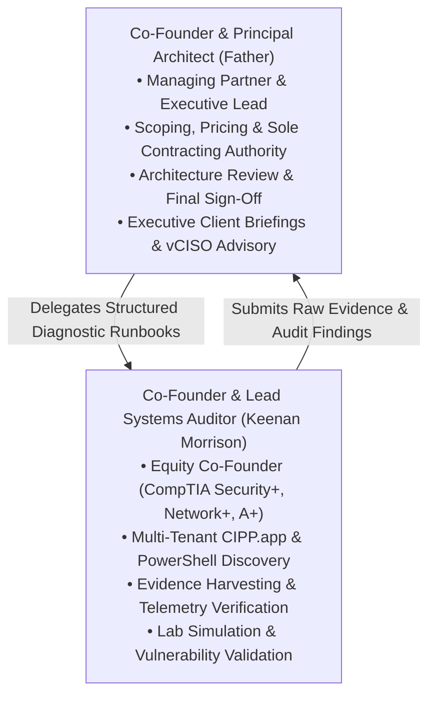

# 3. Governance, Co-Founder Division of Labor & WGU Operations
## Morrison Cyber Defense LLC: Strategic Business Plan

[← Previous: Vision & Goals](02_vision_mission_goals.md) | [Back to Index](README.md) | [Next: Services & Pricing →](04_services_and_pricing_architecture.md)

---

### A. Co-Founder Division of Labor



#### Lines of Authority & Governance
* **Managing Partner & President:** Senior Partner (Co-Founder) holds sole contracting authority, legal engagement sign-off, and client billing administration.
* **Lead Technical Systems Auditor & Co-Founder:** Keenan Morrison executes technical discovery, evidence collection, and remediation tasks within predefined, pre-authorized Standard Operating Procedures (SOPs).
* **Quality Assurance Gate:** No report, finding, risk rating, or remediation recommendation is ever delivered to a client without line-by-line review and digital signature from the Principal Architect.

---

### B. The WGU Competency Model: An Unfair Founder Advantage

Keenan is enrolled in the accelerated Bachelor of Science in Cybersecurity & Information Assurance program at **Western Governors University (WGU)**. Unlike traditional brick-and-mortar universities:

1. **No Fixed Lecture Conflicts:** WGU has zero mandatory physical class times or fixed 8:00 AM lecture halls. Coursework is asynchronous and self-paced.
2. **Daytime Client Availability:** Keenan is available during standard Houston business hours (`8:00 AM – 5:00 PM CT`) to take client intake calls, run discovery scripts, and meet with IT teams.
3. **Curriculum-to-Client Synergy:** WGU courses map directly to industry certifications and objective assessments. Real-world client audits, PowerShell scripting, and Microsoft 365 hardening directly reinforce degree competencies, allowing rapid term acceleration.
4. **Communication Firewall:** Clients communicate strictly through `security@morrisoncyber.org` and a shared virtual business line (OpenPhone / Teams Voice). Personal student emails and phone numbers are never shared with clients.

---

### C. Ownership Structure & Working Capital Architecture

* **Legal Form:** Texas Member-Managed Limited Liability Company (LLC) co-founded by Senior Partner and Keenan Morrison.
* **Equity Distribution & Co-Founder Agreement:** 
  * Co-Founder & Principal Architect: **70% ownership**
  * Co-Founder & Lead Systems Auditor: **30% ownership** (with a documented contract path to 50/50 equal equity partnership upon WGU graduation in 2027 and attainment of CISSP/equivalent).
* **Working Capital & Payment Terms (Zero Net-30):**
  * **Diagnostic & Sprint Projects:** 50% deposit upon contract execution; 50% balance due upon deliverable presentation (reports released upon confirmed settlement).
  * **Monthly Retainers:** 100% automated credit card or ACH debit processed on the **1st of each calendar month** in advance via Stripe / QuickBooks Payments.

---

### D. Legal Fortress: The 5 Non-Negotiable Contract Clauses

1. **Limitation of Liability (LoL):** Aggregate damages strictly capped at total fees paid under the specific SOW during the preceding three (3) months; explicit exclusion of consequential, punitive, or extortion damages.
2. **Third-Party Platform Disclaimer:** Complete immunity from Microsoft 365 cloud outages, zero-day platform bugs, and third-party software vendor patch failures.
3. **No Warranty of Infiltration Immunity:** Explicit acknowledgment that cybersecurity constitutes continuous risk mitigation, never an absolute guarantee against breach or ransomware.
4. **Pre-Existing Breach Clause:** Immediate operational halt upon uncovering active network intrusions, with transition to emergency triage rates ($250.00/hour) under a separate addendum.
5. **Client Data & Backup Warranty:** Client legally warrants that independent, restorable, and disconnected backups exist prior to any configuration change.

---

### E. Internal SWOT Analysis

```
STRENGTHS                                      WEAKNESSES
---------------------------------------------  ---------------------------------------------
• Enterprise architectural expertise (Father) • Small core team (2 co-founders).
• Certified execution speed & agility (Keenan) • Emerging local brand awareness in Year 1.
• WGU flexibility (no rigid lecture conflicts)• Solved: 24/7 SOC risk bridged via Huntress MDR.
• High gross margins (>85%) via lean tooling.  • Solved: Cash flow secured via 1st-of-month ACH.

OPPORTUNITIES                                  THREATS
---------------------------------------------  ---------------------------------------------
• Cyber insurance renewal panic across trades. • Local MSPs adding rudimentary security bolt-ons.
• The Golden Referral Triad (Brokers/Banks/MSPs)• Economic downturns stalling discretionary spend.
• Mandates: FTC Safeguards, HIPAA, CISA CPGs.  • Client liability risk if a breach occurs post-audit.
• Houston Port & Energy Supply Chain demands.  • Rapidly evolving attacker tooling and ransomware.
```

---
[← Previous: Vision & Goals](02_vision_mission_goals.md) | [Back to Index](README.md) | [Next: Services & Pricing →](04_services_and_pricing_architecture.md)
