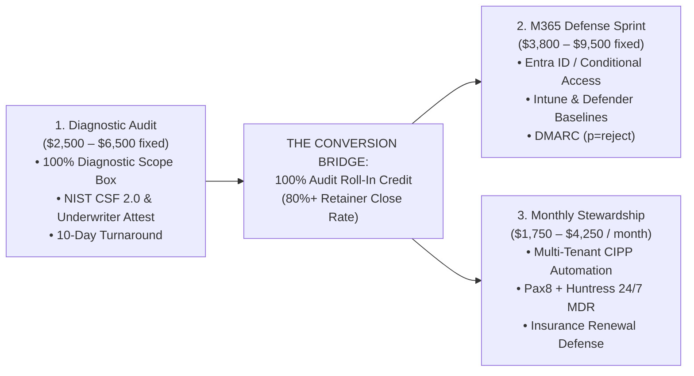

# 4. Products, Services & Pricing Architecture
## Morrison Cyber Defense LLC: Strategic Business Plan

[← Previous: Governance & Operations](03_governance_and_wgu_operations.md) | [Back to Index](README.md) | [Next: Houston Market Assessment →](05_houston_market_assessment.md)

---

### A. Service Portfolio Overview



---

### B. Core Service Packages

#### Package 1: Small-Business Cybersecurity Posture & Risk Audit (Diagnostic Wedge)
* **Target:** 10–150 employee businesses with general IT support but zero security architecture leadership.
* **Value-Banded Pricing:**
  * **Tier 1 (1–25 Users / 1 Tenant):** **$2,500 Flat**
  * **Tier 2 (26–75 Users / 1 Tenant):** **$4,500 Flat**
  * **Tier 3 (76–150 Users / Multi-Site):** **$6,500 Flat**
* **The "Scope Box" Rules (Schedule A):**
  * Strict diagnostic boundary: Exactly 1 M365 tenant, up to 2 domain perimeters, and 5 representative sampled endpoints.
  * **Zero Active Remediation:** Audit covers observation and logging only. Eliminates unpaid IT helpdesk firefighting.
* **Deliverables:** 1-Page Executive Risk Matrix, Technical Remediation Backlog, and Cyber Insurance Underwriter Attestation.
* **Turnaround:** 10 Business Days.

---

### C. The Conversion Masterstroke: 100% Roll-In Credit

To prevent clients from taking the diagnostic audit and walking away, every executive presentation concludes with the **Roll-In Credit Offer**:

> *"Bob, our assessment revealed four critical findings that invalidate your cyber insurance and leave your bank accounts exposed to wire redirection. To fix these properly, you have two options.*  
> 
> *Option 1 is to take this 35-page report and give it to your current IT provider. You have already paid our $2,500 diagnostic fee, and this roadmap belongs to you.*  
> 
> *Option 2 is to have Morrison Cyber Defense handle the complete remediation sprint and oversee your security posture on an ongoing basis. Because we believe in long-term stewardship, **if you authorize our 12-month Security Stewardship agreement within the next 14 calendar days, we will credit 100% of your $2,500 assessment fee directly toward your onboarding and first month's retainer.** That means your assessment was completely free."*

**Why this converts like clockwork:**
1. The client feels foolish walking away from a $2,500–$4,500 credit.
2. It completely neutralizes the fear that they just bought an expensive report that will sit on a shelf.
3. It anchors Morrison Cyber Defense as their permanent security partner from Day 30 onward, yielding an **80%+ close rate**.

---

### D. Implementation Sprints & Recurring Retainers

#### Package 2: Microsoft 365 Cloud Defense Sprint (Flagship Remediation)
* **Target:** Organizations using Microsoft 365 with default, insecure settings.
* **Value-Banded Pricing:**
  * **Tier 1 (1–25 Users):** **$3,800 Flat**
  * **Tier 2 (26–75 Users):** **$6,500 Flat**
  * **Tier 3 (76–150 Users):** **$9,500 Flat**
* **Deliverables:**
  * Administrative account cleanup and dual cloud-only break-glass emergency accounts.
  * Conditional Access enforcement (phishing-resistant MFA, geo-blocking, legacy auth blocking) tested 48 hours in Report-Only mode.
  * Intune device compliance (BitLocker, minimum OS build, Defender Tamper Protection).
  * Email defense: SPF, DKIM, DMARC (`p=quarantine` or `p=reject`), and executive anti-impersonation rules.
  * Before-and-after Microsoft Secure Score validation report.
* **Turnaround:** 2-Week Intensive Sprint.

#### Package 3: Monthly Security Stewardship & vCISO Retainer (Recurring MRR)
* **Target:** Mid-market companies requiring continuous compliance, insurance defense, and vendor risk validation.
* **Value-Banded Retainers (12-Month Agreement):**
  * **Core Defense (Up to 35 Users):** **$1,750 / month**
  * **Advanced Defense (36–75 Users):** **$2,750 / month**
  * **Enterprise Mid-Market (76–150 Users):** **$4,250 / month**
* **Deliverables:**
  * Multi-tenant configuration drift monitoring via **CIPP.app** (daily alerts on rogue rules or permission escalations).
  * Layered 24/7 Managed Detection & Response (MDR) powered by **Huntress Labs via Pax8**.
  * Quarterly Executive Risk Briefing with the Senior Partner.
  * Annual Incident Response Tabletop Simulation.
  * Vendor security questionnaire completion (up to 3/month) and cyber insurance renewal defense.

#### Package 4: OT/ICS Industrial Architecture Advisory (Premium/Scoped)
* **Target:** Houston chemical packaging, machine shops, oilfield fabrication, and logistics facilities.
* **Deliverables:** Purdue Model Level 1–3 network segmentation review, remote maintenance VPN audits, and physical setpoint integrity baselines.
* **Delivery:** 100% led by the Principal Architect; Lead Systems Auditor assists on network mapping.
* **Project Fee:** **$8,000 – $15,000**.

---

### E. Operational Boundaries & Channel-Backed MDR

```
+-----------------------------------------------------------------------------------+
|                         OPERATIONAL BOUNDARIES & GUARDRAILS                       |
+-----------------------------------------------------------------------------------+
| [✓] 24/7 MDR PROVIDED VIA HUNTRESS --> Human SOC isolates threats at 3:00 AM       |
|                                        (Sublicensed via Pax8; zero founder burn)  |
| [X] NO In-House Nocturnal SOC     --> We do not run midnight shifts in-house      |
| [X] NO Solo Penetration Testing   --> Academic labs do NOT equal production tests |
| [X] NO Malware Reverse Engineering--> Unprofitable, highly specialized            |
| [X] NO Compliance "Certifications"--> We provide readiness, not formal CPA audits |
| [X] NO Absolute Guarantees        --> Never promise "100% unhackable immunity"    |
+-----------------------------------------------------------------------------------+
```

---
[← Previous: Governance & Operations](03_governance_and_wgu_operations.md) | [Back to Index](README.md) | [Next: Houston Market Assessment →](05_houston_market_assessment.md)
