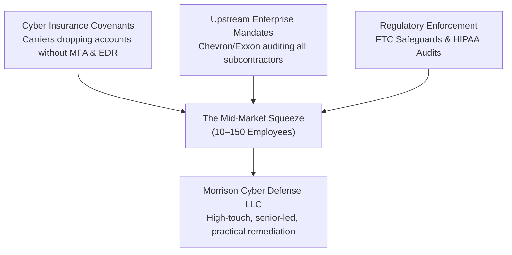
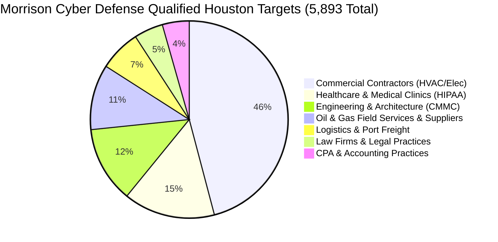

# 5. Houston Market Assessment & Beachhead Analysis
## Morrison Cyber Defense LLC: Strategic Business Plan

[← Previous: Services & Pricing](04_services_and_pricing_architecture.md) | [Back to Index](README.md) | [Next: Operations & Tooling →](06_operations_and_tooling_strategy.md)

---

### A. Houston Macro Environment & Market Drivers

Houston represents an exceptionally dense, high-consequence market. Unlike Silicon Valley or New York, Houston's economy is powered by physical execution: energy, logistics, industrial manufacturing, healthcare, and engineering construction.

---

### B. The 7 Houston MSSP Target Verticals (5,893 Qualified Accounts)

Our proprietary market intelligence engine cataloged **96,334 active commercial businesses** in Houston, pre-sliced into **5,893 high-consequence accounts**:

| Vertical | Target Accounts | Lead Data File | Primary Pain & Urgency Hook | Typical Retainer |
| :--- | :---: | :--- | :--- | :--- |
| **Commercial Contractors** | `2,705` | [`commercial_contractors.csv`](../market-intelligence/leads/commercial_contractors.csv) | Fake invoice wire fraud, cyber insurance questionnaire panic. | **$1,750 – $3,500/mo** |
| **Healthcare & Clinics** | `882` | [`healthcare_hipaa.csv`](../market-intelligence/leads/healthcare_hipaa.csv) | Mandatory HIPAA compliance, unencrypted backups, ransomware downtime. | **$2,000 – $4,500/mo** |
| **Engineering & CAD** | `736` | [`engineering_cmmc.csv`](../market-intelligence/leads/engineering_cmmc.csv) | CMMC 2.0 DoD requirements, municipal bid audits, proprietary CAD/IP theft. | **$2,500 – $6,000/mo** |
| **Oil & Gas Suppliers** | `631` | [`oil_gas_energy.csv`](../market-intelligence/leads/oil_gas_energy.csv) | Passing vendor security questionnaires from supermajors (Chevron, ExxonMobil). | **$3,000 – $7,500/mo** |
| **Logistics & Maritime** | `400` | [`logistics_maritime.csv`](../market-intelligence/leads/logistics_maritime.csv) | Port of Houston supply chain downtime, dispatch disruption, ransomware. | **$2,000 – $5,000/mo** |
| **Law Firms** | `280` | [`law_firms_legal.csv`](../market-intelligence/leads/law_firms_legal.csv) | Escrow wire fraud, client confidentiality, Texas State Bar ethics. | **$1,800 – $4,000/mo** |
| **CPA & Accounting** | `259` | [`cpa_accounting.csv`](../market-intelligence/leads/cpa_accounting.csv) | Strict FTC Safeguards Rule compliance (MFA, annual audit, monitoring). | **$1,750 – $3,000/mo** |

---

### C. Industry Analysis (Porter's Five Forces)

* **Threat of New Entrants (Low-Moderate):** General IT shops claim to do security, but lack deep architectural, Entra ID, and governance credentials. Enterprise cybersecurity firms (Mandiant, Optiv) ignore accounts billing under $100k/year.
* **Bargaining Power of Buyers (Moderate):** SMBs are cost-conscious, but become completely price-inelastic when facing an insurance non-renewal notice or an upstream vendor audit deadline.
* **Threat of Substitutes (Low):** Software-only scanners (e.g., CISA automated tools) provide raw data but zero implementation; business owners do not know how to fix the findings.
* **Competitive Rivalry (Low in Niche):** Few Houston firms blend cloud M365 hardening with OT/industrial physical awareness at SMB-friendly price points.

---
[← Previous: Services & Pricing](04_services_and_pricing_architecture.md) | [Back to Index](README.md) | [Next: Operations & Tooling →](06_operations_and_tooling_strategy.md)
