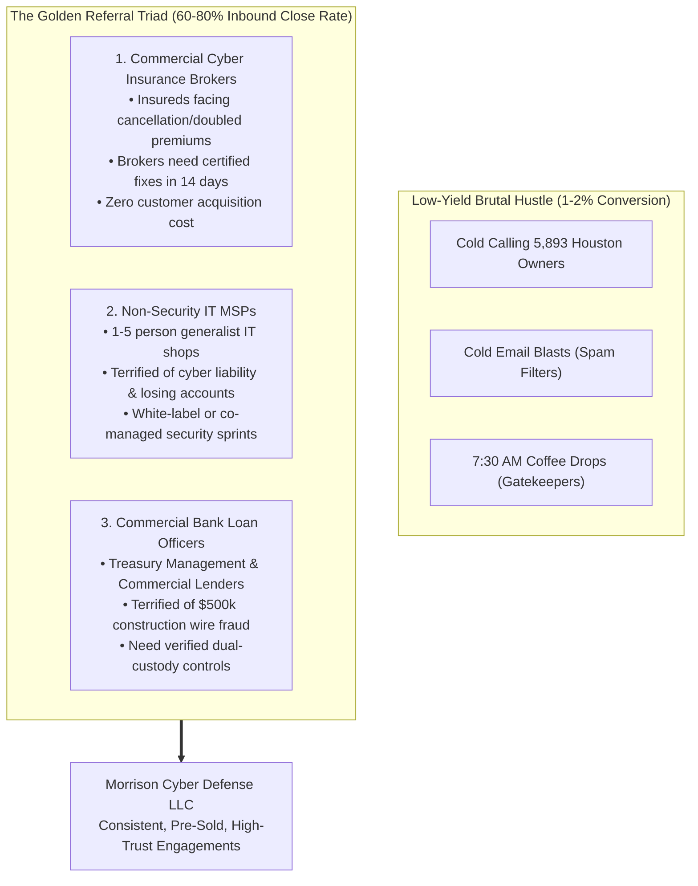

# Audit Chapter 3: The Golden Referral Triad
## Peer Founder Review ($5M ARR Managing Partner)

[← Previous: Pricing & Roll-In Credit](02_pricing_and_roll_in_credit.md) | [Back to Audit Index](README.md) | [Next: WGU Student Founder Advantage →](04_wgu_student_founder_advantage.md)

---

### 3.1 Why Cold Outbound Fails & Why Referrals Win

Commercial contractors, machine shops, and logistics executives in Houston receive 20+ cold calls and emails each week from outsourced IT shops. More importantly: **Cybersecurity requires radical trust.** An executive will not grant administrative access to their email system and accounting servers to someone who walked in with donuts.

Instead of hunting individual fish with a spear, build pipelines that feed you the school:

---

### 3.2 Channel Partner 1: Commercial Cyber Insurance Brokers
Houston brokerages (McGriff, Insurica, USI, Higginbotham) write commercial property, casualty, and cyber liability policies. Underwriters at Chubb, Travelers, Beazley, and Coalition are rejecting renewal applications or demanding 200%+ rate hikes unless the contractor enforces MFA, EDR, and immutable backups.
* **The Pitch:** *"When your insured receives a difficult 5-page cyber questionnaire or non-renewal notice, send them to us. We will conduct a 72-hour Insurance Readiness Sprint, deploy the exact technical controls required, and provide you with a certified attestation document so you can bind the policy on time."*

---

### 3.3 Channel Partner 2: Non-Security IT MSPs
Over 400 small IT providers (1 to 5 technicians) in the Houston area manage printers and helpdesk tickets. They are terrified of being sued when a client suffers ransomware.
* **The Pitch:** Deliver a bilateral **Non-Compete / Co-Managed Security Covenant**: *"We don't touch printers, helpdesks, or hardware resale. We are security architects. We partner with local IT providers to handle compliance, M365 hardening, and vulnerability testing. You keep 100% of your IT relationship; we provide the enterprise credentials that protect you both."*

---

### 3.4 Channel Partner 3: Regional Commercial Bankers
Commercial lenders at regional Texas banks (Amegy Bank, Frost Bank, Texas Capital) deal with wire redirection panics monthly on $500k construction and vendor draws.
* **The Value Offer:** Provide the bank's commercial borrowers with a complimentary **"15-Minute Wire Transfer & Email Security Review"** to ensure dual-custody protocols are enforced.

---
[← Previous: Pricing & Roll-In Credit](02_pricing_and_roll_in_credit.md) | [Back to Audit Index](README.md) | [Next: WGU Student Founder Advantage →](04_wgu_student_founder_advantage.md)
