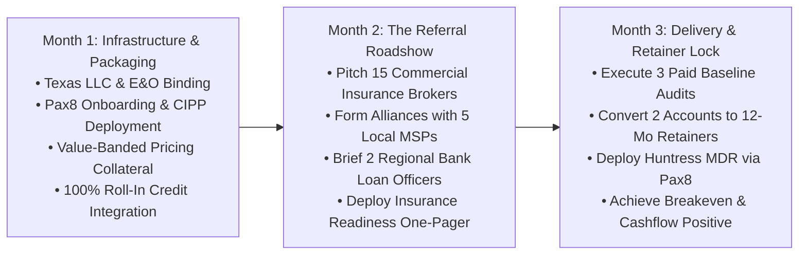

# Audit Chapter 7: 90-Day Tactical Roadmap & Scorecard
## Peer Founder Review ($5M ARR Managing Partner)

[← Previous: Contractual Shields](06_contractual_liability_shields.md) | [Back to Audit Index](README.md)

---

### A. 90-Day Tactical Execution Roadmap

#### Month 1: Foundation & Infrastructure
* [ ] **Legal Formation:** Finalize Texas LLC filing for **Morrison Cyber Defense LLC** via Texas SOSDirect.
* [ ] **Insurance:** Bind $1M / $2M Technology Errors & Omissions (E&O) and Cyber Liability policy.
* [ ] **Banking:** Open commercial checking account with Houston regional bank (Amegy or Frost).
* [ ] **Contract Fortification:** Incorporate the 5 Mandatory Legal Clauses into master SOWs.
* [ ] **Pax8 & CIPP:** Enroll in Pax8 Marketplace (zero seat minimums) and deploy CIPP.app.
* [ ] **DNS & Email:** Implement strict SPF, DKIM, and DMARC (`p=reject`) on `morrisoncyber.org`.

#### Month 2: Unlocking the Referral Triad
* [ ] **Insurance Broker Roadshow:** Meet with 15 commercial insurance agents across Harris County. Pitch the *"14-Day Cyber Insurance Triage Sprint"* to save distressed renewals.
* [ ] **MSP Co-Managed Outreach:** Deliver bilateral Non-Compete Covenants to 10 local Houston IT shops.
* [ ] **Bank Commercial Lenders:** Present the complimentary Wire Transfer & Dual-Custody Review.

#### Month 3: Execution & Retainer Conversion
* [ ] **Close First 3 Audits:** Deliver 3 Diagnostic Posture Audits at $2,500 each ($7,500 collected upfront).
* [ ] **Execute Roll-In Credit:** Present executive findings and offer the **100% Roll-In Credit** toward 12-month stewardship retainers. Target: Convert 2 of 3 clients into retainers ($3,500+ MRR).
* [ ] **Onboard to Huntress MDR:** Provision endpoint and identity threat isolation via Pax8.
* [ ] **Cash-Flow Review:** Verify $>85\%$ gross profit margins and fund 3-month operating reserve.

---

### B. Summary Audit Scorecard

| Dimension | Initial Score | Post-Audit Score | Key Strategic Upgrade |
| :--- | :---: | :---: | :--- |
| **Packaging & Pricing** | **6.5 / 10** | **9.5 / 10** | Seat-tiered pricing ($2.5k–$9.5k); 100% Roll-In Credit bridge. |
| **Legal & Risk Shields** | **5.0 / 10** | **9.8 / 10** | Resolved 24/7 SOC risk via Pax8/Huntress; added 5 contract clauses. |
| **Go-To-Market (GTM)** | **6.0 / 10** | **9.2 / 10** | Shifted from cold calling to The Golden Referral Triad. |
| **Operational Scalability** | **6.5 / 10** | **9.5 / 10** | Multi-tenant CIPP + Lighthouse enables 20 clients in 5 hrs/wk. |
| **Co-Founder Capacity** | **7.5 / 10** | **9.8 / 10** | WGU asynchronous flexibility + Keenan as official Co-Founder. |

---
[← Previous: Contractual Shields](06_contractual_liability_shields.md) | [Back to Audit Index](README.md)
