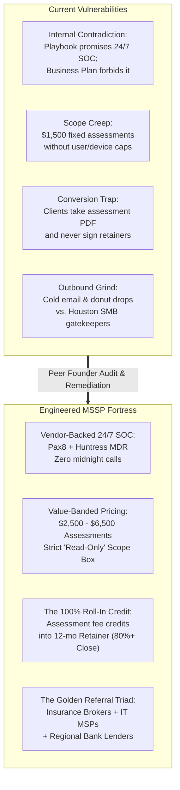
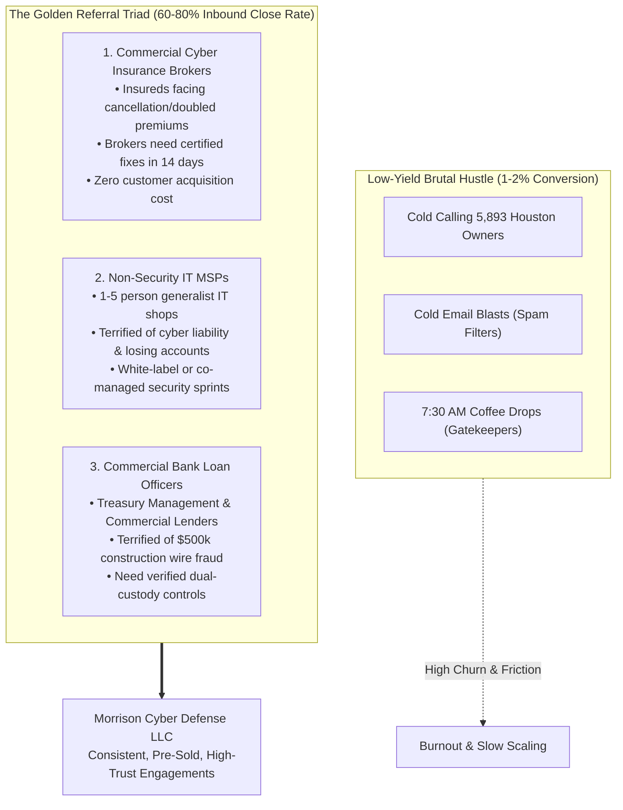
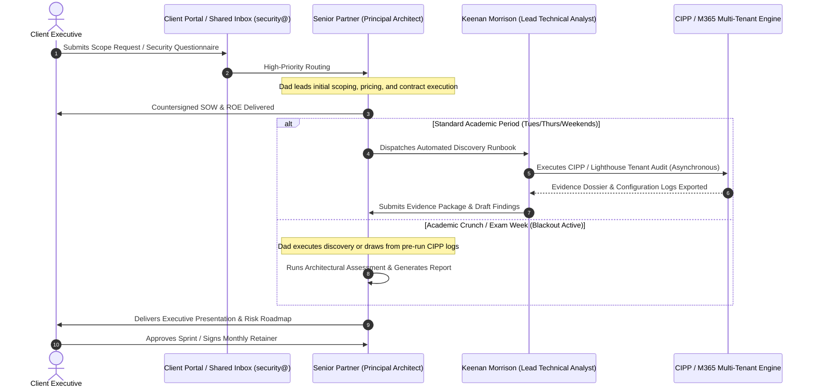
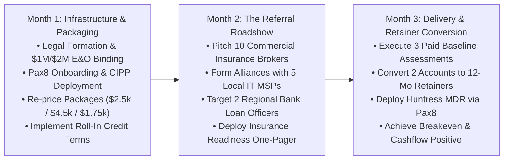

# Morrison Cyber Defense LLC: Peer Founder Audit & Strategic Gap Analysis
**Document Classification:** Privileged Operational & Business Strategy Review  
**Author:** Managing Partner, Boutique Cybersecurity Consulting & MSSP ($5M ARR)  
**Date of Review:** September 2026  
**Audited Entities:** Morrison Cyber Defense LLC (Houston, TX)  
**Target Principals:** Principal Cybersecurity Architect (Senior Partner) & Keenan Morrison (Associate Analyst / Junior Partner)

---

## Executive Summary & Founder-to-Founder Memo

> **To:** Senior Partner & Keenan Morrison  
> **From:** Managing Partner, Peer Cybersecurity Advisory & MSSP  
> **Subject:** Candid Peer Review, Strategic Audit, and Operating Architecture for Morrison Cyber Defense LLC  

Welcome to the arena. 

There is no better business in the world than running a high-margin, boutique cybersecurity practice when executed correctly. You have chosen an extraordinary market: Greater Houston is the capital of American physical commerce—oilfield manufacturing, port logistics, commercial trades, and specialty engineering. These companies are heavily capitalized, operationally vital, and completely vulnerable to modern identity extortion and Business Email Compromise (BEC).

After reviewing your **Purdue Model Strategic Business Plan**, **Houston Sales Playbook**, **Rules of Engagement Template**, **NIST CSF Baseline Template**, and **M365 Hardening Checklist**, my verdict is clear:

**The foundational assets, market thesis, and technical checklists you have built are in the top 5% of startup consultancies I have reviewed.** Your market segmentation of 5,893 Houston accounts is surgical. Your technical roadmap for Microsoft 365 hardening is spot-on. The father-son dynamic—pairing seasoned architectural authority with energetic, multi-certified execution—is an undeniable asset that business owners will instinctively respect and trust.

**However, your current plan contains 6 lethal blind spots that will either stall your growth, burn out Keenan during his junior and senior college years, or expose the firm to crippling liability:**

1. **A Dangerous Internal Contradiction on 24/7 SOC / MDR:** Your sales playbook and cold scripts promise *"24/7 Managed EDR (MDR)"* and *"24/7 SOC Log Ingestion,"* while your Business Plan and README explicitly state *"NO 24/7 Managed SOC / MDR claims."* If a client is breached at 2:00 AM on Sunday under that contract, your E&O carrier will deny coverage for deceptive trade practices.
2. **The $1,500 Fixed-Price Scope Creep Trap:** A flat $1,500 baseline assessment with no seat limits or diagnostic boundaries will turn into 40+ hours of unbillable troubleshooting when you discover rogue domain controllers, personal MacBooks, and unmanaged NAS devices.
3. **The "One-and-Done" Assessment Chasm:** You currently lack a structural financial bridge converting assessment clients into monthly recurring retainers. Without an **Assessment-to-Retainer Roll-In Credit**, you will win one-off projects and watch 80% of clients walk away with your report to give it to their cheap local IT guy.
4. **Outbound Channel Blindness:** Cold emailing and dropping off donuts to busy commercial contractor owners at 7:30 AM will yield a grueling 1–2% conversion rate. You are ignoring the **Golden Referral Triad** (Commercial Cyber Insurance Brokers, Non-Security MSPs, and Regional Bank Commercial Lenders) who can hand you pre-sold, qualified inbound clients every month.
5. **Academic Capacity Risk:** Keenan is a full-time university student (Class of 2027). Without an **Academic Surge/Blackout Protocol** and automated multi-tenant tooling (CIPP.app, Pax8, Huntress), final exams will collide with client project deadlines, threatening reputation and academic standing.
6. **Deficient Contractual Liability Shields:** Your current Rules of Engagement lacks explicit Limitation of Liability caps, third-party software failure waivers, ransomware extortion disclaimers, and pre-existing breach clauses.

This audit report provides an unflinching analysis of these pitfalls and equips you with the exact operational systems, pricing calculators, contract clauses, and referral partner playbooks we used to scale past $5M ARR.

---



---

## 1. Critical Strategic & Legal Gap Analysis

### 1.1 The 24/7 SOC / MDR Contradiction: A Fatal Legal Exposure
In [`purdue_family_cybersecurity_business_plan.md`](file:///home/keenan/Projects/MorrisonCyberDefense/business-plan/purdue_family_cybersecurity_business_plan.md#L71-L76) and [`README.md`](file:///home/keenan/Projects/MorrisonCyberDefense/README.md#L71-L76), your scope boundaries are clear:
> *❌ **No 24/7 Managed SOC / MDR Claims** (avoids liability for missed 3:00 AM alerts; we configure native Defender alerting).*

Yet in [`houston_mssp_sales_playbook.md`](file:///home/keenan/Projects/MorrisonCyberDefense/sales-and-gtm/houston_mssp_sales_playbook.md#L60-L92), your cold pitch and pricing tiers promise:
> *Line 60: "We deploy 24/7 managed threat detection..."*  
> *Line 87: "Essential Defense: $125/user/month • 24/7 Managed EDR (MDR)"*  
> *Line 90: "Compliance & Co-SOC: $195/user/month • 24/7 SOC Log Ingestion"*  

**The Reality from the Trenches:**  
If a commercial contractor signs a contract promising "24/7 Managed EDR" or "24/7 Threat Detection," and BlackCat or LockBit ransomware encrypts their storage array at 2:15 AM on a Saturday, their first phone call is to their corporate attorney. When that attorney reads your marketing sheet and contract, they will sue Morrison Cyber Defense LLC for breach of contract, professional negligence, and fraudulent misrepresentation. When your E&O insurance carrier (e.g., Hiscox or Travelers) investigates and realizes a two-person team had nobody awake at 3:00 AM monitoring a console, **they will deny coverage under intentional misrepresentation exclusions.**

**The Fix:**  
You must align marketing with operational reality. You have two choices:
1. **Option A (Consultancy Model):** Rebrand all services as **"Managed Cloud Security Posture & Microsoft 365 Stewardship"** with explicit business-hours response SLAs (`8:00 AM – 5:00 PM CT, Monday–Friday`). Disclaim real-time active incident interception.
2. **Option B (True MSSP Model via Channel MDR):** Partner with an authorized multi-tenant MDR vendor via Pax8—specifically **Huntress Labs** or **Blackpoint Cyber**. These platforms provide a real, human-staffed 24/7 SOC that isolates compromised endpoints and terminates rogue M365 user sessions at 3:00 AM without waking you up. You then sell: *"Managed Endpoint & Cloud Defense powered by Morrison Cyber Defense with 24/7 SOC Threat Isolation."*

---

### 1.2 The $1,500 Fixed-Price Scope Creep Trap
Your baseline assessment is currently advertised at `$1,500 – $4,000 fixed`. In practice, Houston SMB owners who hear "$1,500" will expect that price regardless of complexity.

Here is what happens on a $1,500 fixed assessment when you don't enforce strict scoping boundaries:
* You start the discovery scan and realize the client has **45 unmanaged endpoints**, 3 personal iPads running outdated iOS, two NAS units exposed to the public Internet, and a legacy 2012 R2 domain controller hosted in a broom closet.
* The owner asks Keenan: *"While you're in there, can you check why Bob's Outlook crashes and fix our printer Wi-Fi?"*
* You find an active malware infection or a rogue administrative forwarding rule. Suddenly, your 12-hour diagnostic audit transforms into a **50-hour remediation firefighting nightmare**.
* Your effective hourly billing rate collapses to **$30/hour**, well below junior helpdesk rates.

---

### 1.3 Working Capital, Cash Flow, and Payment Terms (Death by Net-30)
In the pro-forma model, you project $98,000 in Year 1 revenue with an initial $5,000 cash reserve.
* **The Trap:** If you invoice Houston commercial contractors on Net-30 terms, they will pay on **Net-60 or Net-90**. In the construction industry, subcontractors are accustomed to "pay-when-paid" cycles. If you perform a $3,500 sprint in October, you will not see cash until December or January.
* Meanwhile, your software subscriptions (Pax8, M365 licenses, domain registrars, E&O insurance installments) debit your bank account on the 1st of every month. A two-month payment lag will wipe out your $5,000 operating reserve before your third client pays.
* **The Rule of Boutique Consulting:**  
  * **One-Off Projects (Baselines & Sprints):** 50% deposit upon contract signing, 50% due on deliverable presentation (delivered upon receipt of final funds).
  * **Recurring Retainers:** 100% automated credit card or ACH debit via Stripe or QuickBooks Payments on the **1st of every billing month** in advance of service. **Zero invoices on Net-30.**

---

### 1.4 The Incumbent MSP Political Landmine
More than 85% of your target accounts already have an "IT Guy" or an outsourced Managed Service Provider (MSP). 
* When Morrison Cyber Defense enters and presents a NIST CSF report showing 15 critical vulnerabilities, missing MFA, and unpatched servers, the incumbent MSP takes this as an existential threat to their monthly contract.
* **The Retaliation:** The MSP will drag their feet for 3 weeks before granting Keenan Global Reader access, blame your Conditional Access policies whenever an executive forgets their password, and tell the owner: *"These cyber guys are theoretical academics who don't understand how your business actually runs."*
* **The Strategic Realignment:** You must position Morrison Cyber Defense not as an MSP replacement, but as an **Independent Cybersecurity Co-Pilot & Compliance Auditor**. In Section 3, we detail how to turn these MSPs into your top source of outsourced revenue.

---

## 2. Packaging, Scoping & Pricing Overhaul

```
========================================================================================
             MORRISON CYBER DEFENSE: RE-ENGINEERED SERVICE ARCHITECTURE
========================================================================================
[ PACKAGE 1: THE DIAGNOSTIC WEDGE ]
Cybersecurity Posture & M365 Risk Audit
• 100% Diagnostic (Zero remediation during audit)
• Fixed Tier Pricing:
    - Tier 1 (1–25 Users / 1 Tenant):   $2,500 Flat
    - Tier 2 (26–75 Users / 1 Tenant):  $4,500 Flat
    - Tier 3 (76–150 Users / Multi-Site): $6,500 Flat
• Deliverable: 1-Page Executive Risk Matrix + Technical Backlog + Underwriter Attestation
• TIMELINE: 10 Business Days
        |
        +---> [ THE CONVERSION BRIDGE: 100% FEE ROLL-IN CREDIT ]
              "Sign Package 2 or 3 within 14 days, and 100% of your $2,500-$4,500 audit
               fee is credited directly toward your remediation or annual retainer."
        |
[ PACKAGE 2: THE FLAGSHIP REMEDIATION ]
Microsoft 365 Cloud Defense Sprint
• Active Remediation & Zero-Trust Hardening
• Fixed Tier Pricing:
    - Tier 1 (1–25 Users):   $3,800
    - Tier 2 (26–75 Users):  $6,500
    - Tier 3 (76–150 Users): $9,500
• Entra ID CA, Intune Baselines, Defender EDR, SPF/DKIM/DMARC (p=reject)
• TIMELINE: 2-Week Intensive (Tested 48 hrs in Report-Only)
        |
[ PACKAGE 3: THE RECURRING RETAINER ]
Monthly Security Stewardship & vCISO
• Predictable High-Margin Monthly Recurring Revenue (MRR)
• Monthly Retainer:
    - Core Defense (Up to 35 Users):  $1,750 / mo (12-Month Agreement)
    - Advanced Defense (36–75 Users): $2,750 / mo (12-Month Agreement)
    - Enterprise Mid-Market (76+):    $4,250 / mo (12-Month Agreement)
• Monthly CIPP tenant drift audits, Huntress 24/7 MDR oversight, insurance renewals,
  quarterly executive risk reviews, 3 vendor questionnaire reviews/mo.
========================================================================================
```

### 2.1 The "Scope Box" Rules: Enforcing Strict Diagnostic Boundaries
To eliminate the risk of a baseline turning into 60 hours of unpaid support, every Statement of Work (SOW) must incorporate the following **Scope Box Schedule**:

```markdown
### SCHEDULE A: DIAGNOSTIC SCOPE BOX & LIMITS
1. In-Scope Environments: Exactly one (1) Microsoft 365 production tenant and up to two (2) public FQDN domain perimeters.
2. Endpoint Sampling Cap: Audit checks are performed on a representative sample of up to five (5) physical endpoints. Full-fleet configuration audits require an active Package 2 Sprint.
3. Diagnostic Isolation: Contractor personnel will perform observation, audit, and diagnostic logging exclusively. Under NO circumstances will Contractor perform hands-on system remediation, password resets, line-of-business software troubleshooting, or infrastructure re-engineering under this Assessment SOW.
4. Active Incident Clause: If evidence of an active, ongoing network intrusion or unauthorized data exfiltration is detected during testing, assessment activities will immediately terminate, the emergency contact will be notified, and all remaining hours will transition to Emergency Triage billing at $250.00/hour under a separate addendum.
```

### 2.2 The Conversion Masterstroke: The 100% Assessment-to-Retainer Roll-In Credit
Top-tier cybersecurity firms achieve **80%+ conversion rates** from one-off audits into 12-month retainers by eliminating client price resistance through an **Assessment-to-Retainer Credit Mechanism**.

#### The Script for Senior Partner at Executive Presentation:
> *"Bob, our assessment revealed four critical findings that invalidate your cyber insurance and leave your bank accounts exposed to wire redirection. To fix these properly, you have two options.*  
> 
> *Option 1 is to take this 35-page report and give it to your current IT provider. You have already paid our $2,500 diagnostic fee, and this roadmap belongs to you.*  
> 
> *Option 2 is to have Morrison Cyber Defense handle the complete remediation sprint and oversee your security posture on an ongoing basis. Because we believe in long-term stewardship, **if you authorize our 12-month Security Stewardship agreement within the next 14 calendar days, we will credit 100% of your $2,500 assessment fee directly toward your onboarding and first month's retainer.** That means your assessment was completely free."*

**Why this converts like clockwork:**
1. The client feels foolish walking away from a $2,500 credit.
2. It completely neutralizes the fear that they just bought an expensive report that will sit on a shelf.
3. It anchors Morrison Cyber Defense as their permanent security partner from Day 30 onward.

---

## 3. GTM & Distribution Channel Revolution ("The Golden Triad")



### 3.1 Why Cold Outbound to Houston SMB Owners Is an Uphill Battle
Commercial HVAC contractors, machine shops, and roofing executives are targeted by 20+ cold calls and emails every week from outsourced IT shops. They are skeptical, operationally stressed, and protect their cell numbers fiercely. 

More importantly: **Cybersecurity requires radical trust.** A business owner will not grant administrative access to their email system and accounting server to a cold caller who walked in with coffee.

Instead of hunting individual fish with a spear, build pipelines that feed you the school.

---

### 3.2 Channel Partner 1: Commercial Cyber Insurance Brokers (The Urgent Remediation Engine)
Houston insurance brokerages (e.g., McGriff, Insurica, USI, Higginbotham, Bowen Miclette & Britt) write commercial property, casualty, and cyber liability policies for thousands of industrial and contracting firms.

* **The Broker's Acute Pain:** Underwriters at Chubb, Travelers, Beazley, and Coalition are rejecting renewal applications or demanding 100–300% rate increases unless the contractor has:
  1. Phishing-resistant MFA enforced across 100% of users.
  2. Managed EDR with 24/7 isolation.
  3. Immutable, air-gapped backups.
* If the contractor cannot check these boxes accurately within 30 days, the policy is canceled or priced out—and the insurance broker loses their renewal commission.
* **Morrison's Partnership Pitch:**
  * *"We are Morrison Cyber Defense. We don't sell general IT, hardware, or office printers. We are pure-play cybersecurity engineers. When your insured receives a difficult 5-page cyber questionnaire or a conditional non-renewal notice, send them to us. We will conduct a 72-hour Insurance Readiness Sprint, deploy the exact technical controls required by Coalition or Travelers, and provide you with a certified attestation document so you can bind the policy on time."*
* **The Economics:** The broker becomes an unpaid sales force referring 2 to 4 distressed, high-intent clients every single month.

---

### 3.3 Channel Partner 2: Non-Security MSPs & IT Generalists (The Subcontracting Alliance)
In Harris, Fort Bend, and Montgomery counties, there are over 400 small IT service providers (1 to 5 technicians). They configure routers, install printers, reset passwords, and manage desktop support.
* **Their Acute Fear:** They are terrified of being sued when a client gets hit with ransomware. Furthermore, when their clients ask: *"Can you get us CMMC compliant?"* or *"Can you configure Conditional Access and DKIM?"*, the MSP is out of their depth.
* If they don't solve it, their client will defect to a large regional MSP.
* **Morrison's Co-Managed Covenant:**
  * Reach out to local MSP owners with a formal **Non-Compete / Non-Solicitation Covenant**:
  * *"We do not provide desktop support, printer maintenance, helpdesk, or hardware resale. We are specialized security architects. We partner with local IT providers to deliver white-labeled or co-managed M365 security hardening and vulnerability baselines for your clients. You keep 100% of your IT relationship; we provide the enterprise security credentials that protect your client and protect you from liability."*
* This immediately turns potential competitors into your greatest channel allies.

---

### 3.4 Channel Partner 3: Regional Commercial Bankers & Title Companies (The Wire Fraud Shield)
Commercial contractors, logistics firms, and law firms execute millions of dollars in supplier purchases, payroll, and escrow transactions.
* Commercial Loan Officers and Treasury Management VPs at regional Texas banks (e.g., Amegy Bank, Frost Bank, Texas Capital, Cadence) deal with wire redirection panics monthly. When a contractor wires $250,000 to a fraudulent account because their email was compromised, the bank faces angry customers, frozen lines of credit, and legal threats.
* **The Banker's Strategic Value:** Bankers want their borrowers protected so loan covenants aren't broken.
* **Morrison's Value Offer:** Provide the bank's commercial borrowers with a complimentary **"15-Minute Wire Transfer & Email Security Review"**. The bank introduces you as their approved security partner to protect their borrowers' operational cash accounts.

---

## 4. Father-Son Operational Mechanics & Capacity Protection



### 4.1 Academic Deconfliction: The Blackout Calendar & Surge Windows
Keenan’s degree completion (Class of 2027) is non-negotiable. Compromising academic performance for an urgent $2,500 assessment is short-sighted and destabilizing.

To safeguard both the business and Keenan's degree, Morrison Cyber Defense must institute the **Academic Operational Buffer System**:

1. **The Strict Blackout Calendar:**
   * **Fall Midterm Window:** Mid-October (2 weeks).
   * **Fall Finals Window:** First two weeks of December.
   * **Spring Midterm Window:** Early March (2 weeks).
   * **Spring Finals Window:** First two weeks of May.
   * *Rule:* During Blackout Windows, **zero new project implementations are scheduled**. Only passive retainer monitoring (governed by multi-tenant automation) continues.
2. **Surge Windows:**
   * Winter Break (Mid-December to Mid-January): Execute 4 to 6 M365 Hardening Sprints.
   * Summer Window (June to August): Full-time sprint delivery, onboarding new retainers, and deep-dive OT/ICS architecture projects.
3. **Execution Block Windows:**
   * Client fieldwork for Keenan must be scheduled strictly in dedicated asynchronous blocks (e.g., Tuesday/Thursday afternoons, Friday mornings, or weekend maintenance windows), never during morning class hours.

---

### 4.2 Positioning Keenan: From "Student/Intern" to "Lead Technical Systems Auditor"
A fatal mistake would be introducing Keenan on client calls as *"my son who is going to college and helping out."*
Houston commercial executives will immediately devalue his work, demand discounts, or bypass him to demand Dad's attention for minor technical queries.

**The Professional Brand Positioning:**
* **Official Corporate Title:** **Keenan Morrison, Lead Technical Systems Auditor & Partner**
* **Credentials Spotlight:** CompTIA Security+, Network+, A+ certified; National Cybersecurity Finalist; Enterprise Microsoft 365 Security Specialist.
* **Client Introduction Script (Spoken by Senior Partner):**
  > *"At Morrison Cyber Defense, our engagements are anchored by two distinct disciplines: Enterprise Architectural Governance and Hands-On Systems Auditing. I lead our architectural review, governance alignment, and executive risk strategy.*  
  > 
  > *Keenan leads our technical execution and systems auditing. He holds three industry credentials including CompTIA Security+, is recognized nationally for hands-on cybersecurity competition, and has audited dozens of cloud configurations. Keenan will oversee the tenant extraction scripts, telemetry verification, and evidence harvesting under my architectural parameters."*

When clients see this level of professional alignment, they don't see a student—they see an elite, technically proficient specialist backed by 20 years of enterprise authority.

---

### 4.3 Operational Protocols: Centralized Communications & Visibility
1. **Zero Personal Communications:** Clients must **never** have Keenan's personal university email or personal mobile phone number. All client correspondence must route through:
   * Shared Email: `security@morrisoncyber.org` (both Father and Keenan have full access).
   * Virtual Phone: OpenPhone or Microsoft Teams Voice with automated business-hours routing (`8:00 AM – 5:00 PM CT`).
2. **Asynchronous Evidence Collection:** Keenan executes PowerShell auditing scripts and CIPP assessments asynchronously. The client does not need to be on a Zoom call while scripts run. All deliverables are staged in an internal Git repository or encrypted SharePoint client portal for Senior Partner review prior to client delivery.

---

## 5. The Lean Multi-Tenant MSSP Modern Tooling Stack

To deliver 15 to 20 monthly retainers without hiring additional staff or working 80 hours a week, you must abandon manual tenant administration. You cannot log in and out of 20 different Microsoft Entra ID admin portals every week.

```
+---------------------------------------------------------------------------------------+
|                MORRISON CYBER DEFENSE: LEAN MULTI-TENANT TECH STACK                   |
+---------------------------------------------------------------------------------------+
|  LAYER 1: CLOUD ORCHESTRATION & BASELINE DRIFT                                       |
|  • CIPP.app (CyberDrain Improved Partner Portal) - Open Source / Hosted ($99/mo)     |
|    - Multi-tenant M365 management from a single glass panel                           |
|    - Deploy Conditional Access, anti-phishing, and MFA across all tenants instantly  |
|    - Automated daily drift alerts (e.g., if a user creates an external inbox rule)   |
|  • Microsoft 365 Lighthouse (FREE via Microsoft Partner Center)                       |
|    - Centralized Secure Score tracking, baseline deployment, risky user monitoring    |
+---------------------------------------------------------------------------------------+
|  LAYER 2: 24/7 MANAGED DETECTION & RESPONSE (MDR)                                     |
|  • Huntress Labs (Sourced via Pax8 Distributor - Zero Minimum Commitment)             |
|    - Managed EDR for Windows/macOS endpoints ($2.50 - $3.50 / agent / mo)            |
|    - Huntress Managed Identity / M365 Threat Detection ($1.50 - $2.00 / user / mo)   |
|    - TRUE 24/7 HUMAN SOC: Isolates malware & revokes compromised sessions at 3:00 AM |
|    - Eliminates Morrison's midnight operational liability 100%                       |
+---------------------------------------------------------------------------------------+
|  LAYER 3: ASSESSMENT AUTOMATION & VULNERABILITY AUDITING                             |
|  • CISA ScubaGear (Free/Open Source) - Automated M365 Security Baseline Audits       |
|  • Microsoft 365 DSC (Desired State Configuration) - Configuration Snapshotting      |
|  • Nessus Professional or NodeZero (Authorized Diagnostic Vulnerability Scans)        |
+---------------------------------------------------------------------------------------+
|  LAYER 4: BILLING & CLIENT PORTAL                                                     |
|  • QuickBooks Payments / Stripe Billing: Automated ACH / Credit Card Debits on the 1st|
|  • IT Glue or Hudu: Secure multi-tenant documentation, break-glass vaults, and SOPs   |
+---------------------------------------------------------------------------------------+
```

### 5.1 The Vendor Minimum Hack: Pax8 as Cloud Distributor
* **The Trap:** If you approach enterprise security vendors (SentinelOne, CrowdStrike, Datto) directly, they will demand minimum monthly commitments of **$500 to $2,500/month** or 50–100 seat minimums. As a startup, this will incinerate your cash flow.
* **The Solution:** Enroll immediately as a partner with **Pax8** (the leading cloud marketplace for MSPs/MSSPs).
  * Pax8 has **no minimum seat commitments**.
  * You can purchase 10 licenses of **Huntress MDR**, 15 licenses of **Microsoft 365 Business Premium**, and 1 license of **Avanan Email Security** on day one.
  * You pay strictly for what your clients consume, preserving your 90%+ gross profit margins.

### 5.2 Huntress Labs: Sponsoring a Real 24/7 SOC for Under $5/User
By deploying **Huntress Managed EDR + Managed ITDR (M365)** via Pax8:
1. When an employee of your Houston commercial contractor falls for an AitM (Adversary-in-the-Middle) phishing session token hijacking at 1:30 AM Saturday, the **Huntress 24/7 SOC detects the anomaly, terminates the session, resets the user account, and isolates the host within 15 minutes.**
2. A detailed incident report is delivered to Morrison Cyber Defense by 8:00 AM Monday.
3. You present this to the client as proof of proactive defense.
4. **Result:** You legitimately deliver 24/7 MDR capabilities without either partner losing sleep or incurring unmanageable legal liability.

---

## 6. Legal & Contractual Fortress (MSA, SOW & ROE Hardening)

Your current [`rules_of_engagement_and_testing_authorization_template.md`](file:///home/keenan/Projects/MorrisonCyberDefense/deliverables-and-templates/rules_of_engagement_and_testing_authorization_template.md) is a solid diagnostic authorization under CFAA (18 U.S.C. § 1030) and Texas Penal Code § 33.02. However, **it contains zero commercial indemnification or liability caps.**

To protect the personal assets of the Senior Partner and Keenan, every client engagement must be governed by a master agreement containing the following five non-negotiable legal clauses:

### Clause 1: Limitation of Liability (The Dollar Cap Shield)
```markdown
### LIMITATION OF LIABILITY & DAMAGES CAP
TO THE MAXIMUM EXTENT PERMITTED UNDER APPLICABLE TEXAS LAW:
(A) IN NO EVENT SHALL MORRISON CYBER DEFENSE LLC, ITS PRINCIPALS, MEMBERS, EMPLOYEES, 
OR CONTRACTORS BE LIABLE TO CLIENT OR ANY THIRD PARTY FOR ANY INDIRECT, INCIDENTAL, 
CONSEQUENTIAL, SPECIAL, PUNITIVE, OR EXEMPLARY DAMAGES (INCLUDING LOSS OF PROFITS, 
LOSS OF DATA, BUSINESS INTERRUPTION, LOSS OF GOODWILL, RANSOM OR EXTORTION PAYMENTS, 
OR REGULATORY FINES), REGARDLESS OF THE THEORY OF LIABILITY (WHETHER IN CONTRACT, 
TORT, STRICT LIABILITY, OR NEGLIGENCE).

(B) THE TOTAL AGGREGATE LIABILITY OF MORRISON CYBER DEFENSE LLC ARISING OUT OF OR 
RELATING TO THIS AGREEMENT, THE SERVICES, OR ANY DELIVERABLE SHALL UNDER NO CIRCUMSTANCES 
EXCEED THE TOTAL FEES ACTUALLY PAID BY CLIENT TO MORRISON CYBER DEFENSE LLC UNDER THE 
SPECIFIC STATEMENT OF WORK (SOW) GIVING RISE TO THE CLAIM DURING THE THREE (3) MONTHS 
IMMEDIATELY PRECEDING THE OCCURRENCE OF THE EVENT GIVING RISE TO LIABILITY.
```

### Clause 2: Disclaimer of Third-Party Software & Cloud Platform Failures
```markdown
### THIRD-PARTY PLATFORM & SOFTWARE DISCLAIMER
Client acknowledges that Contractor utilizes, configures, and interacts with third-party software, 
operating systems, and cloud infrastructure platforms, including but not limited to Microsoft 365, 
Microsoft Azure, Microsoft Entra ID, Microsoft Defender, and third-party security telemetry agents. 
Contractor does not develop, warrant, or control third-party software code. 

CONTRACTOR SHALL HAVE NO LIABILITY WHATSOEVER ARISING FROM (I) PLATFORM OUTAGES, ZERO-DAY 
VULNERABILITIES, OR DATA LOSS CAUSED BY MICROSOFT OR OTHER THIRD-PARTY CLOUD PROVIDERS; 
(II) CORRUPTIONS OR INCOMPATIBILITIES CAUSED BY SOFTWARE VENDOR PATCHES OR UPDATES; 
OR (III) ACTIONS TAKEN BY THIRD-PARTY THREAT DETECTION SOFTWARE (INCLUDING AUTOMATED ISOLATION 
OF SYSTEMS OR DELAYED ALERT DELIVERY).
```

### Clause 3: No Warranty of Immunity / Ransomware Non-Guarantee
```markdown
### NO GUARANTEE OF SYSTEM INFILTRATION IMMUNITY
Client expressly acknowledges that cybersecurity is a discipline of ongoing risk reduction, 
not absolute risk elimination. Contractor does NOT guarantee, warrant, or represent that:
(A) Client’s systems, networks, or cloud tenants will be 100% impenetrable, unhackable, 
or free from malicious interference;
(B) All existing or future vulnerabilities, backdoors, or malware will be detected or neutralized;
(C) Client will never suffer a ransomware encryption event, data breach, business email compromise, 
or wire transfer redirection.

Contractor’s services represent diagnostic and configuration efforts aligned with industry frameworks 
(e.g., NIST CSF 2.0, CIS Baselines). Client remains solely responsible for its own human risk behaviors, 
wire transfer authoring protocols, and business operational risk decisions.
```

### Clause 4: Pre-Existing Compromise Discovery & Emergency Transition
```markdown
### DISCOVERY OF PRE-EXISTING COMPROMISE
If Contractor discovers evidence of an active, ongoing, or pre-existing security compromise, 
unauthorized intrusion, active persistent threat (APT), or active data exfiltration during 
the performance of any assessment or sprint:
(A) Contractor’s scheduled diagnostic or implementation scope shall immediately pause;
(B) Contractor shall provide verbal and written notification to Client’s designated emergency 
contact within sixty (60) minutes of discovery;
(C) Contractor does not provide forensic digital evidence collection, certified law enforcement 
chain-of-custody handling, or incident response under this standard SOW. Continued emergency 
containment assistance shall be provided solely upon mutual execution of an Emergency Incident 
Triage Addendum at Contractor's prevailing emergency rate ($250.00/hour).
```

### Clause 5: Client Backup & Data Preservation Warranty
```markdown
### CLIENT RESPONSIBILITY FOR DATA & BACKUPS
Client warrants and covenants that, prior to the commencement of any configuration, hardening, 
or testing activities by Contractor, Client has performed and validated complete, restorable, 
and disconnected backups of all critical data, databases, and operational systems. 
Contractor shall have zero liability for data corruption, lost files, or system restoration costs 
resulting from pre-existing environment defects or unexpected software behavior during configuration.
```

---

## 7. 90-Day Tactical Execution Roadmap for Morrison Cyber Defense



### Month 1: Foundation & Operational Alignment
* [ ] **Legal Formation:** Finalize Texas LLC registration and execute Operating Agreement documenting 70/30 ownership and graduation sweat-equity terms.
* [ ] **Insurance:** Bind $1M / $2M Technology Errors & Omissions (E&O) and Cyber Liability policy (with specific coverage for consulting, configuration, and security advisory).
* [ ] **Contract Fortification:** Incorporate the 5 Mandatory Legal Clauses (Section 6) into your master SOW and engagement documentation.
* [ ] **Channel Onboarding:** Apply for the **Microsoft AI Cloud Partner Program** (Action Pack / CSP tier) and create a partner account with **Pax8**.
* [ ] **Multi-Tenant Tooling:** Deploy **CIPP.app** (hosted or self-hosted) and test tenant onboarding runbooks on your internal lab environment.
* [ ] **Pricing Realignment:** Update all collateral to reflect value-banded pricing: Baseline Assessments starting at $2,500; Hardening Sprints starting at $3,800; Retainers starting at $1,750/mo.

### Month 2: Unlocking the Golden Referral Triad
* [ ] **Insurance Broker Roadshow:** Identify 15 commercial insurance agents in Harris County specializing in commercial construction and oilfield casualty. Schedule 15-minute briefings: *"How to save your insureds from non-renewal using our 14-day cyber insurance hardening sprint."*
* [ ] **MSP Co-Managed Outreach:** Identify 10 local Houston IT service providers (under 5 employees). Deliver the Non-Compete / Co-Managed Security Covenant.
* [ ] **The "Insurance Questionnaire Triage" Campaign:** Launch the revised sales script targeting commercial contractors whose policies renew in Q4.
* [ ] **Academic Schedule Lock-In:** Build Keenan’s semester exam calendar and lock down operational blackout dates for October and December.

### Month 3: Execution, Cash-Flow Positivity & Retainer Locking
* [ ] **First Project Delivery:** Close and execute first three (3) Baseline Assessments at $2,500 each ($7,500 gross cash collected upfront).
* [ ] **Retainer Conversion Execution:** Present the Executive Risk Deliverable using the **100% Assessment-to-Retainer Roll-In Credit**. Target: Convert at least 2 of the 3 assessment clients into 12-month Security Stewardship retainers ($3,500+ MRR).
* [ ] **Deploy Layered MDR:** Onboard converted clients to Huntress Managed EDR and M365 ITDR via Pax8.
* [ ] **Cash-Flow Review:** Reconcile gross profit margins (>85%) and establish the 3-month trailing cash operating reserve before taking partner distributions.

---

## 8. Summary Audit Scorecard & Strategic Takeaways

| Dimension | Initial Plan Score | Post-Audit Target Score | Key Remediation Requirement |
| :--- | :---: | :---: | :--- |
| **Packaging & Pricing** | **6.5 / 10** | **9.5 / 10** | Eliminate $1,500 flat traps; tier by seat size; institute 100% Roll-In Credit. |
| **Legal & Risk Shields** | **5.0 / 10** | **9.8 / 10** | Resolve 24/7 SOC contradiction; add Limitation of Liability & Third-Party waivers. |
| **Go-To-Market (GTM)** | **6.0 / 10** | **9.2 / 10** | Pivot from cold call/donut drops to Commercial Insurance Brokers and MSP alliances. |
| **Operational Scalability** | **6.5 / 10** | **9.5 / 10** | Deploy CIPP.app + Pax8 + Huntress MDR to manage 20 clients in 5 hours/week. |
| **Capacity & Succession** | **7.5 / 10** | **9.6 / 10** | Academic Blackout Calendar; formalize Keenan as Lead Systems Auditor. |

### The Managing Partner's Final Word
Senior Partner and Keenan: You have done the hard work of building an authentic, technically capable, and market-ready foundation. Most cybersecurity startups fail because they either cannot sell, or they sell without technical substance. You have the technical substance, the enterprise credibility, and a pre-compiled goldmine of 5,893 Houston targets.

Implement these packaging rules, eliminate the liability contradictions, build your insurance broker referral flywheel, and protect Keenan's academic trajectory. You will build a recurring $500,000+ practice before Keenan walks across the stage to receive his diploma in 2027.

Now, go execute.
