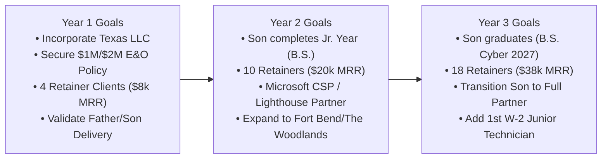
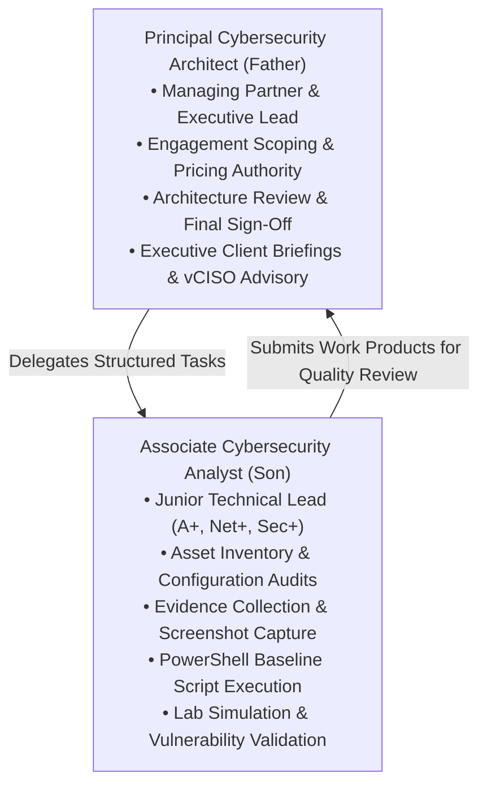
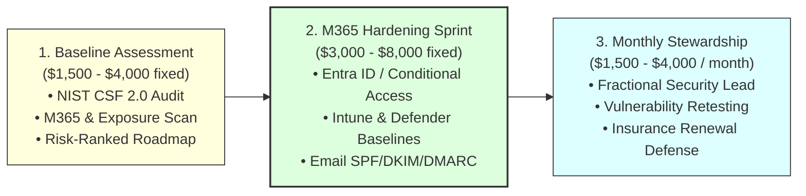
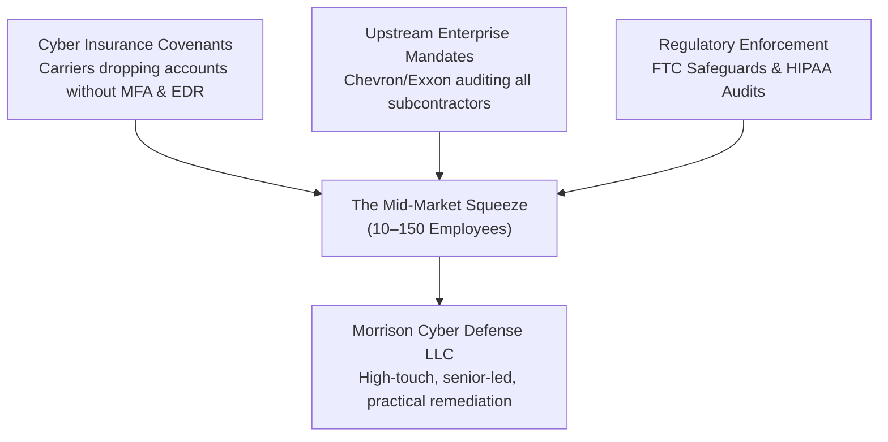
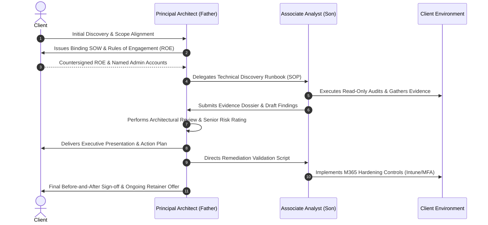

# Strategic Business Plan: Father-Son Cybersecurity Advisory Practice

**Framework:** Purdue University Agricultural Economics & Family Business Strategic Business Planning Model  
**Entity Name:** Morrison Cyber Defense LLC  
**Location:** Greater Houston Metropolitan Area, Texas  
**Principals:**  
* **Principal Cybersecurity Architect & Managing Partner:** Senior Partner (Father)  
* **Associate Cybersecurity Analyst & Junior Partner:** Keenan Morrison  
**Document Classification:** Confidential — Strategic Business Plan v1.0  

---

## Table of Contents
1. [Executive Summary](#1-executive-summary)
2. [Vision, Mission Statement, and Goals](#2-vision-mission-statement-and-goals)
   - [A. Vision & Mission Statement](#a-vision--mission-statement)
   - [B. Goals and Objectives](#b-goals-and-objectives)
   - [C. Keys to Success](#c-keys-to-success)
3. [Company Summary](#3-company-summary)
   - [A. Company Background](#a-company-background)
   - [B. Resources, Facilities, and Equipment](#b-resources-facilities-and-equipment)
   - [C. Marketing Methods](#c-marketing-methods)
   - [D. Management, Organization, and Family Division of Labor](#d-management-organization-and-family-division-of-labor)
   - [E. Ownership Structure & Legal Formation](#e-ownership-structure--legal-formation)
   - [F. Professional Standards & Data Ethics](#f-professional-standards--data-ethics)
   - [G. Internal Analysis (SWOT & Core Competencies)](#g-internal-analysis-swot--core-competencies)
4. [Products and Services](#4-products-and-services)
   - [A. Service Portfolio & Scope](#a-service-portfolio--scope)
   - [B. Explicit Boundaries: What We Do NOT Sell Yet](#b-explicit-boundaries-what-we-do-not-sell-yet)
5. [Market Assessment](#5-market-assessment)
   - [A. External Analysis & Houston Macro Environment](#a-external-analysis--houston-macro-environment)
   - [B. Target Customer Analysis (Houston Beachheads)](#b-target-customer-analysis-houston-beachheads)
   - [C. Industry Analysis (Porter's Five Forces)](#c-industry-analysis-porters-five-forces)
   - [D. Strategic Alternatives](#d-strategic-alternatives)
6. [Strategic Implementation](#6-strategic-implementation)
   - [A. Service Production & Quality Control Process](#a-service-production--quality-control-process)
   - [B. Resource Needs (Human, Financial, Physical)](#b-resource-needs-human-financial-physical)
   - [C. Sourcing & Vendor Tooling Strategy](#c-sourcing--vendor-tooling-strategy)
   - [D. Marketing & Sales Strategy (The Trojan Horse Approach)](#d-marketing--sales-strategy-the-trojan-horse-approach)
   - [E. Performance Standards & Delivery Quality Gates](#e-performance-standards--delivery-quality-gates)
7. [Financial Plan](#7-financial-plan)
   - [A. 3-Year Pro-Forma Financial Projections](#a-3-year-pro-forma-financial-projections)
   - [B. Startup Capitalization & Debt/Equity Strategy](#b-startup-capitalization--debtequity-strategy)
   - [C. Contingency & Family Business Succession Plan](#c-contingency--family-business-succession-plan)

---

## 1. Executive Summary

### A. Vision/Mission Statement
To provide enterprise-grade, pragmatic cybersecurity architecture and compliance stewardship for Houston-area mid-market businesses and critical industrial suppliers, pairing seasoned architectural leadership with emerging certified technical talent.

### B. Company Summary
The firm operates as a boutique, father-son cybersecurity advisory consultancy organized as a Texas Member-Managed LLC. The practice is uniquely anchored by a two-tier operational hierarchy:
* **The Father (Principal Architect):** Provides 20+ years of architectural authority, governance, cloud/M365 engineering, OT/ICS operational context, and executive client leadership.
* **The Son (Associate Analyst):** An 18-year-old certified professional (CompTIA A+, Network+, Security+, top-ranked TryHackMe competitor, and SkillsUSA cybersecurity finalist pursuing a B.S. in Cybersecurity, class of 2027) who handles hands-on data collection, baseline audits, evidence gathering, and remediation validation under strict senior oversight.

### C. Products/Services
1. **Cybersecurity Baseline & Roadmap ($1,500 – $4,000 fixed):** NIST CSF 2.0-aligned posture audit, threat surface scan, and prioritized risk register.
2. **Microsoft 365 Security Hardening Sprint ($3,000 – $8,000 fixed):** Entra ID, Conditional Access, Intune, Defender, anti-phishing, and Secure Score remediation.
3. **Monthly Security Stewardship ($1,500 – $4,000/month recurring):** Fractional security leadership, policy updates, cyber insurance renewal support, and quarterly executive reviews.
4. **OT/ICS Architecture Advisory (Premium/Scoped):** Industrial network segmentation, Purdue Model Level 1–3 audits, and vendor remote access hardening.

### D. Market Assessment
Houston boasts over **96,000 active commercial businesses** and **139,000 in Harris County**. Our beachhead consists of **5,893 high-consequence SMBs** (10–150 employees) across commercial specialty contracting, engineering, healthcare clinics, and oilfield service suppliers. These firms are under intense pressure from cyber insurance carriers and upstream enterprise clients (e.g., Exxon, Chevron, CenterPoint) to prove baseline security, yet cannot justify a $220k/year full-time CISO.

### E. Strategic Implementation
Our primary GTM wedge is the complimentary **15-Minute Cyber Insurance Readiness Review**. Delivery enforces a strict **"Senior Architect Sign-Off Gate"**: all scanning, configuration scripts, and documentation drafted by the Associate Analyst must undergo senior architectural code-review and peer sign-off before client delivery.

### F. Expected Outcomes
* **Year 1:** 12 project sprints + 4 recurring retainer clients = **$98,000 Gross Revenue** (breakeven in Month 3).
* **Year 2:** 20 project sprints + 10 recurring retainer clients = **$242,000 Gross Revenue**.
* **Year 3:** 25 project sprints + 18 recurring retainer clients = **$465,000 Gross Revenue** (supporting full-time salaries and college graduation transition).

---

## 2. Vision, Mission Statement, and Goals

### A. Vision Statement
To become the premier trusted family-owned cybersecurity advisory firm for Houston’s commercial trades, engineering contractors, and essential mid-market businesses—safeguarding regional economic engines through honest, non-inflated, and technically rigorous defenses.

### B. Goals and Objectives



* **Financial Performance:**
  * Achieve cash-flow positivity by Month 3 of operations.
  * Maintain $>75\%$ gross margins across advisory services.
  * Grow Monthly Recurring Revenue (MRR) to **$10,000/mo by Month 12** and **$35,000/mo by Month 36**.
* **Educational & Professional Milestones:**
  * Support the Associate Analyst’s university curriculum while integrating practical client fieldwork.
  * Associate Analyst to achieve Microsoft Certified: Cybersecurity Architect (SC-100) or CySA+ prior to graduation.

### C. Keys to Success
1. **The Believable Father-Son Framing:** Never pitch as "two peers." Pitch as a **Principal Architect backed by an energetic, certified Associate Analyst**. Clients respect mentorship, family values, and transparent billing tiers.
2. **Actionable Remediation over Threat Theoreticals:** SMBs hate 80-page vulnerability scanner dumps. We deliver prioritized, 1-page action checklists with plain-English business impact.
3. **Strict Scope Discipline:** Never bid on 24/7 active SOC, custom penetration testing, or red teaming. Master the Microsoft 365 identity, endpoint, and backup ecosystem.

---

## 3. Company Summary

### A. Company Background
Founded in 2026 in Houston, Texas, the firm was created to solve the acute cybersecurity gap facing small and medium-sized industrial, technical, and professional firms. Small businesses are increasingly required to adhere to CISA Cross-Sector Cybersecurity Performance Goals, FTC Safeguards, and strict cyber insurance covenants, but traditional IT MSPs lack deep security architecture expertise, and enterprise cybersecurity firms ignore accounts billing under $100,000/year.

### B. Resources, Facilities, and Equipment
* **Headquarters:** Virtual / Home Office laboratory in Houston, TX with dedicated client isolation subnets and encrypted NAS storage.
* **Hardware & Testing Infrastructure:**
  * Multi-node Proxmox / Hyper-V test environment for pre-testing M365 PowerShell automation and group policies.
  * Encrypted client laptops running Linux/Windows 11 Enterprise with BitLocker, YubiKey hardware 2FA, and segregated virtual machines.
* **Client System Access:** Dedicated, named individual admin accounts using customer-issued licenses with mandatory FIDO2 hardware MFA. No shared credentials or unencrypted password vaults.

### C. Marketing Methods
* Direct B2B relationship outreach to Houston trade associations (ABC Greater Houston, Houston Bar Association, Houston CPA Society).
* Targeted cold outreach utilizing the state public records registry (5,893 pre-qualified Houston leads).
* Strategic alliances with local IT MSPs who do not have internal cybersecurity specialists and want to subcontract white-glove security sprints.

### D. Management, Organization, and Family Division of Labor



#### Lines of Authority & Governance
* **Managing Partner & President:** Principal Architect (Father) holds sole contracting authority, billing oversight, and legal engagement sign-off.
* **Associate Analyst:** Keenan Morrison executes technical discovery, evidence collection, and remediation tasks within predefined, pre-authorized Standard Operating Procedures (SOPs).
* **Quality Assurance Gate:** No report, finding, risk rating, or remediation recommendation is ever delivered to a client without line-by-line review and digital signature from the Principal Architect.

### E. Ownership Structure & Legal Formation
* **Legal Form:** Texas Member-Managed Limited Liability Company (LLC).
* **Equity Distribution:** 
  * Principal Architect: **70% ownership**
  * Associate Analyst: **30% ownership** (with a documented 5-year sweat-equity path to 50/50 partnership upon college graduation and attainment of CISSP/equivalent).
* **Legal Hygiene & Permitting:**
  * Texas Secretary of State Certificate of Filing.
  * City of Houston Commercial Assumed Name / Business Registration.
  * Comprehensive **Professional Errors & Omissions (E&O) and Cyber Liability Policy** ($1M per occurrence / $2M aggregate through Hiscox/Embroker).
  * Attorney-drafted Master Services Agreement (MSA), Statement of Work (SOW), and Mutual Non-Disclosure Agreement (NDA) with explicit Limitation of Liability clauses capping damages at engagement fees paid.

### F. Professional Standards & Data Ethics
* **Written Authorization Guarantee:** Zero port scans, configuration audits, or credential assessments will ever take place without a counter-signed **Rules of Engagement (ROE)** document specifying exact IP ranges, tenant IDs, execution windows, and emergency escalation contacts.
* **Data Sovereignty:** Client data is stored in tenant-isolated, AES-256 encrypted storage, never uploaded to public AI models, and destroyed upon completion of engagement retention requirements.

### G. Internal Analysis (SWOT)

```
STRENGTHS                                      WEAKNESSES
---------------------------------------------  ---------------------------------------------
• Enterprise architectural expertise (Father) • Small team capacity (2 people).
• Certified hands-on execution speed (Son)    • Son's academic schedule constraints (part-time).
• Local Houston physical presence (7:30 AM drops) • No 24/7 SOC staffing (must avoid SOC claims).
• Agile, low-overhead pricing ($1.5k–$5k).    • Emerging brand awareness in Year 1.

OPPORTUNITIES                                  THREATS
---------------------------------------------  ---------------------------------------------
• Cyber insurance renewal panic across trades. • Local MSPs adding rudimentary security bolt-ons.
• 5,893 pre-qualified Houston B2B lead targets.• Economic downturns stalling discretionary spend.
• Mandates: FTC Safeguards, HIPAA, CISA CPGs.  • Client liability risk if a breach occurs post-audit.
• Houston Port & Energy Supply Chain demands.  • Rapidly evolving attacker tooling and ransomware.
```

---

## 4. Products and Services

### A. Service Portfolio & Scope



#### Package 1: Small-Business Cybersecurity Baseline & Roadmap
* **Target:** 10–100 employee businesses with IT support but zero security leadership.
* **Deliverables:**
  * Asset and data discovery inventory.
  * Microsoft 365 identity, MFA, and permission architecture audit.
  * External network exposure review using CISA-compliant non-invasive scanning.
  * 1-Page Executive Risk Matrix + Technical Remediation Backlog.
* **Labor Split:** Son collects configurations and generates raw evidence (8 hours); Father analyzes business risk and presents executive briefing (4 hours).
* **Fixed Fee:** **$1,800 – $3,800**.

#### Package 2: Microsoft 365 Security Hardening Sprint (Flagship)
* **Target:** Businesses using M365 Business Standard/Premium with default, vulnerable configurations.
* **Deliverables:**
  * Administrative account cleanup and dedicated break-glass account creation.
  * Conditional Access enforcement (MFA, geo-blocking, legacy auth blocking).
  * Microsoft Defender for Business and Intune device compliance baselines.
  * Email hygiene: SPF, DKIM, DMARC (p=reject or quarantine), and anti-spoofing policies.
  * Before-and-after Microsoft Secure Score report (guaranteeing a 25+ point lift).
* **Fixed Fee:** **$3,500 – $7,500**.

#### Package 3: Monthly Security Stewardship (Fractional vCISO)
* **Target:** Companies needing ongoing security governance to satisfy client contracts or insurers.
* **Deliverables:**
  * Monthly vulnerability scan and remediation progress tracking.
  * Quarterly Board / Leadership Threat Briefing.
  * Annual Incident Response Tabletop Simulation.
  * Vendor security questionnaire completion (up to 3/month).
  * Direct 4-hour advisory escalation window for the CEO/GM.
* **Monthly Retainer:** **$1,500 – $3,500 / month** (12-month commitment).

#### Package 4: OT/ICS Physical & Industrial Architecture Review (Premium)
* **Target:** Houston chemical batching, machine shops, oilfield packaging facilities.
* **Deliverables:** Purdue Model Level 1–3 network segmentation review, remote maintenance VPN audits, and physical setpoint integrity baselines.
* **Delivery:** 100% led and executed by the Principal Architect; Associate Analyst assists solely on network mapping documentation.
* **Project Fee:** **$8,000 – $15,000**.

### B. Explicit Boundaries: What We Do NOT Sell Yet

```
+-----------------------------------------------------------------------------------+
|                         OUT-OF-SCOPE BOUNDARIES & GUARDRAILS                      |
+-----------------------------------------------------------------------------------+
| [X] NO 24/7 Managed SOC / MDR Monitoring  --> Avoid liability of "missed alerts"  |
| [X] NO Solo Penetration Testing by Son   --> Labs do NOT equal production testing|
| [X] NO Malware Reverse Engineering       --> Unprofitable, highly specialized     |
| [X] NO Compliance "Certifications"       --> We provide readiness, not audit stamps|
| [X] NO Absolute Guarantees               --> Never state "we will prevent breaches"|
+-----------------------------------------------------------------------------------+
```

---

## 5. Market Assessment

### A. External Analysis & Houston Macro Environment
Houston represents an exceptionally dense, high-consequence market. Unlike Silicon Valley or New York, Houston's economy is powered by physical execution: energy, logistics, industrial manufacturing, healthcare, and engineering construction.



### B. Target Customer Analysis (Houston Beachheads)

| Beachhead Vertical | Qualified Houston Targets | Primary Decision Maker | The Urgency Hook |
| :--- | :--- | :--- | :--- |
| **Commercial Contractors** *(HVAC, Electrical, Roofing)* | **2,705** accounts | Owner / General Manager | Wire fraud on $200k supplier invoices; insurance renewal checklist. |
| **Healthcare & Dental Clinics** | **882** accounts | Practice Administrator | HHS HIPAA Security Rule audit threats; unencrypted local backups. |
| **Engineering & CAD Consultancies** | **736** accounts | Principal Engineer / VP | CMMC 2.0 defense flow-down; intellectual property theft. |
| **Oilfield Machine & Equipment Shops** | **631** accounts | Operations Director | Passing vendor cybersecurity questionnaires for Exxon/Baker Hughes. |

### C. Industry Analysis (Porter's Five Forces)
* **Threat of New Entrants (Low-Moderate):** General IT shops claim to do security, but lack deep architectural and governance credentials. Enterprise firms cannot service small budgets.
* **Bargaining Power of Buyers (Moderate):** SMBs are cost-conscious, but become price-inelastic when facing an insurance cancellation notice or a vendor audit deadline.
* **Threat of Substitutes (Low):** Software-only scanners (e.g., CISA automated tools) provide data but zero implementation; business owners do not know how to fix the findings.
* **Competitive Rivalry (Low in Niche):** Few Houston firms blend cloud M365 hardening with OT/industrial physical awareness at SMB-friendly price points.

---

## 6. Strategic Implementation

### A. Service Production & Quality Control Process



### B. Resource Needs
* **Human Resources:** Father allocates 15–20 hours/week; Son allocates 10–15 hours/week around college lectures and laboratory schedules.
* **Financial Resources:** $5,000 initial founder equity capital to cover Texas LLC formation ($300), E&O insurance down payment ($1,200), legal agreement templates ($1,500), and annual software subscriptions ($2,000).
* **Physical & Virtual Resources:** Encrypted workstations, hardware security keys, and virtual lab environments.

### C. Sourcing & Vendor Tooling Strategy
* **Microsoft Cloud Solution Provider (CSP) / Partner Center:** Enrolling in the Microsoft AI Cloud Partner Program to utilize **Microsoft 365 Lighthouse** for centralized, multi-tenant baseline management.
* **Scanning & Assessment Tools:**
  * Free/Open Source: Microsoft Extensible Assessment Engine (M365 DSC), CISA ScubaGear (M365 security baseline assessment tool), Nessus Professional (authorized vulnerability scanning).
  * Communication & Ticketing: Dedicated tenant using Microsoft 365 Business Premium + OpenPhone virtual VoIP.

### D. Marketing & Sales Strategy (The Trojan Horse Approach)
1. **The Lead Source:** Leverage our pre-compiled database of **5,893 Houston target companies**.
2. **The 7:30 AM Coffee Protocol:** Target commercial mechanical and electrical contractors in Northwest Houston (`77041` / `77070`). Drop off breakfast for dispatch, meet the owner before trucks roll.
3. **The Wedge Offer:** *"We perform a complimentary 15-minute Cyber Insurance Questionnaire Review."*
   * 90% of business owners fill out cyber insurance renewals fraudulently or incorrectly (checking "Yes" to MFA on all endpoints when it is only on email).
   * Finding these discrepancies proves immediate value and seamlessly converts into a **$3,500 M365 Hardening Sprint**.

### E. Performance Standards & Quality Gates
* **Response SLAs:** 4-hour business hour response for ongoing retainer clients.
* **Audit Zero-Defect Rule:** All PowerShell scripts must be executed in read-only audit mode (`-WhatIf` or audit logging) before any state-changing changes are made.
* **Pre-Change Snapshots:** Mandatory rollback snapshots and M365 backup verification prior to changing tenant Conditional Access policies.

---

## 7. Financial Plan

### A. 3-Year Pro-Forma Financial Projections

```
================================================================================
                    VANGUARD CYBER PARTNERS — 3-YEAR P&L PROJECTION
================================================================================
REVENUE STREAMS                      YEAR 1 (Launch)   YEAR 2 (Growth)   YEAR 3 (Scale)
--------------------------------------------------------------------------------
Cybersecurity Baselines ($2.5k avg)    $25,000 (10)      $35,000 (14)      $40,000 (16)
M365 Hardening Sprints ($5k avg)       $40,000 (8)       $75,000 (15)     $110,000 (22)
Monthly Stewardship ($2.5k/mo avg)     $30,000 (4)      $120,000 (10)     $285,000 (18)
OT/ICS Specialty Audits ($10k avg)      $3,000 (0.3)     $12,000 (1.2)     $30,000 (3)
--------------------------------------------------------------------------------
GROSS REVENUE                          $98,000          $242,000          $465,000
Cost of Goods Sold (Software, Tools)    $8,400           $18,000           $32,000
--------------------------------------------------------------------------------
GROSS PROFIT                           $89,600 (91%)    $224,000 (92%)    $433,000 (93%)

OPERATING EXPENSES (OpEx)
Insurance (E&O + Cyber Liability)       $3,200            $4,500            $6,500
Legal, Tax & Accounting                 $2,500            $3,500            $5,000
Marketing, Coffee & Association Dues    $3,600            $7,200           $12,000
Professional Certifications & Training  $2,000            $3,000            $4,500
Hardware & Infrastructure Depreciation  $3,000            $5,000            $8,000
--------------------------------------------------------------------------------
TOTAL OPERATING EXPENSES               $14,300           $23,200           $36,000
--------------------------------------------------------------------------------
NET OPERATING INCOME / EBITDA          $75,300          $200,800          $397,000

PARTNER DRAW ALLOCATION
Father Partner Draw (70%)              $52,710          $140,560          $277,900
Son Associate / College Draw (30%)     $22,590           $60,240          $119,100
================================================================================
```

### B. Startup Capitalization & Debt/Equity Strategy
* **Zero Debt Policy:** The business will launch with zero commercial bank debt or outside investor equity.
* **Initial Capitalization:** $5,000 self-funded cash reserve deposited into an Amegy Bank or Frost Bank Texas commercial account.
* **Operating Reserve:** Maintain a 3-month trailing expense reserve in a High-Yield Business Savings account before taking quarterly partner distributions.

### C. Contingency & Family Business Succession Plan
1. **Academic Prioritization Clause:** The partnership agreement explicitly stipulates that the Associate Analyst’s university coursework, exams, and degree completion take operational priority over consulting deliverables.
2. **Key-Person Incapacity:** If the Principal Architect is temporarily incapacitated, all active implementation sprints pause; retainer clients receive an automatic monthly fee credit, and technical monitoring continues under senior external advisory network backstops.
3. **Graduate Transition Plan (2027):** Upon college graduation, the Associate Analyst transitions to full-time Managing Partner status, equity adjusts to 50/50, and the practice initiates hiring its first non-family Junior Security Technician.
