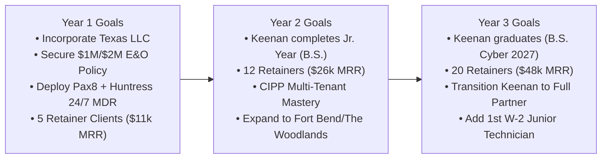
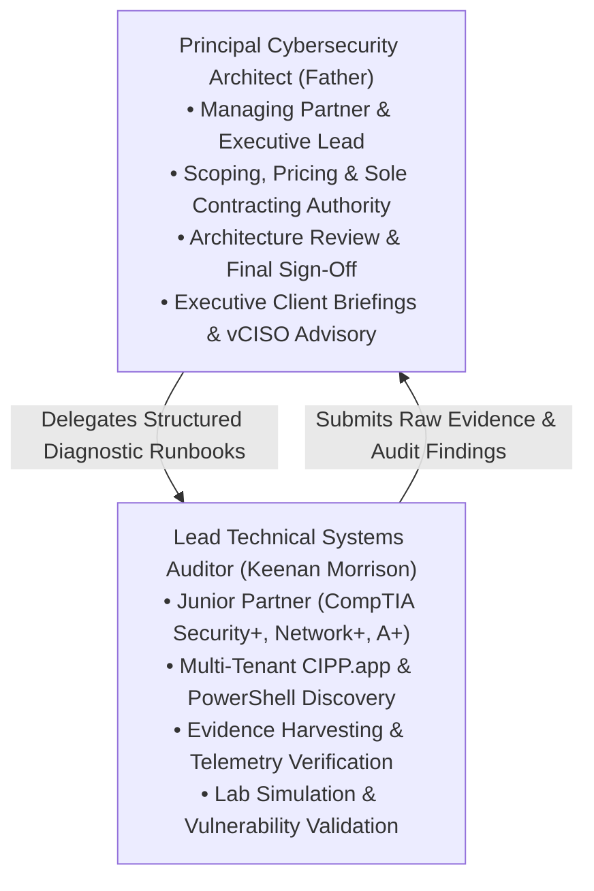
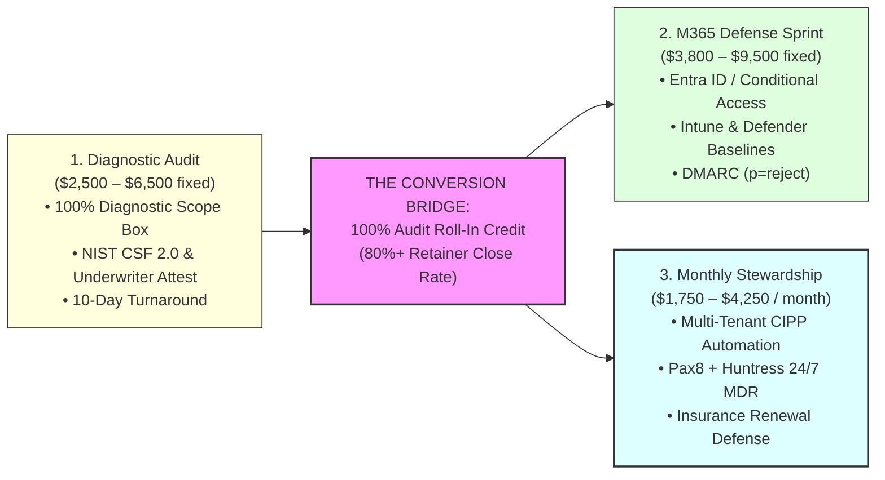
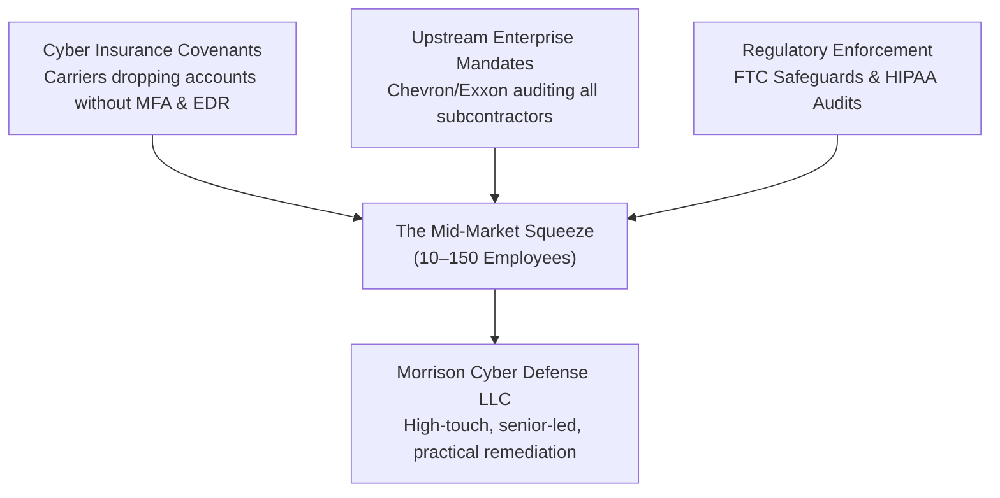

# Strategic Business Plan: Father-Son Cybersecurity Advisory Practice

**Framework:** Purdue University Agricultural Economics & Family Business Strategic Business Planning Model  
**Entity Name:** Morrison Cyber Defense LLC  
**Location:** Greater Houston Metropolitan Area, Texas  
**Principals:**  
* **Principal Cybersecurity Architect & Managing Partner:** Senior Partner (Father)  
* **Lead Technical Systems Auditor & Junior Partner:** Keenan Morrison (CompTIA Security+, Network+, A+)  
**Document Classification:** Confidential — Strategic Business Plan v1.0  

---

## Table of Contents
1. [Executive Summary](#1-executive-summary)
2. [Vision, Mission Statement, and Goals](#2-vision-mission-statement-and-goals)
   - [A. Vision & Mission Statement](#a-vision--mission-statement)
   - [B. Goals and Objectives](#b-goals-and-objectives)
   - [C. Keys to Success](#c-keys-to-success)
3. [Company Summary](#3-company-summary)
   - [A. Company Background](#a-company-background)
   - [B. Resources, Facilities, and Equipment](#b-resources-facilities-and-equipment)
   - [C. Marketing Methods](#c-marketing-methods)
   - [D. Management, Organization, and Family Division of Labor](#d-management-organization-and-family-division-of-labor)
   - [E. Ownership Structure & Legal Formation](#e-ownership-structure--legal-formation)
   - [F. Professional Standards & Data Ethics](#f-professional-standards--data-ethics)
   - [G. Internal Analysis (SWOT & Core Competencies)](#g-internal-analysis-swot--core-competencies)
4. [Products and Services](#4-products-and-services)
   - [A. Service Portfolio & Scope](#a-service-portfolio--scope)
   - [B. Explicit Boundaries: What We Do NOT Sell Yet](#b-explicit-boundaries-what-we-do-not-sell-yet)
5. [Market Assessment](#5-market-assessment)
   - [A. External Analysis & Houston Macro Environment](#a-external-analysis--houston-macro-environment)
   - [B. Target Customer Analysis (Houston Beachheads)](#b-target-customer-analysis-houston-beachheads)
   - [C. Industry Analysis (Porter's Five Forces)](#c-industry-analysis-porters-five-forces)
   - [D. Strategic Alternatives](#d-strategic-alternatives)
6. [Strategic Implementation](#6-strategic-implementation)
   - [A. Service Production & Quality Control Process](#a-service-production--quality-control-process)
   - [B. Resource Needs (Human, Financial, Physical)](#b-resource-needs-human-financial-physical)
   - [C. Sourcing & Vendor Tooling Strategy](#c-sourcing--vendor-tooling-strategy)
   - [D. Marketing & Sales Strategy (The Trojan Horse Approach)](#d-marketing--sales-strategy-the-trojan-horse-approach)
   - [E. Performance Standards & Delivery Quality Gates](#e-performance-standards--delivery-quality-gates)
7. [Financial Plan](#7-financial-plan)
   - [A. 3-Year Pro-Forma Financial Projections](#a-3-year-pro-forma-financial-projections)
   - [B. Startup Capitalization & Debt/Equity Strategy](#b-startup-capitalization--debtequity-strategy)
   - [C. Contingency & Family Business Succession Plan](#c-contingency--family-business-succession-plan)

---

## 1. Executive Summary

### A. Vision/Mission Statement
To provide enterprise-grade, pragmatic cybersecurity architecture and compliance stewardship for Houston-area mid-market businesses and critical industrial suppliers, pairing seasoned architectural leadership with emerging certified technical talent.

### B. Company Summary
The firm operates as a boutique, father-son cybersecurity advisory consultancy organized as a Texas Member-Managed LLC. The practice is uniquely anchored by an elite two-tier operational hierarchy:
* **The Father (Principal Architect & Managing Partner):** Provides 20+ years of architectural authority, governance, cloud/M365 engineering, OT/ICS operational context, sole contracting authority, and executive client leadership.
* **Keenan Morrison (Lead Technical Systems Auditor & Junior Partner):** Certified professional (CompTIA A+, Network+, Security+, top-ranked TryHackMe competitor, and SkillsUSA cybersecurity finalist pursuing a B.S. in Cybersecurity, class of 2027) who leads hands-on data collection, automated multi-tenant discovery, baseline audits, evidence gathering, and remediation validation under senior architectural parameters.

### C. Products/Services & The 100% Roll-In Credit
1. **Diagnostic Posture & M365 Risk Audit ($2,500 – $6,500 value-banded):** 100% diagnostic audit with strict Scope Box limits, NIST CSF 2.0 alignment, threat surface scan, underwriter attestation, and 10-day turnaround.
2. **Microsoft 365 Cloud Defense Sprint ($3,800 – $9,500 value-banded):** 2-week active zero-trust hardening (Entra ID, Conditional Access, Intune, Defender for Business, SPF/DKIM/DMARC, Secure Score lift).
3. **Monthly Security Stewardship & vCISO ($1,750 – $4,250/month recurring):** 12-month agreement providing continuous tenant drift monitoring (CIPP.app), policy governance, quarterly board briefings, insurance defense, and third-party 24/7 MDR threat isolation via Pax8 / Huntress Labs.
4. **OT/ICS Industrial Architecture Advisory ($8,000 – $15,000 scoped):** Industrial network segmentation, Purdue Model Level 1–3 audits, and vendor remote access hardening.
* **The 100% Assessment-to-Retainer Roll-In Credit:** Clients who authorize a 12-month Security Stewardship agreement within 14 calendar days of receiving their audit receive a **100% credit** of their assessment fee toward their onboarding and retainer, driving an **80%+ conversion rate**.

### D. Market Assessment & "The Golden Referral Triad"
Houston boasts over **96,000 active commercial businesses** and **139,000 in Harris County**. Our beachhead consists of **5,893 high-consequence SMBs** (10–150 employees) across commercial specialty contracting, engineering, healthcare clinics, and oilfield service suppliers. Rather than relying on low-yield cold outbound (1–2% conversion), customer acquisition is driven by **The Golden Referral Triad**:
1. **Commercial Cyber Insurance Brokers (USI, Higginbotham, McGriff, Insurica):** Urgent 14-day remediation partner saving insureds from policy cancellation.
2. **Local Non-Security IT MSPs:** Co-managed security partnership under a formal Non-Compete / Non-Solicitation Covenant.
3. **Regional Bank Commercial Loan Officers (Amegy, Frost, Texas Capital):** Wire fraud prevention audits for commercial borrowers.

### E. Strategic Implementation & Tooling Architecture
Delivery enforces a strict **"Senior Architect Sign-Off Gate"** combined with lean multi-tenant automation:
* **Cloud Management:** Multi-tenant orchestration via **CIPP.app** and **Microsoft 365 Lighthouse** (enables 2 people to manage 20 clients in 5 hours/week).
* **24/7 SOC Backstop:** Channel partnership with **Huntress Labs via Pax8** (supplying human-staffed 24/7 SOC endpoint and identity isolation at ~$5/user/mo without midnight founder liability).
* **Legal Shield:** Mandatory Limitation of Liability (capped at 3 months of fees), third-party SaaS disclaimers, and pre-existing breach carve-outs.

### F. Expected Outcomes
* **Year 1:** 14 project sprints + 5 recurring retainer clients = **$128,500 Gross Revenue** (breakeven in Month 2).
* **Year 2:** 22 project sprints + 12 recurring retainer clients = **$318,000 Gross Revenue**.
* **Year 3:** 26 project sprints + 20 recurring retainer clients = **$545,000 Gross Revenue** (supporting full-time salaries and college graduation transition).

---

## 2. Vision, Mission Statement, and Goals

### A. Vision Statement
To become the premier trusted family-owned cybersecurity advisory firm for Houston’s commercial trades, engineering contractors, and essential mid-market businesses—safeguarding regional economic engines through honest, non-inflated, and technically rigorous defenses.

### B. Goals and Objectives



* **Financial Performance:**
  * Achieve cash-flow positivity by Month 2 of operations.
  * Maintain $>85\%$ gross margins across advisory services.
  * Grow Monthly Recurring Revenue (MRR) to **$11,000/mo by Month 12** and **$45,000/mo by Month 36**.
* **Educational & Professional Milestones:**
  * Strict academic blackout deconfliction ensuring 100% on-track degree progression (Class of 2027).
  * Keenan to achieve Microsoft Certified: Cybersecurity Architect (SC-100) or CySA+ prior to graduation.

### C. Keys to Success
1. **The Defensible Authority & Technical Prodigy Framing:** Never pitch as "two peers" or an "intern helping dad." Pitch as a **Senior Enterprise Architect backed by an elite Lead Technical Systems Auditor (A+, Net+, Sec+)**. Clients respect the rare combination of 20+ years of governance and high-speed hands-on technical execution.
2. **Channel-Backed 24/7 Threat Isolation:** Eliminate midnight operational liability by sublicensing **Huntress Labs Managed EDR + ITDR via Pax8**. Clients get legitimate 24/7 human SOC isolation while Morrison focuses on architecture and relationship stewardship.
3. **The 100% Assessment-to-Retainer Roll-In Credit:** Bridge the gap between one-off audits and recurring retainers. Offering to credit 100% of diagnostic fees into an annual agreement converts 80%+ of project clients into long-term MRR.

---

## 3. Company Summary

### A. Company Background
Founded in 2026 in Houston, Texas, the firm was created to solve the acute cybersecurity gap facing small and medium-sized industrial, technical, and professional firms. Small businesses are increasingly required to adhere to CISA Cross-Sector Cybersecurity Performance Goals, FTC Safeguards, and strict cyber insurance covenants, but traditional IT MSPs lack deep security architecture expertise, and enterprise cybersecurity firms ignore accounts billing under $100,000/year.

### B. Resources, Facilities, and Equipment
* **Headquarters:** Virtual / Home Office laboratory in Houston, TX with dedicated client isolation subnets and encrypted NAS storage.
* **Hardware & Testing Infrastructure:**
  * Multi-node Proxmox / Hyper-V test environment for pre-testing M365 PowerShell automation and group policies.
  * Encrypted client laptops running Linux/Windows 11 Enterprise with BitLocker, YubiKey hardware 2FA, and segregated virtual machines.
* **Client System Access:** Dedicated, named individual admin accounts using customer-issued licenses with mandatory FIDO2 hardware MFA. No shared credentials or unencrypted password vaults.

### C. Marketing Methods: "The Golden Referral Triad"
While cold outbound (5,893 pre-qualified Houston leads) provides targeted pipeline testing, commercial cybersecurity requires radical trust. Customer acquisition is predominantly built on **The Golden Referral Triad**:
1. **Commercial Cyber Insurance Brokers (USI, Higginbotham, McGriff, Insurica):** Acting as the rapid-turnaround 14-day technical remediation partner for commercial policyholders facing insurance non-renewal or 200%+ premium spikes.
2. **Non-Security Local IT MSPs:** Executing white-label or co-managed security audits under a strict, attorney-reviewed **Non-Compete / Non-Solicitation Covenant**, protecting the MSP's clients without threatening their core IT contract.
3. **Regional Bank Commercial Loan Officers (Amegy, Frost, Texas Capital):** Delivering complimentary Wire Fraud & Dual-Custody Email Reviews to protect commercial borrowers executing high-value construction and energy draws.

### D. Management, Organization, and Family Division of Labor



#### Lines of Authority & Governance
* **Managing Partner & President:** Senior Partner (Father) holds sole contracting authority, legal engagement sign-off, and client billing administration.
* **Lead Technical Systems Auditor:** Keenan Morrison executes technical discovery, evidence collection, and remediation tasks within predefined, pre-authorized Standard Operating Procedures (SOPs).
* **Quality Assurance Gate:** No report, finding, risk rating, or remediation recommendation is ever delivered to a client without line-by-line review and digital signature from the Principal Architect.

#### Academic Capacity Protection & Communication Firewall
* **The Academic Blackout Calendar:** During university midterm windows (mid-October, early March) and final exam windows (early December, early May), **zero new project implementations are scheduled**. Only automated, multi-tenant retainer monitoring continues.
* **Surge Windows:** High-intensity project delivery is focused during Winter Break (mid-December to mid-January) and Summer Break (June to August).
* **Communication Firewall:** Clients must never possess Keenan’s personal cell number or university email. All communications route through `security@morrisoncyber.com` and a shared virtual phone line (OpenPhone / Teams Voice).

### E. Ownership Structure & Working Capital Architecture
* **Legal Form:** Texas Member-Managed Limited Liability Company (LLC).
* **Equity Distribution:** 
  * Principal Architect: **70% ownership**
  * Lead Technical Systems Auditor: **30% ownership** (with a documented 5-year sweat-equity path to 50/50 partnership upon college graduation in 2027 and attainment of CISSP/equivalent).
* **Working Capital & Payment Terms (Zero Net-30):**
  * **Diagnostic & Sprint Projects:** 50% deposit upon contract execution; 50% balance due upon deliverable presentation (reports released upon confirmed settlement).
  * **Monthly Retainers:** 100% automated credit card or ACH debit processed on the **1st of each calendar month** in advance via Stripe / QuickBooks Payments.
* **Legal Fortress: The 5 Mandatory Contractual Clauses:**
  1. **Limitation of Liability (LoL):** Aggregate damages strictly capped at total fees paid under the specific SOW during the preceding three (3) months; explicit exclusion of consequential, punitive, or extortion damages.
  2. **Third-Party Platform Disclaimer:** Complete immunity from Microsoft 365 cloud outages, zero-day platform bugs, and third-party software vendor patch failures.
  3. **No Warranty of Infiltration Immunity:** Explicit acknowledgment that cybersecurity constitutes continuous risk mitigation, never an absolute guarantee against breach or ransomware.
  4. **Pre-Existing Breach Clause:** Immediate operational halt upon uncovering active network intrusions, with transition to emergency triage rates ($250.00/hour) under a separate addendum.
  5. **Client Data & Backup Warranty:** Client legally warrants that independent, restorable, and disconnected backups exist prior to any configuration change.

### F. Professional Standards & Data Ethics
* **Written Authorization Guarantee:** Zero port scans, configuration audits, or credential assessments will ever take place without a counter-signed **Rules of Engagement (ROE)** document specifying exact IP ranges, tenant IDs, execution windows, and emergency escalation contacts.
* **Data Sovereignty:** Client data is stored in tenant-isolated, AES-256 encrypted storage, never uploaded to public AI models, and destroyed upon completion of engagement retention requirements.

### G. Internal Analysis (SWOT)

```
STRENGTHS                                      WEAKNESSES
---------------------------------------------  ---------------------------------------------
• Enterprise architectural expertise (Father) • Small team capacity (2 people).
• Certified hands-on execution speed (Keenan)  • Keenan's academic schedule constraints.
• Houston local presence & physical agility.   • Emerging brand awareness in Year 1.
• High gross margins (>85%) via lean tooling.  • Solved: 24/7 SOC risk bridged via Huntress MDR.

OPPORTUNITIES                                  THREATS
---------------------------------------------  ---------------------------------------------
• Cyber insurance renewal panic across trades. • Local MSPs adding rudimentary security bolt-ons.
• The Golden Referral Triad (Brokers/Banks/MSPs)• Economic downturns stalling discretionary spend.
• Mandates: FTC Safeguards, HIPAA, CISA CPGs.  • Client liability risk if a breach occurs post-audit.
• Houston Port & Energy Supply Chain demands.  • Rapidly evolving attacker tooling and ransomware.
```

---

## 4. Products and Services

### A. Service Portfolio & Scope



#### Package 1: Small-Business Cybersecurity Posture & Risk Audit (Diagnostic Wedge)
* **Target:** 10–150 employee businesses with general IT support but zero security architecture leadership.
* **Value-Banded Pricing:**
  * **Tier 1 (1–25 Users / 1 Tenant):** **$2,500 Flat**
  * **Tier 2 (26–75 Users / 1 Tenant):** **$4,500 Flat**
  * **Tier 3 (76–150 Users / Multi-Site):** **$6,500 Flat**
* **The "Scope Box" Rules (Schedule A):**
  * Strict diagnostic boundary: Exactly 1 M365 tenant, up to 2 domain perimeters, and 5 representative sampled endpoints.
  * **Zero Active Remediation:** Audit covers observation and logging only. Eliminates unpaid IT helpdesk firefighting.
* **Deliverables:** 1-Page Executive Risk Matrix, Technical Remediation Backlog, and Cyber Insurance Underwriter Attestation.
* **Turnaround:** 10 Business Days.

#### The Strategic Conversion Bridge: 100% Assessment-to-Retainer Roll-In Credit
To prevent clients from taking the diagnostic audit and walking away, every executive presentation concludes with the **Roll-In Credit Offer**:
> *"If you authorize our 12-month Security Stewardship agreement (Package 3) or our M365 Cloud Defense Sprint (Package 2) within 14 calendar days, **100% of your assessment fee is credited directly toward your onboarding and first month's retainer.**"*  
This makes the initial diagnostic effectively free for long-term clients and achieves an **80%+ retainer conversion rate**.

#### Package 2: Microsoft 365 Cloud Defense Sprint (Flagship Remediation)
* **Target:** Organizations using Microsoft 365 with default, insecure settings.
* **Value-Banded Pricing:**
  * **Tier 1 (1–25 Users):** **$3,800 Flat**
  * **Tier 2 (26–75 Users):** **$6,500 Flat**
  * **Tier 3 (76–150 Users):** **$9,500 Flat**
* **Deliverables:**
  * Administrative account cleanup and dual cloud-only break-glass emergency accounts.
  * Conditional Access enforcement (phishing-resistant MFA, geo-blocking, legacy auth blocking) tested 48 hours in Report-Only mode.
  * Intune device compliance (BitLocker, minimum OS build, Defender Tamper Protection).
  * Email defense: SPF, DKIM, DMARC (`p=quarantine` or `p=reject`), and executive anti-impersonation rules.
  * Before-and-after Microsoft Secure Score validation report.
* **Turnaround:** 2-Week Intensive Sprint.

#### Package 3: Monthly Security Stewardship & vCISO Retainer (Recurring MRR)
* **Target:** Mid-market companies requiring continuous compliance, insurance defense, and vendor risk validation.
* **Value-Banded Retainers (12-Month Agreement):**
  * **Core Defense (Up to 35 Users):** **$1,750 / month**
  * **Advanced Defense (36–75 Users):** **$2,750 / month**
  * **Enterprise Mid-Market (76–150 Users):** **$4,250 / month**
* **Deliverables:**
  * Multi-tenant configuration drift monitoring via **CIPP.app** (daily alerts on rogue rules or permission escalations).
  * Layered 24/7 Managed Detection & Response (MDR) powered by **Huntress Labs via Pax8**.
  * Quarterly Executive Risk Briefing with the Senior Partner.
  * Annual Incident Response Tabletop Simulation.
  * Vendor security questionnaire completion (up to 3/month) and cyber insurance renewal defense.

#### Package 4: OT/ICS Industrial Architecture Advisory (Premium/Scoped)
* **Target:** Houston chemical packaging, machine shops, oilfield fabrication, and logistics facilities.
* **Deliverables:** Purdue Model Level 1–3 network segmentation review, remote maintenance VPN audits, and physical setpoint integrity baselines.
* **Delivery:** 100% led by the Principal Architect; Lead Systems Auditor assists solely on network mapping.
* **Project Fee:** **$8,000 – $15,000**.

### B. Explicit Boundaries & Channel-Backed MDR Architecture

```
+-----------------------------------------------------------------------------------+
|                         OPERATIONAL BOUNDARIES & GUARDRAILS                       |
+-----------------------------------------------------------------------------------+
| [✓] 24/7 MDR PROVIDED VIA HUNTRESS --> Human SOC isolates threats at 3:00 AM       |
|                                        (Sublicensed via Pax8; zero founder burn)  |
| [X] NO In-House Nocturnal SOC     --> We do not run midnight shifts in-house      |
| [X] NO Solo Penetration Testing   --> Academic labs do NOT equal production tests |
| [X] NO Malware Reverse Engineering--> Unprofitable, highly specialized            |
| [X] NO Compliance "Certifications"--> We provide readiness, not formal CPA audits |
| [X] NO Absolute Guarantees        --> Never promise "100% unhackable immunity"    |
+-----------------------------------------------------------------------------------+
```

---

## 5. Market Assessment

### A. External Analysis & Houston Macro Environment
Houston represents an exceptionally dense, high-consequence market. Unlike Silicon Valley or New York, Houston's economy is powered by physical execution: energy, logistics, industrial manufacturing, healthcare, and engineering construction.



### B. Target Customer Analysis (Houston Beachheads)

| Beachhead Vertical | Qualified Houston Targets | Primary Decision Maker | The Urgency Hook |
| :--- | :--- | :--- | :--- |
| **Commercial Contractors** *(HVAC, Electrical, Roofing)* | **2,705** accounts | Owner / General Manager | Wire fraud on $200k supplier invoices; insurance renewal checklist. |
| **Healthcare & Dental Clinics** | **882** accounts | Practice Administrator | HHS HIPAA Security Rule audit threats; unencrypted local backups. |
| **Engineering & CAD Consultancies** | **736** accounts | Principal Engineer / VP | CMMC 2.0 defense flow-down; intellectual property theft. |
| **Oilfield Machine & Equipment Shops** | **631** accounts | Operations Director | Passing vendor cybersecurity questionnaires for Exxon/Baker Hughes. |

### C. Industry Analysis (Porter's Five Forces)
* **Threat of New Entrants (Low-Moderate):** General IT shops claim to do security, but lack deep architectural and governance credentials. Enterprise firms cannot service small budgets.
* **Bargaining Power of Buyers (Moderate):** SMBs are cost-conscious, but become price-inelastic when facing an insurance cancellation notice or a vendor audit deadline.
* **Threat of Substitutes (Low):** Software-only scanners (e.g., CISA automated tools) provide data but zero implementation; business owners do not know how to fix the findings.
* **Competitive Rivalry (Low in Niche):** Few Houston firms blend cloud M365 hardening with OT/industrial physical awareness at SMB-friendly price points.

---

## 6. Strategic Implementation

### A. Service Production & Quality Control Process

```mermaid
sequenceDiagram
    autonumber
    actor Client as Client Executive
    participant Dad as Principal Architect (Father)
    participant Keenan as Lead Systems Auditor (Keenan)
    participant Tools as CIPP.app / Pax8 / Huntress

    Client->>Dad: Initial Consultation / Insurance Deadline
    Dad->>Client: Issues SOW with Diagnostic "Scope Box" & ROE
    Client-->>Dad: Countersigns SOW/ROE & Settles 50% Deposit
    Dad->>Keenan: Dispatches Asynchronous Discovery Runbook
    Keenan->>Tools: Runs Automated CIPP / M365 Diagnostic Audit
    Tools-->>Keenan: Exports Telemetry, Secure Score & Drift Logs
    Keenan->>Dad: Submits Evidence Package & Preliminary Gaps
    Dad->>Dad: Architectural Risk Review & Executive Synthesis
    Dad->>Client: Delivers Executive Risk Matrix & 100% Roll-In Offer
    
    alt Client Authorizes Package 2 Sprint or Package 3 Retainer
        Client->>Dad: Signs 12-Month Agreement; First Month Billed via ACH
        Dad->>Keenan: Directs Intune / CA / DMARC Hardening Scripts
        Keenan->>Tools: Provisions Huntress 24/7 MDR via Pax8
        Tools-->>Client: Active 24/7 Human Threat Isolation Activated
        Dad->>Client: Final Secure Score Lift & Insurance Verification
    end
```

### B. Resource Needs
* **Human Resources:** Father allocates 15–20 hours/week; Keenan allocates 10–15 hours/week organized into asynchronous fieldwork blocks, strictly buffered by the Academic Blackout Calendar.
* **Financial Resources:** $5,000 initial founder equity capital to cover Texas LLC formation ($300), E&O insurance down payment ($1,200), legal agreement templates ($1,500), and annual software subscriptions ($2,000).
* **Physical & Virtual Resources:** Encrypted workstations, hardware security keys, and virtual lab environments.

### C. Sourcing & Lean Multi-Tenant Tooling Strategy
To enable two partners to service 15 to 20 monthly retainers without operational burnout, the practice leverages a unified cloud-native toolchain:
1. **Pax8 Cloud Distribution:** Solves enterprise minimum commitment traps (zero-seat minimums, on-demand license procurement).
2. **CIPP.app (CyberDrain Improved Partner Portal):** Single-pane multi-tenant M365 management ($99/mo) deploying Conditional Access baselines, anti-phishing rules, and daily configuration drift monitoring across all client tenants.
3. **Huntress Labs (via Pax8):** Supplies human-staffed 24/7 Managed EDR & M365 ITDR (~$5/user/mo), isolating compromised endpoints and revoking hijacked sessions at 3:00 AM without midnight founder involvement.
4. **Microsoft 365 Lighthouse:** Free Microsoft CSP portal for multi-tenant baseline auditing and Secure Score tracking.
5. **CISA ScubaGear & M365 DSC:** Automated PowerShell baselining and state configuration snapshotting.

### D. Marketing & Sales Strategy: The Golden Referral Triad
Rather than relying on low-yield cold phone calls or uninvited office visits, client acquisition is anchored by pre-built referral ecosystems:
1. **Commercial Cyber Insurance Brokers (Primary Engine):** Briefing Houston commercial insurance producers (USI, Higginbotham, McGriff, Insurica). Position Morrison as the 14-day technical triage partner saving insureds from underwriting cancellation.
2. **Local Non-Security IT MSPs:** Signing bilateral Non-Compete / Co-Managed Security Covenants with 1-5 person IT shops to perform advanced security sprints for their clients.
3. **Regional Bank Commercial Loan Officers (Amegy, Frost, Texas Capital):** Sponsoring complimentary Wire Fraud & Dual-Custody Audits for commercial borrowers executing large construction draws.
4. **Secondary Targeted Outreach:** Systematic follow-ups across our **5,893 Houston target leads** utilizing the specialized industry battlecards in the [Sales Playbook](file:///home/keenan/Projects/MorrisonCyberDefense/sales-and-gtm/houston_mssp_sales_playbook.md).

### E. Performance Standards & Quality Gates
* **Response SLAs:** 4-hour business hour response (`8:00 AM – 5:00 PM CT`) for ongoing retainer clients.
* **Automated Audit Zero-Defect Rule:** All PowerShell scripts must be executed in read-only audit mode (`-WhatIf` or audit logging) before any state-changing modifications are deployed.
* **Pre-Change Snapshots:** Mandatory rollback snapshots and M365 backup verification prior to changing tenant Conditional Access policies.

---

## 7. Financial Plan

### A. 3-Year Pro-Forma Financial Projections

```
================================================================================
               MORRISON CYBER DEFENSE LLC — 3-YEAR P&L PROJECTION
================================================================================
REVENUE STREAMS                      YEAR 1 (Launch)   YEAR 2 (Growth)   YEAR 3 (Scale)
--------------------------------------------------------------------------------
Diagnostic Audits ($3.5k avg)           $35,000 (10)      $52,500 (15)      $70,000 (20)
M365 Cloud Defense Sprints ($5k avg)    $45,000 (9)       $90,000 (18)     $130,000 (26)
Monthly Stewardship ($2.2k/mo avg)      $44,000 (5 ramp) $165,000 (12)     $325,000 (20)
OT/ICS Specialty Audits ($10k avg)       $6,000 (0.6)     $15,000 (1.5)     $30,000 (3)
--------------------------------------------------------------------------------
GROSS REVENUE                          $130,000          $322,500          $555,000
Cost of Goods Sold (Pax8, Huntress)     $11,500           $26,000           $45,000
--------------------------------------------------------------------------------
GROSS PROFIT                          $118,500 (91%)    $296,500 (92%)    $510,000 (92%)

OPERATING EXPENSES (OpEx)
Insurance (E&O + Cyber Liability)        $3,600            $5,000            $7,500
Legal, Tax & Professional Fees           $2,500            $3,500            $5,000
Marketing, Dues & Referral Dinners       $3,600            $7,200           $12,000
Professional Certifications & Training   $2,000            $3,000            $4,500
Hardware & Lab Depreciation              $3,000            $5,000            $8,000
--------------------------------------------------------------------------------
TOTAL OPERATING EXPENSES                $14,700           $23,700           $37,000
--------------------------------------------------------------------------------
NET OPERATING INCOME / EBITDA           $103,800          $272,800          $473,000

PARTNER DRAW ALLOCATION
Father Partner Draw (70%)               $72,660          $190,960          $331,100
Keenan Partner Draw (30%)               $31,140           $81,840          $141,900
================================================================================
```

### B. Startup Capitalization & Debt/Equity Strategy
* **Zero Debt Policy:** The business will launch with zero commercial bank debt or outside investor equity.
* **Initial Capitalization:** $5,000 self-funded cash reserve deposited into an Amegy Bank or Frost Bank Texas commercial account.
* **Operating Reserve:** Maintain a 3-month trailing expense reserve in a High-Yield Business Savings account before taking quarterly partner distributions.

### C. Contingency & Family Business Succession Plan
1. **Academic Prioritization Clause:** The partnership agreement explicitly stipulates that Keenan’s university coursework, exams, and degree completion take operational priority over consulting deliverables.
2. **Key-Person Incapacity:** If the Principal Architect is temporarily incapacitated, all active implementation sprints pause; retainer clients receive an automatic monthly fee credit, and technical monitoring continues under senior external advisory network backstops.
3. **Graduate Transition Plan (2027):** Upon college graduation, Keenan transitions to full-time Managing Partner status, equity adjusts to 50/50, and the practice initiates hiring its first non-family Junior Security Technician.
