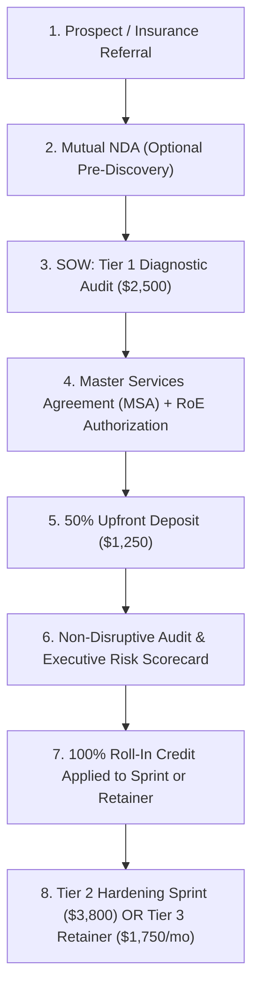

# Client Deliverables & Legal Templates
## Morrison Cyber Defense LLC: Operational Documentation

**Entity:** Morrison Cyber Defense LLC (Houston, TX)  
**Web & Identity:** [`https://morrisoncyber.org`](https://morrisoncyber.org) | `security@morrisoncyber.org`  
**Co-Founders:** Senior Partner (Principal Architect) & Keenan Morrison (Lead Systems Auditor, CompTIA Sec+/Net+/A+, WGU)  

---

## 📑 Master Legal Contracts & Deliverables Index

All client-facing agreements are drafted under Texas law (Harris County venue), incorporating our 5 non-negotiable liability shields, zero Net-30 terms, and the 100% Roll-In Credit mechanism:

| Category | Document Name | File Link | Focus & Operational Function |
| :--- | :--- | :--- | :--- |
| **Core Agreement** | Master Services Agreement (MSA) | [master_services_agreement_template.md](master_services_agreement_template.md) | Governing legal contract; 5 liability shields, limitation of liability, payment terms. |
| **Project Scope** | Statement of Work (SOW) — Audit & Sprint | [statement_of_work_template.md](statement_of_work_template.md) | Granular scope ($2,500 audit, 100% roll-in credit, $3,800 sprint), asset limits, milestones. |
| **Service Retainer** | Managed Security SLA | [managed_security_service_level_agreement_template.md](managed_security_service_level_agreement_template.md) | Tier 3 Retainer ($1,750–$2,500/mo); Huntress 24/7 SOC vs daytime advisory, 4 severity tiers. |
| **Pre-Testing Consent** | Testing Authorization & Rules of Engagement | [rules_of_engagement_and_testing_authorization_template.md](rules_of_engagement_and_testing_authorization_template.md) | CFAA (18 U.S.C. § 1030) & Texas Penal Code § 33.02 authorization; target asset boundaries. |
| **Crisis Protocol** | Incident Scope Limitation & Emergency Triage Addendum | [incident_response_scope_limitation_addendum_template.md](incident_response_scope_limitation_addendum_template.md) | Delineates DFIR vs advisory; pre-existing breach discovery; emergency $250/hr rate. |
| **Confidentiality** | Mutual Non-Disclosure Agreement (NDA) | [mutual_non_disclosure_agreement_template.md](mutual_non_disclosure_agreement_template.md) | TUTSA bilateral confidentiality; safeguards client findings and Morrison proprietary IP. |
| **Privacy / Health** | Data Processing & Business Associate Agreement (DPA / BAA) | [data_processing_and_business_associate_agreement_template.md](data_processing_and_business_associate_agreement_template.md) | Texas TDPSA compliance, HIPAA/HITECH BAA provisions, approved subprocessor disclosures. |
| **Package 1 Deliverable** | NIST CSF 2.0 Baseline Assessment Report | [nist_csf_baseline_assessment_template.md](nist_csf_baseline_assessment_template.md) | Diagnostic Audit deliverable: Executive Risk Matrix, Technical Backlog, 30-60-90 roadmap. |
| **Package 2 Deliverable** | M365 Cloud Defense Sprint Checklist | [m365_hardening_sprint_checklist.md](m365_hardening_sprint_checklist.md) | Hardening Sprint deliverable: 4-phase technical implementation & insurance attestation. |

---

### Contract Flow Architecture for New Engagements

---
[← Back to Main Repository Dashboard](../README.md)
