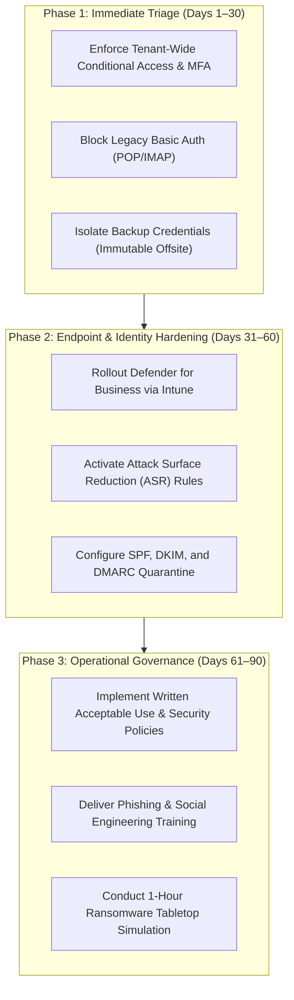

# Morrison Cyber Defense LLC
## Cybersecurity Baseline Assessment & Remediation Roadmap
### NIST Cybersecurity Framework (CSF) 2.0 Quick-Start Assessment

**Client Organization:** `[Client Business Name]`  
**Assessment Date:** `[Date]`  
**Practice:** Morrison Cyber Defense LLC | [`https://morrisoncyber.org`](https://morrisoncyber.org)  
**Principal Architect (Review & Sign-Off):** Senior Partner (Co-Founder), Morrison Cyber Defense LLC  
**Lead Technical Systems Auditor (Discovery & Evidence):** Keenan Morrison (Co-Founder, CompTIA Security+, Network+, A+)  
**Document Classification:** Confidential — Client Privileged Information  

---

## 1. Executive Summary

Morrison Cyber Defense LLC was engaged by `[Client Business Name]` to conduct a comprehensive, rapid-turnaround Cybersecurity Baseline Assessment aligned with the **NIST Cybersecurity Framework 2.0 (Small Business Quick-Start Tier)** and prevailing commercial cyber insurance underwriting standards.

### Overall Security Posture Rating: `[CRITICAL / AT RISK / MODERATE / HARDENED]`

```
+-------------------------------------------------------------------------------+
| Posture Score: [XX] / 100                                                     |
| Top Risk Drivers:                                                             |
| 1. [e.g., Missing MFA on 40% of user mailboxes and legacy IMAP active]        |
| 2. [e.g., Backups physically connected to local domain; vulnerable to crypt]  |
| 3. [e.g., Unsupported Windows 10 build with no centralized EDR monitoring]   |
+-------------------------------------------------------------------------------+
```

### Executive Verdict & Business Risk
If an attack occurred today, the organization faces an estimated recovery window of `[X to Y days]` and direct financial exposure from business email wire fraud, extortion demands, and operational halt. Implementing the 30-day prioritized roadmap below remediates **85% of total exploit vectors** with zero hardware reinvestment.

---

## 2. NIST CSF 2.0 Assessment Matrix

| CSF 2.0 Function | Current State Evaluation | Target Baseline | Gap Severity | Key Observation |
| :--- | :--- | :--- | :--- | :--- |
| **GOVERN (GV)** | `Ad-hoc / Informal` | Defined Policies | **HIGH** | No written Acceptable Use Policy or Employee Onboarding Security Standard. |
| **IDENTIFY (ID)** | `Partially Tracked` | Complete Asset Inventory | **MEDIUM** | Unknown rogue endpoints and unmanaged mobile devices accessing tenant. |
| **PROTECT (PR)** | `Fragmented` | Phishing-Resistant MFA & Intune | **CRITICAL** | Legacy basic authentication enabled; MFA bypass feasible via SMS fallback. |
| **DETECT (DE)** | `No Central Logging` | Unified Defender XDR | **CRITICAL** | No centralized alert aggregation; intrusion could dwell unnoticed for months. |
| **RESPOND (RS)** | `Unplanned` | 1-Page Incident Runbook | **HIGH** | No designated breach response team, legal counsel contact, or forensic hotline. |
| **RECOVER (RC)** | `Vulnerable Local Backups` | Air-Gapped / Immutable Cloud | **CRITICAL** | Backup repositories mapped to domain admin credentials; exposed to ransomware. |

---

## 3. Detailed Technical Findings

### Finding MCD-01: Inadequate Multi-Factor Authentication & Conditional Access
* **Severity:** `CRITICAL (CVSS 9.2 Equivalent)`
* **Evidence Collected By:** Keenan Morrison (Associate Analyst) via Microsoft Graph & Entra Admin Center
* **Architectural Review:** Senior Partner (Principal Architect)
* **Description:** Out of `[XX]` active user accounts, `[YY]` accounts do not enforce MFA. Furthermore, legacy authentication protocols (POP3/IMAP/SMTP Auth) remain enabled, allowing attackers to bypass MFA using credential stuffing.
* **Direct Business Risk:** Business Email Compromise (BEC), payroll redirection, fraudulent supplier wire transfers.
* **Remediation Action:** Enforce tenant-wide Conditional Access requiring Microsoft Authenticator with number matching. Block legacy authentication protocols immediately.

### Finding MCD-02: Absence of Enterprise Endpoint Detection & Response (EDR)
* **Severity:** `HIGH (CVSS 8.4 Equivalent)`
* **Description:** Workstations rely solely on consumer antivirus or unmanaged Windows Defender with signature updates lagging over 14 days.
* **Direct Business Risk:** Ransomware execution without automated isolation or memory-level behavioral detection.
* **Remediation Action:** Onboard all endpoints to Microsoft Defender for Business via Microsoft Intune; enforce attack surface reduction (ASR) rules.

### Finding MCD-03: Ransomware Exposure in Backup Architecture
* **Severity:** `CRITICAL (CVSS 9.5 Equivalent)`
* **Description:** Daily backup snapshots are stored on a local Synology NAS connected directly to the primary Active Directory domain with domain administrator credentials stored in memory.
* **Direct Business Risk:** Modern ransomware groups actively target and delete shadow copies and local backup repositories prior to encryption.
* **Remediation Action:** Separate backup authentication into dedicated out-of-band credentials; deploy immutable cloud-tiered storage (3-2-1-1-0 architecture).

---

## 4. Prioritized 30-60-90 Day Remediation Roadmap



---

## 5. Delivery Verification & Sign-Off

This report has undergone two-tier review in accordance with Morrison Cyber Defense operational standards. Data discovery and baseline technical testing were performed by the Associate Analyst; all risk ratings, architectural findings, and strategic recommendations were audited and approved by the Principal Cybersecurity Architect.

**Technical Analyst:**  
Keenan Morrison, Associate Cybersecurity Analyst  
Certifications: CompTIA A+, Network+, Security+  

**Architectural Sign-Off:**  
Senior Partner, Principal Cybersecurity Architect  
Morrison Cyber Defense LLC  
Signature: `______________________________________` Date: `____________`
