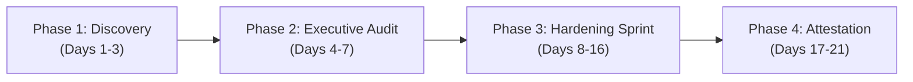

# Statement of Work (SOW)
## Microsoft 365 Diagnostic Baseline Audit & Defense Hardening Sprint

**SOW Tracking ID:** `MCD-SOW-[YYYYMMDD]-[ClientCode]`  
**Governing Master Agreement:** Master Services Agreement ("MSA") dated `[MSA Effective Date]`  
**Provider:** Morrison Cyber Defense LLC (Houston, TX) | `security@morrisoncyber.org`  
**Client:** `[Client Legal Entity Name]`  
**Effective Date:** `[Engagement Start Date]`  
**Estimated Completion Date:** `[Engagement Target Completion Date, typically 14–21 calendar days from start]`  

---

### 1. Engagement Executive Summary & Objectives

1.1 **Purpose:** Client engages Morrison Cyber Defense LLC ("MCD") to perform an objective, third-party Microsoft 365 security configuration audit, evaluate cloud tenant posture against federal benchmarks and cyber insurance underwriting criteria, and execute a high-impact technical defense hardening sprint.

1.2 **Primary Business Objectives:**
* **Cyber Insurance Readiness:** Eliminate common carrier declination triggers (e.g., missing phishing-resistant MFA, permissive email routing, legacy authentication).
* **Identity Defense & Credential Shielding:** Secure Entra ID with risk-based Conditional Access policies and least-privilege administrative roles.
* **Email & Domain Hardening:** Enforce strict SPF, DKIM, and DMARC (`p=reject`) policies to prevent executive impersonation and wire transfer fraud.
* **Endpoint Telemetry & Rapid Containment:** Deploy and validate 24/7 endpoint detection and response (Huntress Managed EDR) across all core corporate workstations.

---

### 2. In-Scope Asset Limits & Environment Boundaries

To ensure rigorous execution and prevent scope creep, this Statement of Work is strictly limited to the following technical asset inventory:

| Asset Category | In-Scope Asset Limit | Specific Target Identifiers |
| :--- | :--- | :--- |
| **Primary Cloud Tenant** | Exactly One (1) Production Tenant | `[clientcompany.onmicrosoft.com]` |
| **Primary Domain(s)** | Up to Two (2) Registered Domains | `[clientcompany.com, clientgroup.com]` |
| **Active User Mailboxes** | Up to Fifty (50) User Accounts | Entra ID Licensed Users |
| **Privileged Admin Accounts** | Up to Five (5) Global/Role Admins | All administrative tiers |
| **Managed Endpoints** | Up to Twenty-Five (25) Workstations | Windows 10/11 & macOS endpoints |

> [!WARNING]
> **Out-of-Scope Assets & Infrastructure (Strictly Excluded):**
> * Legacy On-Premise Active Directory Domain Services (AD DS) / hybrid sync infrastructure (unless scoped via separate hybrid addendum).
> * Operational Technology (OT), SCADA, job-site telemetry, heavy machinery networks, and HVAC/BMS controllers.
> * Custom in-house application source code auditing or dynamic application pen-testing (DAST).
> * Litigation-grade digital forensics or certified law-enforcement chain of custody.

---

### 3. Phased Implementation & Deliverables Schedule

This engagement is structured across four (4) sequential, non-disruptive phases:

#### Phase 1: Non-Disruptive Tenant Discovery & Baseline Harvesting (Days 1–3)
* Execution of pre-engagement Rules of Engagement (RoE) and authorization.
* Automated, read-only extraction of tenant configurations using CISA ScubaGear, Microsoft Graph, and CIPP.app.
* DNS record inspection (SPF, DKIM public keys, DMARC alignment, MX security).
* Verification of existing endpoint protection agents and OS patch baselines.

#### Phase 2: Executive Gap Analysis & Cyber Insurance Scorecard (Days 4–7)
* Mapping tenant posture against NIST CSF 2.0 categories and CIS Microsoft 365 Foundations Benchmark v3.0.
* Generation of the **Executive Cybersecurity Risk Report & Insurance Scorecard** (identifying coverage vulnerabilities, wire fraud exposures, and account takeover vectors).
* Executive Briefing Meeting: 45-minute structured presentation with Client executive leadership to review findings, risk heat map, and remediation priorities.

#### Phase 3: Technical Defense Hardening Sprint (Days 8–16)
* **Entra ID & Access Control:** Deprecate legacy basic authentication protocols (IMAP/POP3/SMTP Auth); enforce MFA across 100% of user population; deploy hardened Conditional Access templates.
* **Privileged Identity Protection:** Transition administrators to dedicated secondary cloud-only admin accounts with FIDO2 hardware key enforcement or Microsoft Authenticator number matching.
* **Email & Exchange Security:** Configure DKIM signing across all active outbound domains; elevate DMARC policy towards `p=reject`; disable unapproved external mailbox auto-forwarding rules.
* **SharePoint & OneDrive Data Guardrails:** Disable anonymous link sharing; configure basic DLP rules preventing credit card, SSN, and banking data exfiltration.
* **Endpoint Telemetry Onboarding:** Install and verify Huntress Managed EDR + Managed Defender telemetry across up to 25 target endpoints.

#### Phase 4: Validation & Formal Insurance Attestation (Days 17–21)
* Post-hardening delta scan verifying 100% closure of critical and high-priority gaps.
* Formal **Cyber Insurance Underwriting Attestation Letter** signed by Senior Partner (Principal Architect), certifying implemented controls for presentation to Client's insurance broker.
* Project closeout briefing and handover of operational documentation.

---

### 4. Commercial Terms, Packaging & 100% Roll-In Credit

4.1 **Selected Service Package(s):** *(Check all applicable)*

* [ ] **Tier 1: Diagnostic Baseline Audit & Insurance Scorecard:** **$2,500.00 Fixed Fee**  
  * Includes Phase 1, Phase 2, and the Executive Risk Report & 30-Day Remediation Roadmap.  
  * *Special Provision (100% Roll-In Credit):* If Client engages Contractor for the Tier 2 Hardening Sprint or Tier 3 Monthly Stewardship Retainer within thirty (30) days of audit delivery, 100% of this $2,500.00 audit fee is credited directly against the subsequent engagement.

* [ ] **Tier 2: Microsoft 365 Cloud Defense Hardening Sprint:** **$3,800.00 Fixed Fee** *(or $1,300.00 net after Roll-In Credit)*  
  * Includes Phase 3 technical remediation and Phase 4 formal insurance attestation letter.

* [ ] **Full Turnkey Package (Tier 1 + Tier 2 Combined):** **$5,000.00 Fixed Fee** *(Packaged savings of $1,300.00)*

4.2 **Payment Schedule:**
* **Initial Deposit:** 50% upon mutual execution of this SOW prior to scheduling discovery ($1,250.00 for Tier 1; $2,500.00 for Full Turnkey).
* **Completion Milestone:** 50% balance due immediately upon delivery of the final executive report or completion of Phase 4 closeout briefing.
* **Payment Method:** Automated Clearing House (ACH) or corporate credit card via Contractor’s secure accounting portal. Strictly zero Net-30 terms.

---

### 5. Client Responsibilities & Dependencies

5.1 **Administrative Credentials:** Client shall provision temporary, least-privilege administrative access to MCD personnel within two (2) business days of SOW execution.

5.2 **Internal IT / Managed Service Provider Coordination:** If Client utilizes an incumbent IT service provider or internal systems administrator, Client shall notify said party in writing of MCD’s engagement and instruct them to cooperate fully with reasonable technical inquiries.

5.3 **Mandatory Backup Verification:** In accordance with Section 4.5 of the MSA, Client expressly certifies that all cloud mailboxes, OneDrive/SharePoint files, and local workstation data have been fully backed up prior to the commencement of Phase 3 configuration changes.

---

### 6. Change Order Process & Out-of-Scope Rates

6.1 **Scope Additions:** If Client requests expansion of the asset limits (e.g., additional domains, mailboxes exceeding 50, endpoints exceeding 25), or requests services beyond the explicit scope herein, Contractor shall submit a written Change Order specifying the additional cost and schedule impact.

6.2 **Hourly Advisory Rate:** Out-of-scope technical consulting, custom PowerShell automation, or end-user desk-side assistance shall be billed at Contractor’s standard consulting rate of **$175.00 per hour**, pre-authorized by Client in writing.

6.3 **Emergency Incident Discovery:** If active malicious intrusion is identified during testing, work immediately transfers to the Emergency Incident Triage protocol at **$250.00 per hour** as set forth in the MSA and Incident Response Scope Limitation Addendum.

---

### 7. Signatures & Authorization

By signing below, the parties confirm that they have read, understand, and agree to this Statement of Work and the governing Master Services Agreement.

**FOR CLIENT:**  
**`[Client Legal Entity Name]`**  

Signature: `________________________________________________`  
Printed Name: `________________________________________`  
Title: `_______________________________________________`  
Date: `________________________`  

**FOR SERVICE PROVIDER:**  
**Morrison Cyber Defense LLC**  

Signature: `________________________________________________`  
Printed Name: Senior Partner  
Title: Principal Cybersecurity Architect  
Date: `________________________`
