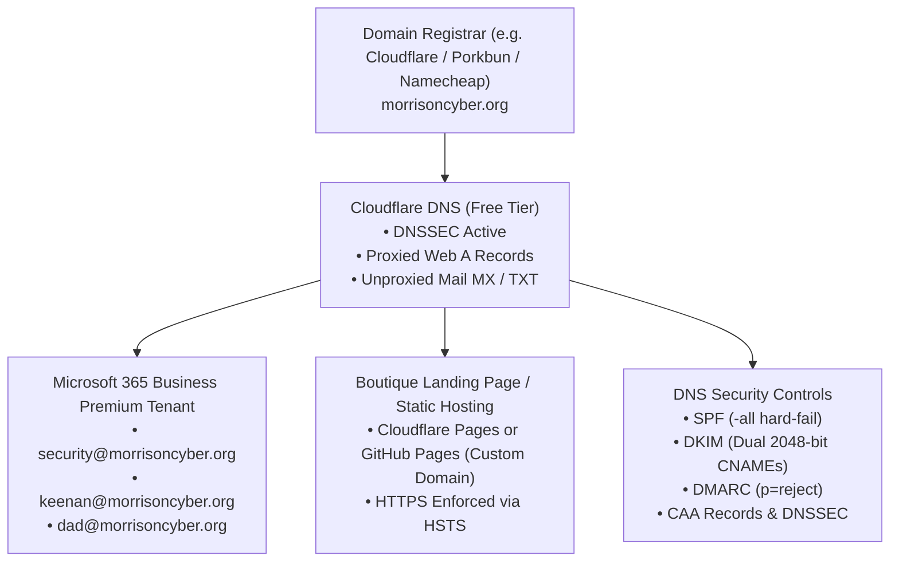

# Morrison Cyber Defense LLC
## `morrisoncyber.org` Domain Setup, DNS Architecture & Security Hardening Guide

**Target Domain:** `morrisoncyber.org`  
**Purpose:** Corporate Identity, Microsoft 365 Tenant Federation, Inbound/Outbound Email Deliverability, and Public Web Landing Page  
**Architectural Standard:** 100/100 Mail Deliverability Score & Zero Email Spoofing Surface  

---

## 1. Why Perfect Domain Hygiene Is Non-Negotiable

As a cybersecurity advisory practice selling Microsoft 365 defense and email security to Houston businesses, **`morrisoncyber.org` is your public technical proof of competence**. 

Commercial clients, IT Directors, and insurance brokers will inspect your domain on MXToolbox or DMARCian before hiring you. Furthermore, strict SPF/DKIM/DMARC alignment is mandatory to prevent your cold outreach emails from being quarantined by Google Workspace or Microsoft 365 spam filters.

---

## 2. Complete DNS Record Configuration Table

Configure these records in your authoritative DNS manager (Cloudflare DNS is strongly recommended for instant propagation, free DNSSEC, and automated SSL):

### A. MX (Mail Exchanger) Record
| Type | Name / Host | Priority | Target / Value | TTL |
| :--- | :--- | :--- | :--- | :--- |
| **MX** | `@` (or `morrisoncyber.org`) | `0` | `morrisoncyber-org.mail.protection.outlook.com` | Auto / 3600 |

*(Note: Verify your exact MX target inside Microsoft 365 Admin Center > Settings > Domains).*

---

### B. SPF (Sender Policy Framework) Record
Prevents unauthorized servers from sending mail pretending to be from `@morrisoncyber.org`.

| Type | Name / Host | Target / Value |
| :--- | :--- | :--- |
| **TXT** | `@` | `v=spf1 include:spf.protection.outlook.com -all` |

> [!IMPORTANT]
> The `-all` flag indicates a **hard fail**. Any mail sent from servers not explicitly authorized in this SPF record will be rejected by recipient mail servers. Never use `~all` (soft fail) in production for a cybersecurity firm.

---

### C. DKIM (DomainKeys Identified Mail) Dual CNAME Records
Cryptographically signs every outbound message. Microsoft 365 requires two separate CNAME selector records:

| Type | Name / Host | Target / Value |
| :--- | :--- | :--- |
| **CNAME** | `selector1._domainkey` | `selector1-morrisoncyber-org._domainkey.morrisoncyber.onmicrosoft.com` |
| **CNAME** | `selector2._domainkey` | `selector2-morrisoncyber-org._domainkey.morrisoncyber.onmicrosoft.com` |

*Step to activate:* After publishing these DNS CNAME records, navigate to:  
`Microsoft Defender Portal > Policies & rules > Threat Policies > Email authentication settings > DKIM`  
Select `morrisoncyber.org` and toggle **Enable**.

---

### D. DMARC (Domain-based Message Authentication, Reporting & Conformance)
Instructs recipient mail servers to outright reject any message failing SPF/DKIM validation.

| Type | Name / Host | Target / Value |
| :--- | :--- | :--- |
| **TXT** | `_dmarc` | `v=DMARC1; p=reject; pct=100; rua=mailto:dmarc-reports@morrisoncyber.org; adkim=s; aspf=s` |

* **`p=reject`**: Instructs receiving mail servers (Google, Outlook, Yahoo) to drop fraudulent emails immediately.
* **`adkim=s; aspf=s`**: Strict alignment for both DKIM and SPF.
* **`rua`**: Sends daily XML aggregate delivery reports to your tracking mailbox.

---

### E. DNSSEC & CAA Records (DNS Tampering & Certificate Protection)
* **DNSSEC (DNS Security Extensions):** Enable in Cloudflare with 1-click. Adds cryptographic signatures to your DNS queries, preventing DNS poisoning / cache spoofing.
* **CAA (Certificate Authority Authorization):** Restricts which CAs can issue SSL/TLS certificates for `morrisoncyber.org` (e.g. Let's Encrypt / DigiCert):

| Type | Name / Host | Flag | Tag | Value |
| :--- | :--- | :--- | :--- | :--- |
| **CAA** | `@` | `0` | `issue` | `"letsencrypt.org"` |
| **CAA** | `@` | `0` | `issue` | `"digicert.com"` |
| **CAA** | `@` | `0` | `iodef` | `"mailto:security@morrisoncyber.org"` |

---

## 3. Microsoft 365 Mailbox & Alias Architecture

Set up your internal accounts with proper separation of roles:

| User / Mailbox | Type | Purpose | Forwarding / Access |
| :--- | :--- | :--- | :--- |
| `security@morrisoncyber.org` | **Shared Mailbox** (Free - No License) | Central client intake, questionnaires, assessments, incident alerts | Father & Keenan both have Full Access + Send As permissions. |
| `keenan@morrisoncyber.org` | Licensed User (M365 Business Premium) | Keenan’s primary professional email & Entra ID account | Named account with FIDO2 / Authenticator MFA. |
| `[father]@morrisoncyber.org` | Licensed User (M365 Business Premium) | Senior Partner’s executive email & administrative account | Named account with FIDO2 / Authenticator MFA. |
| `dmarc-reports@morrisoncyber.org` | Shared Mailbox / Alias | Ingestion of daily XML DMARC aggregate reports | Filtered to folder or connected to DMARC Analyzer (e.g. Postmark DMARC / Cloudflare DMARC). |

---

## 4. Web Presence & Minimalist High-Authority Landing Page

A boutique cybersecurity consultancy does not need a complex 50-page WordPress website that requires continuous patching. In fact, WordPress plugins are a common attack vector!

### Recommended Web Architecture:
* **Static Single-Page Architecture:** Built with simple HTML/Tailwind CSS or Astro.
* **Hosting:** **Cloudflare Pages** or **GitHub Pages** (free, global edge CDN, zero server maintenance, DDoS immune).
* **Core Page Sections:**
  1. **Headline:** *"Senior-Led Cybersecurity Architecture & Microsoft 365 Cloud Defense for Houston Commercial Enterprises."*
  2. **The Problem:** Cyber insurance renewal panics, FTC Safeguards / HIPAA compliance, and upstream vendor audits.
  3. **The 3 Core Offerings:**
     - 10-Day Diagnostic Posture & Risk Audit ($2,500+)
     - 2-Week M365 Cloud Defense Sprint ($3,800+)
     - Monthly Security Stewardship Retainer ($1,750/mo+)
  4. **The Leadership:** Father (Principal Architect, 20+ years enterprise governance) & Keenan Morrison (Lead Technical Systems Auditor, CompTIA Sec+/Net+/A+).
  5. **Call to Action:** *"Book a 15-Minute Cyber Insurance Questionnaire Review."* (Connected to Cal.com or Microsoft Bookings).
  6. **Security Footer:** Displaying active SPF/DKIM/DMARC badge and Houston, Texas location.

---

## 5. Pre-Outreach Domain Warm-Up Protocol

If you immediately send 50 cold emails per day from a brand-new domain (`morrisoncyber.org`), spam filters will flag the domain as suspicious.

### 14-Day Warm-Up Rules:
1. **Week 1:** Send only 5 to 10 normal business emails per day to people you know (family, colleagues, personal inboxes). Reply to those threads to establish healthy sender reputation.
2. **Week 2:** Ramp to 15 to 25 emails per day. Ensure DKIM and DMARC have 100% pass rates on [Mail-Tester.com](https://www.mail-tester.com).
3. **Register Domain in Postmaster Tools:**
   * Register `morrisoncyber.org` in **Google Postmaster Tools** to monitor spam complaint rates.
   * Register in **Microsoft Smart Network Data Services (SNDS)**.
4. **Never send unsolicited mass bulk blasts:** Send personalized, one-to-one cold emails using the battlecards in [`houston_mssp_sales_playbook.md`](file:///home/keenan/Projects/MorrisonCyberDefense/sales-and-gtm/houston_mssp_sales_playbook.md).
