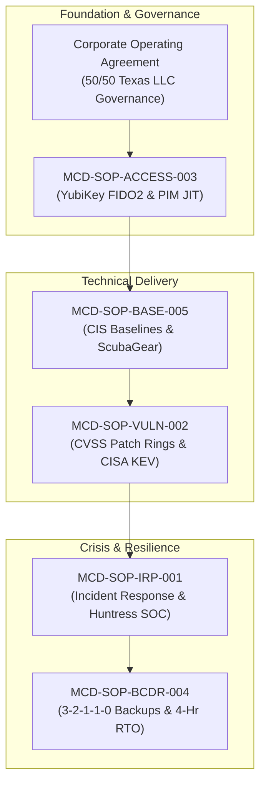

# Internal Policies & Standard Operating Procedures (SOPs)
## Morrison Cyber Defense LLC: Quality & Security Baselines

**Entity:** Morrison Cyber Defense LLC (Houston, TX)  
**Classification:** Internal Operating Standard  
**Governing Frameworks:** NIST CSF 2.0, NIST SP 800-61, NIST SP 800-40, CIS Controls v8, CISA CPGs  
**Practice Leads:** Keenan Morrison (Lead Systems Auditor) & Senior Partner (Principal Architect)  

---

## 📑 SOP Master Directory

The following standardized internal policies and operational runbooks govern all technical execution, client infrastructure management, and internal operational security:

| Document Code | Policy Name | File Link | Focus & Operational Function |
| :--- | :--- | :--- | :--- |
| **MCD-SOP-IRP-001** | Incident Response Plan (IRP) | [incident_response_plan.md](incident_response_plan.md) | 6-phase triage runbooks, Sev 1–4 matrix, Huntress 24/7 SOC bridge, Texas breach notice rules. |
| **MCD-SOP-VULN-002** | Vulnerability & Patch Management | [vulnerability_and_patch_management_policy.md](vulnerability_and_patch_management_policy.md) | CVSS SLAs, CISA KEV 24-hr mandate, phased deployment rings (Ring 0/1/2), reboot controls. |
| **MCD-SOP-ACCESS-003**| Access Control & Zero-Trust SOP | [access_control_and_zero_trust_sop.md](access_control_and_zero_trust_sop.md) | FIDO2 YubiKey enforcement on admin consoles, PIM JIT elevation, 8-hr timeouts, break-glass vault. |
| **MCD-SOP-BCDR-004** | Business Continuity & Disaster Recovery | [business_continuity_and_disaster_recovery_plan.md](business_continuity_and_disaster_recovery_plan.md) | 3-2-1-1-0 backup architecture, 4-hr RTO/RPO targets, tenant restoration, hurricane plan. |
| **MCD-SOP-BASE-005** | Secure Configuration Baselines | [secure_configuration_baselines.md](secure_configuration_baselines.md) | CIS M365 Foundations v3.0, CISA CPGs, Conditional Access policies, ScubaGear PowerShell commands. |

---

### Key Operational Architecture

---
[← Back to Main Repository Dashboard](../README.md)
