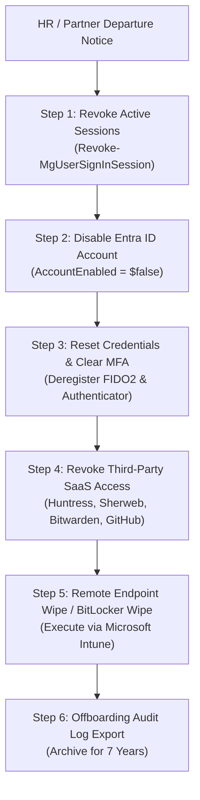

# Access Control & Zero-Trust Standard Operating Procedure (SOP)
## Morrison Cyber Defense LLC

**Document Control:** `MCD-SOP-ACCESS-003`  
**Classification:** Internal Confidential / Standard Operating Procedure  
**Effective Date:** October 1, 2026  
**Governing Standards:** NIST SP 800-207 (Zero Trust Architecture) & CISA Zero Trust Maturity Model v2.0  
**Policy Owners:** Senior Partner (Principal Architect) & Keenan Morrison (Lead Systems Auditor)  

---

### 1. Zero-Trust Core Architecture & Principles

Morrison Cyber Defense LLC strictly enforces the three foundational pillars of Zero Trust across all internal operations and client environments:
1. **Explicit Verification:** Always authenticate and authorize based on all available data points (identity, location, device health, service or workload, data classification, and anomalies).
2. **Least-Privilege Access:** Limit user access with Just-In-Time (JIT) and Just-Enough-Access (JEA), risk-based adaptive policies, and data protection.
3. **Assume Breach:** Minimize blast radius by segmenting access by network, user, devices, and application awareness. Encrypt all sessions end-to-end.

---

### 2. Mandatory Hardware FIDO2 Multi-Factor Authentication

2.1 **Hardware Security Key Mandate:** Phishing-resistant hardware security keys (YubiKey 5C NFC / YubiKey 5 NFC) implementing FIDO2 / WebAuthn standards are **mandatory** for all administrative access across the following core platforms:

```
┌────────────────────────────────────────────────────────────────────────┐
│ MANDATORY YUBIKEY FIDO2 HARDWARE ENFORCEMENT PORTALS                   │
│ 1. Microsoft Entra ID (Global Admin, Privileged Role Admin)           │
│ 2. Sherweb Cloud Solutions Provider (CSP) Partner Center               │
│ 3. Huntress Labs Partner Management Portal                             │
│ 4. Cloudflare DNS, DNSSEC & Zero Trust Dashboard                       │
│ 5. GitHub Organization & Production Code Repositories                  │
│ 6. Enterprise Secrets Vault (Bitwarden Teams / 1Password)              │
│ 7. Commercial Banking & Payroll Portals (Amegy / Frost Bank)           │
└────────────────────────────────────────────────────────────────────────┘
```

2.2 **Prohibited Authentication Methods:**
* **SMS & Voice MFA:** Strictly prohibited due to SS7 vulnerabilities, SIM-swapping, and interception risks.
* **Basic Push Notifications without Number Matching:** Prohibited to eliminate MFA fatigue / prompt-bombing attacks.

2.3 **Key Redundancy Architecture (2+2 Strategy):**
* **Primary Key:** Kept on founder person / keychain for daily administrative authentication.
* **Vaulted Backup Key:** Second pre-registered YubiKey stored in a fireproof, biometric safe as an immediate disaster replacement to prevent account lockouts.

---

### 3. Administrative Account Separation & Privileged Identity Management (PIM)

3.1 **Separation of Standard and Privileged Accounts:**
* Founders and technicians must **never** conduct web browsing, email correspondence, or routine tasks from an administrative account.
* Every technician holds two distinct identities:
  * `first.last@morrisoncyber.org` (Standard User — M365 Business Premium, email, Teams, no tenant admin rights).
  * `admin.first.last@morrisoncyber.org` (Dedicated Admin — Cloud-only, zero email license, high-privilege directory roles).

3.2 **Privileged Identity Management (PIM) & JIT Elevation:**
* High-privilege roles (Global Administrator, Exchange Administrator, Intune Administrator) must not be permanently assigned.
* Technicians must activate roles via Entra ID PIM with mandatory MFA re-authentication and business ticket justification.
* **Maximum Activation Window:** PIM role activations expire automatically after a maximum of **eight (8) hours**.

3.3 **Break-Glass Emergency Accounts (Emergency Access):**
* The firm maintains exactly two (2) cloud-only emergency break-glass Global Admin accounts (`mcd-breakglass-01` and `mcd-breakglass-02`).
* Excluded from Conditional Access policies to prevent lockout during identity provider outages.
* Secured with 36-character randomly generated passwords stored in tamper-evident physical safes.
* Automated high-priority alerts notify both founders via SMS, Proton Mail, and Huntress immediately upon any sign-in attempt.

---

### 4. Session Lifetime & Workstation Lockout Controls

4.1 **Administrative Session Limits:**
* Web session lifetimes for all administrative portals are capped at **eight (8) hours**, requiring full re-authentication with hardware key.
* Non-persistent browser sessions enforced on all administrative portals (no "Stay signed in?" persistent cookies).

4.2 **Endpoint Screen Lockout:**
* Workstation inactivity lock timer is enforced via Microsoft Intune configuration profile set to exactly **fifteen (15) minutes**.
* Re-authentication requires Windows Hello for Business (PIN + Biometric) or YubiKey insertion.

---

### 5. Onboarding & Immediate Offboarding Runbook



* **Immediate Offboarding SLA:** Complete deprovisioning must be executed within **sixty (60) minutes** of departure notice.
* **BitLocker Remote Wipe:** Remote wipe initiated via Intune on all corporate-managed endpoints upon confirmed termination.

---

### 6. Clean Administrative Hardware SOP

All administrative and diagnostic engineering work must be conducted exclusively from hardened corporate-issued laptops (Lenovo ThinkPad fleet):
* Full disk encryption enforced via **BitLocker (XTS-AES 256-bit)** with TPM 2.0 validation.
* Local Administrator password randomized via **Windows LAPS**.
* Core isolation, Memory Integrity (HVCI), and Secure Boot permanently enabled in UEFI BIOS.
* All outbound administrative traffic routed through Cloudflare Zero Trust / WireGuard encrypted tunnels.
