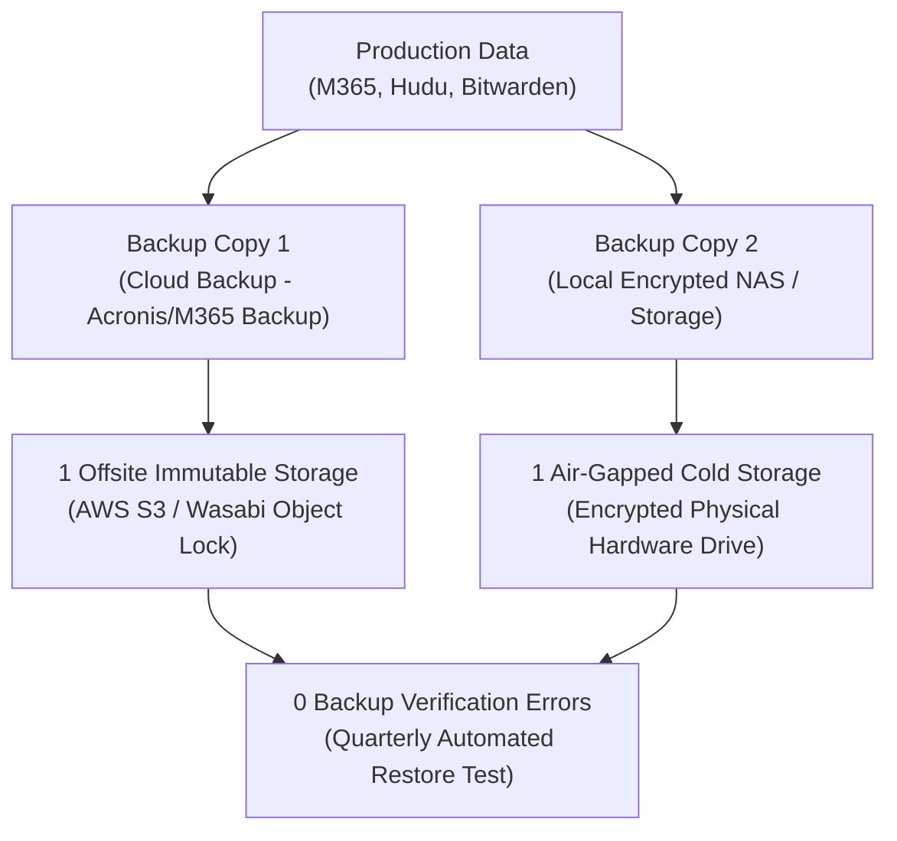

# Business Continuity & Disaster Recovery Plan (BCDR)
## Morrison Cyber Defense LLC

**Document Control:** `MCD-SOP-BCDR-004`  
**Classification:** Internal Confidential / Standard Operating Procedure  
**Effective Date:** October 1, 2026  
**Governing Standards:** NIST SP 800-34 Rev. 1 (Contingency Planning Guide for Federal Information Systems) & ISO 22301  
**Executive Leads:** Senior Partner (Principal Architect) & Keenan Morrison (Lead Systems Auditor)  

---

### 1. Recovery Objectives & Resilience Principles

To guarantee business survival and seamless client defense during physical catastrophes or catastrophic cyber events, Morrison Cyber Defense LLC ("MCD") establishes the following operational recovery targets:

* **Recovery Time Objective (RTO):** **Four (4) Hours** — Maximum acceptable elapsed time from formal disaster declaration until core communication, ticketing, and telemetry monitoring are fully operational.
* **Recovery Point Objective (RPO):** **Four (4) Hours** — Maximum allowable data loss window for transactional logs, tickets, and technical documentation.

---

### 2. The 3-2-1-1-0 Modern Backup Architecture

MCD enforces the enhanced 3-2-1-1-0 data resilience architecture across both internal operations and managed client environments:

* **3 Copies of Data:** Primary production tenant + Two (2) discrete backup copies.
* **2 Different Media:** Cloud-to-cloud automated snapshots + Encrypted local storage.
* **1 Offsite Location:** Geographically separated cloud datacenter outside the Texas Gulf Coast hurricane basin (e.g., US-East or US-West).
* **1 Immutable or Air-Gapped Copy:** Write-Once-Read-Many (WORM) Object Lock enabled; mathematically protected against ransomware encryption or malicious deletion even by a compromised Global Admin.
* **0 Backup Errors:** Regular scheduled restoration verification confirming zero data corruption.

---

### 3. Internal MCD Systems Continuity Specifications

| System / Asset | Primary Platform | Backup & Redundancy Mechanism | RTO | RPO |
| :--- | :--- | :--- | :--- | :--- |
| **Email & Identity** | Microsoft 365 (Entra ID, Exchange) | Acronis Cyber Protect Cloud-to-Cloud Backup + Proton Mail OOB fallback | 2 Hours | 4 Hours |
| **Documentation & Secrets** | Hudu IT Documentation + Bitwarden Teams | Daily automated AES-256 encrypted database export stored in immutable cloud bucket | 1 Hour | 24 Hours |
| **Code & Script Baselines** | GitHub Private Repositories | Secondary encrypted Git mirror on local encrypted NVMe storage + offsite replica | 30 Mins | 1 Hour |
| **Ticketing & Client PSA** | HaloPSA / Cloud PSA | Continuous vendor multi-region high availability (99.99% SLA) + weekly CSV data export | 4 Hours | 24 Hours |
| **Client Telemetry & MDR** | Huntress Labs Management Console | Distributed cloud architecture managed by Huntress across AWS multi-region infrastructure | 1 Hour | Real-Time |

---

### 4. Disaster Recovery Scenarios & Execution Runbooks

#### Scenario A: Catastrophic Cloud Tenant Compromise / Data Deletion
1. **Declare Disaster:** Incident Commander declares formal disaster state; all standard client notifications transfer to Proton Mail OOB channels.
2. **Engage Break-Glass Access:** Activate emergency cloud break-glass admin accounts stored in biometric vault.
3. **Isolate Compromised Tenant:** Block all inbound external federation and revoke all user authentication sessions.
4. **Initiate Immutable Restore:** Log into Acronis Cyber Protect cloud console via hardware YubiKey; initiate point-in-time bare-metal restoration of Exchange mailboxes, SharePoint document libraries, and Intune configuration profiles from the pre-infection immutable snapshot.
5. **Re-Validate Baselines:** Run automated CIPP.app / ScubaGear audits to verify tenant clean state before releasing users.

#### Scenario B: Physical Laptop Loss / Hardware Destruction
1. **Remote Wipe:** Instantly issue BitLocker remote wipe command from Microsoft Intune console to cryptographically shred all local data on the lost device.
2. **Provision Spare ThinkPad:** Unbox pre-configured standby Lenovo ThinkPad from physical corporate inventory.
3. **Hardware Key Re-Registration:** Insert secondary vaulted YubiKey 5 NFC; authenticate to Microsoft Entra ID via Windows Autopilot.
4. **Automated Provisioning:** Intune automatically downloads and enforces full compliance profile, BitLocker 256-bit encryption, Huntress agent, and browser certificates within **forty-five (45) minutes**.

#### Scenario C: Severe Regional Disaster (Gulf Coast Hurricane / Grid Failure)
1. **Power & Network Redundancy:** Operational centers maintain secondary satellite internet (Starlink) and portable battery backup generators.
2. **Remote Failover:** Senior Partner or designated secondary technical lead executes remote operations outside the Houston weather event zone.
3. **Client Proactive Notification:** Issue broadcast advisory informing all retainer clients that 24/7 nocturnal monitoring remains 100% active via Huntress distributed SOC.

---

### 5. Annual BCDR Simulation & Verification Schedule

* **Semi-Annual Tabletop Exercise:** Both co-founders execute a simulated ransomware and data loss crisis scenario in Q1 and Q3 of each calendar year.
* **Quarterly Restore Drill:** Keenan Morrison executes a test restoration of a sample 10GB mailbox and SharePoint document repository to confirm integrity and timing.
* **Documentation Review:** Plan reviewed and certified annually by Senior Partner.
