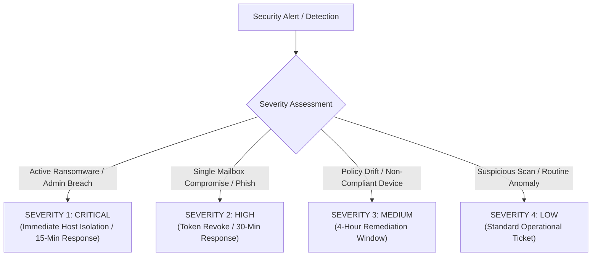

# Incident Response Plan (IRP) & Operational Runbooks
## Morrison Cyber Defense LLC

**Document Control:** `MCD-SOP-IRP-001`  
**Classification:** Internal Confidential / Standard Operating Procedure  
**Effective Date:** October 1, 2026  
**Governing Standard:** NIST SP 800-61 Rev. 2 (Computer Security Incident Handling Guide)  
**Primary Escalation Leads:** Senior Partner (Principal Architect) & Keenan Morrison (Lead Systems Auditor)  

---

### 1. Purpose, Scope & Team Roles

1.1 **Purpose:** This Incident Response Plan establishes authoritative procedures for detecting, triaging, containing, eradicating, and recovering from cybersecurity incidents affecting Morrison Cyber Defense LLC ("MCD") internal systems, and provides standard escalation runbooks for client environments under management.

1.2 **Incident Response Team (IRT) Roster:**

| Role | Primary Assigned Personnel | Operational Responsibilities |
| :--- | :--- | :--- |
| **Incident Commander & Legal Liaison** | **Senior Partner** (Principal Architect) | Overall incident authority, executive communications, cyber insurance carrier notification, breach legal counsel coordination. |
| **Technical Lead & Forensic Triage** | **Keenan Morrison** (Lead Systems Auditor) | Technical log analysis, Huntress isolation validation, PowerShell script execution, IOC hunting, baseline verification. |
| **24/7 Threat Hunting & Isolation Backstop** | **Huntress Labs Managed SOC** | Automated 24/7/365 process termination, machine-speed host network isolation, identity threat notification. |
| **Specialized Outside Breach Counsel** | Outside Retained Privacy Attorney | Attorney-client privilege protection, regulatory notification guidance (Texas AG, OCR). |

1.3 **Mandatory Out-of-Band (OOB) Communications:**
> [!CAUTION]
> If a cloud tenant, email service, or network is suspected of compromise, **NEVER** communicate regarding the incident using corporate Microsoft 365 Exchange, Teams, or Outlook. Threat actors routinely monitor internal IT mailboxes and chat channels once inside.
> * **Primary OOB Email:** Proton Mail encrypted accounts (`morrisoncyber-emergency@proton.me`).
> * **Primary OOB Voice / Chat:** Signal end-to-end encrypted messaging group.

---

### 2. Incident Classification & Severity Matrix

Every alert or detected anomaly must be triaged immediately into one of four severity levels:



| Severity | Criteria & Threat Examples | SLA Target | Required Escalation Actions |
| :--- | :--- | :--- | :--- |
| **Sev 1: Critical** | Active ransomware deployment, tenant-wide administrative takeover, massive unauthorized data exfiltration, active domain controller compromise. | **< 15 Mins** | Huntress machine isolation; IRT mobilizes; OOB comms engaged; Client CEO/Legal contacted; insurer notified. |
| **Sev 2: High** | Verified Business Email Compromise (BEC), unauthorized inbox forwarding rule, active token replay attempt, single workstation malware execution. | **< 30 Mins** | Revoke user sessions; reset credentials; host isolated; investigate inbox rule history. |
| **Sev 3: Medium** | Device encryption disabled, legacy auth attempt logged, repeated failed admin logins from anomalous geolocation, non-compliant mobile device. | **< 4 Hours** | Conditional Access policy audit; investigate sign-in logs; re-enforce baseline. |
| **Sev 4: Low** | Unsuccessful external port scan, spam campaign blocked by Defender, routine low-confidence threat alert. | **< 8 Hours** | Log incident in PSA; standard operational review during business hours. |

---

### 3. The 6-Phase Incident Handling Lifecycle


#### Phase 1: Preparation
* Hardware FIDO2 YubiKeys enforced on all administrative access.
* Pre-deployed Huntress MDR agents on all endpoints and M365 tenants.
* Offline immutable backups of critical tenant policies and server images.
* Pre-printed hard copies of this IRP stored in secure physical founder vaults.

#### Phase 2: Detection & Analysis
* Aggregate indicators from Huntress MDR, Defender for Cloud Apps, Entra ID Sign-In logs, and Microsoft Unified Audit Log (UAL).
* Determine scope: Impacted user accounts, IP addresses, affected workstations, and timestamps.
* Preserve log integrity: Do not reboot machines prior to volatile RAM capture if certified forensics are required.

#### Phase 3: Containment (Stop the Bleed)
* **Endpoint Containment:** Execute Huntress Host Isolation (restricts all network traffic except Huntress C2).
* **Identity Containment:** Execute immediate session revocation and password scramble:
  ```powershell
  # Emergency Entra ID Session Revocation & Password Invalidation
  Revoke-MgUserSignInSession -UserId $CompromisedUserUPN
  Update-MgUser -UserId $CompromisedUserUPN -AccountEnabled $false
  ```
* **Network Containment:** Block malicious external IP addresses and domains at the perimeter firewall / Cloudflare WAF.

#### Phase 4: Eradication
* Remove persistent backdoors: Inspect Entra ID Enterprise Applications, OAuth app consents, and scheduled tasks.
* Delete malicious Exchange transport rules, hidden inbox forwarding rules, and delegate permissions.
* Execute full Huntress assisted remediation (registry key purging, malicious script removal).

#### Phase 5: Recovery
* Re-enable user account with mandatory temporary password and immediate FIDO2 MFA registration.
* Restore verified clean data from immutable offline/cloud backup if files were encrypted.
* Monitor affected systems under heightened 24/7 telemetry observation for a minimum of fourteen (14) days.

#### Phase 6: Post-Incident Activity & Legal Compliance
* Complete formal **Incident Post-Mortem & Root Cause Analysis (RCA)** within five (5) business days.
* **Texas Data Breach Regulatory Review:**
  * Evaluate applicability of **Texas Business & Commerce Code § 521.053**:
    * If breach involves sensitive personal information (PII) of **250 or more Texas residents**, written notice must be submitted to the **Texas Attorney General** via electronic form within **30 days** of determination.
    * Notice to affected Texas consumers must be provided within **60 days**.

---

### 4. Tactical Operational Runbooks

#### Runbook A: Business Email Compromise (BEC) / Account Takeover (ATO)
1. **Freeze Account:** Instantly disable account and revoke all active refresh tokens in Entra ID admin center.
2. **Audit Rules:** Run Exchange Online PowerShell to inspect hidden or suspicious forwarding rules:
   ```powershell
   Get-InboxRule -Mailbox $User | Select Name, Description, ForwardTo, RedirectTo, DeleteMessage
   ```
3. **Audit OAuth Apps:** Check for illicit user-consented OAuth third-party applications in Entra ID > Enterprise Applications.
4. **Inspect Audit Logs:** Review Microsoft 365 Unified Audit Log (`Search-UnifiedAuditLog`) for unauthorized mailbox access (`MailItemsAccessed`), file downloads, or wire-instruction keyword searches (`wire`, `invoice`, `bank`, `payment`).
5. **Customer / Vendor Alert:** If the threat actor sent deceptive invoices, immediately notify Client financial officer to issue voice-verified wire payment warnings to affected vendor accounts.

#### Runbook B: Ransomware / Malicious Host Execution
1. **Network Isolation:** Confirm Huntress has engaged Host Isolation. If offline, physically unplug Ethernet cabling and disable Wi-Fi toggle immediately. **DO NOT POWER OFF** (to preserve volatile memory).
2. **Identify Blast Radius:** Review Huntress incident timeline for lateral movement indicators (SMB connections, PsExec, RDP attempts).
3. **Identify Threat Strain:** Collect file extension and ransom note metadata; check against CISA Known Exploited Vulnerabilities and ID Ransomware database.
4. **Carrier Notification:** Instruct Client executive to contact cyber insurance claims hotline immediately prior to engaging external recovery vendors.

---

### 5. Document Governance & Review

This Incident Response Plan shall be tested semi-annually via tabletop simulation exercises led by Keenan Morrison, and formally reviewed and updated annually by Senior Partner.
