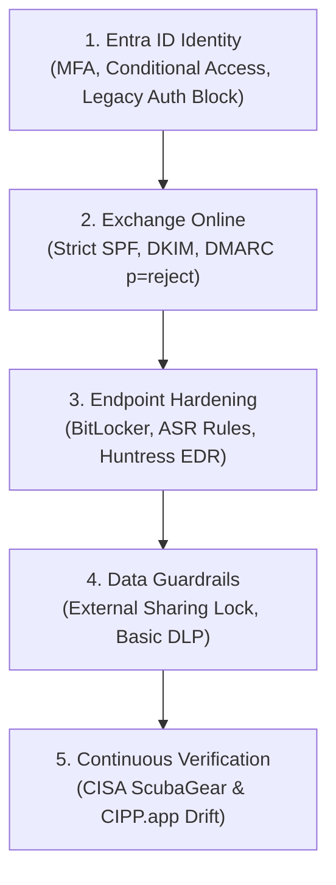

# Secure Configuration Baselines (CIS & CISA CPGs)
## Morrison Cyber Defense LLC

**Document Control:** `MCD-SOP-BASE-005`  
**Classification:** Internal & Client Technical Implementation Standard  
**Effective Date:** October 1, 2026  
**Governing Benchmarks:**  
* CIS Microsoft 365 Foundations Benchmark v3.0 (Level 1 & Level 2)  
* CISA Cross-Sector Cybersecurity Performance Goals (CPGs v1.0.1)  
* CISA ScubaGear Baseline Automation Architecture  
**Technical Lead:** Keenan Morrison, Lead Systems Auditor  

---

### 1. Architectural Overview & Compliance Hierarchy

All Microsoft 365 tenants and endpoints deployed, remediated, or monitored by Morrison Cyber Defense LLC ("MCD") must adhere to this standardized baseline. Controls are divided into non-negotiable core safeguards and advanced risk mitigations:



---

### 2. Domain 1: Entra ID Identity & Access Control

| Control ID | CIS Ref | Policy Name & Setting | Technical Implementation Specification |
| :--- | :--- | :--- | :--- |
| **ID-01** | CIS 1.1.1 | **Block Legacy Basic Authentication** | Conditional Access policy blocking all legacy protocols (POP3, IMAP4, SMTP Auth, MAPI, older Office clients). |
| **ID-02** | CIS 1.1.2 | **Mandatory Multi-Factor Authentication (MFA)** | Enforce MFA for 100% of user population using Microsoft Authenticator with number matching or FIDO2 hardware keys. |
| **ID-03** | CIS 1.1.3 | **Phishing-Resistant MFA for Privileged Roles** | Global Admins and Privileged Role Admins must authenticate strictly via FIDO2 hardware security keys (YubiKey). |
| **ID-04** | CIS 1.1.4 | **Disable User Consent for Third-Party OAuth Apps** | Block non-admin users from granting permissions to third-party applications; require administrative approval workflow. |
| **ID-05** | CIS 1.1.7 | **Dedicated Cloud-Only Administrative Accounts** | Admins must utilize secondary cloud-only accounts (`admin.username@tenant.onmicrosoft.com`) with zero email licenses. |
| **ID-06** | CISA 1.B | **Geographic Access Restrictions (Conditional Access)** | Block sign-ins originating from high-risk foreign countries outside verified client operational regions. |
| **ID-07** | CIS 1.1.9 | **Sign-In Risk & User Risk Policies** | Automatically block or require password change with MFA for sign-ins flagged by Entra ID Protection as High Risk. |

#### Core Conditional Access Architecture (Standard Policy Set):
* **MCD-CA-01-BlockLegacyAuth:** Targets All Users, All Cloud Apps, Client Apps: Other clients -> Grant: Block.
* **MCD-CA-02-RequireMFA-AllUsers:** Targets All Users, All Cloud Apps -> Grant: Require MFA.
* **MCD-CA-03-RequireCompliantDevice:** Targets All Users, All Cloud Apps, Devices: Exclude Compliant -> Grant: Require device compliance.
* **MCD-CA-04-BlockHighRiskSignIns:** Targets All Users, Sign-in Risk: High -> Grant: Block.
* **MCD-CA-05-AdminSessionLimits:** Targets Admin Roles -> Session: Sign-in frequency 8 hours, persistent browser session disabled.

---

### 3. Domain 2: Exchange Online & Email Defense

| Control ID | Standard | Policy Name & Setting | Technical Implementation Specification |
| :--- | :--- | :--- | :--- |
| **EM-01** | RFC 7208 | **Sender Policy Framework (SPF) Hard Fail** | Enforce strict SPF record terminating in `-all` (e.g., `v=spf1 include:spf.protection.outlook.com -all`). |
| **EM-02** | RFC 6376 | **DomainKeys Identified Mail (DKIM)** | Provision two 2048-bit CNAME selector keys per domain; enable automated DKIM signing on all outbound mail. |
| **EM-03** | RFC 7489 | **DMARC Enforcement (`p=reject`)** | Publish DMARC policy advancing from `p=none` to `p=quarantine` to **`p=reject`** with aggregated reporting. |
| **EM-04** | CIS 2.1.1 | **Disable External Auto-Forwarding Rules** | Set outbound anti-spam policy to disable automatic external forwarding; alert SOC if user attempts redirect. |
| **EM-05** | CISA 2.D | **External Sender Visual Warning Banner** | Prepend visual warning banner to all inbound messages originating from outside the organization. |
| **EM-06** | CIS 2.1.4 | **Defender for Office 365 (Safe Links & Safe Attachments)** | Enforce dynamic delivery, time-of-click link verification, and malware detonation sandbox. |

---

### 4. Domain 3: Endpoint Hardening & Intune Compliance

| Control ID | CIS Ref | Policy Name & Setting | Technical Implementation Specification |
| :--- | :--- | :--- | :--- |
| **EP-01** | CIS 1.2 | **Full Disk Encryption (BitLocker)** | Mandatory **XTS-AES 256-bit** encryption enforced across all internal drives; recovery keys backed up to Entra ID. |
| **EP-02** | CIS 2.3 | **Tamper Protection Enabled** | Permanently lock Windows Security settings against unauthorized modification or disabling by malware. |
| **EP-03** | CIS 2.4 | **Defender Attack Surface Reduction (ASR) Rules** | Enforce ASR rules: Block executable content from email; block Office from creating child processes; block LSASS credential stealing. |
| **EP-04** | CISA 3.A | **Huntress Managed EDR Deployment** | Deploy Huntress telemetry agent across 100% of endpoints for 24/7 process monitoring and rapid host isolation. |
| **EP-05** | CIS 4.1 | **Windows LAPS (Local Admin Password Solution)** | Automatically randomize and rotate local administrator passwords every thirty (30) days; escrow keys in Entra ID. |
| **EP-06** | CIS 5.2 | **Automated Screen Lockout** | Enforce 15-minute inactivity lock screen requiring biometric or PIN re-authentication. |

---

### 5. Domain 4: SharePoint, OneDrive & Data Loss Prevention (DLP)

| Control ID | Standard | Policy Name & Setting | Technical Implementation Specification |
| :--- | :--- | :--- | :--- |
| **DP-01** | CIS 3.1 | **Block Anonymous External Sharing Links** | Disable "Anyone with the link" public links across SharePoint and OneDrive; restrict sharing to authenticated guests. |
| **DP-02** | CIS 3.2 | **Guest User Inactivity Expiration** | Automatically expire external guest user access after thirty (30) days unless re-certified by site owner. |
| **DP-03** | CISA 4.A | **Financial & PII Data Loss Prevention (DLP)** | Block unencrypted outbound transmission of US Social Security Numbers, Credit Card Numbers, and Bank Routing Numbers. |
| **DP-04** | CIS 3.5 | **Unified Audit Log (UAL) Retention** | Ensure Unified Audit Logging is enabled with minimum 180-day retention (or 1-year if licensed under Purview Audit Advanced). |

---

### 6. Automated Baseline Auditing & Drift Verification

6.1 **Automated CISA ScubaGear Audit:**
Keenan Morrison executes automated ScubaGear assessment commands prior to and immediately following every hardening sprint:
```powershell
# Execute Non-Disruptive Read-Only CISA Baseline Harvest
Import-Module ScubaGear
Invoke-SCuBA -ProductNames aad, exo, sharepoint, defender -M365Environment Commercial -OutPath "./AuditReports"
```

6.2 **Continuous Drift Detection via CIPP.app:**
* Managed clients under Tier 3 Retainer are enrolled in CIPP.app tenant drift monitoring.
* Any unauthorized configuration changes (e.g., disabled Conditional Access rule, unassigned MFA, external forward created) trigger automated alerts to MCD within fifteen (15) minutes.
