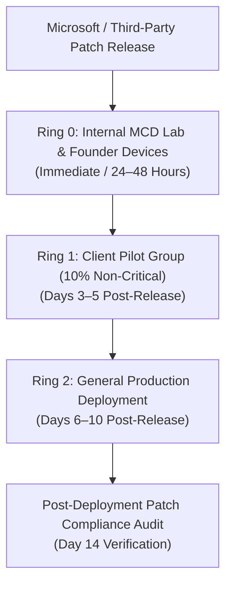

# Vulnerability & Patch Management Policy
## Morrison Cyber Defense LLC

**Document Control:** `MCD-SOP-VULN-002`  
**Classification:** Internal Confidential / Standard Operating Procedure  
**Effective Date:** October 1, 2026  
**Governing Standards:** NIST SP 800-40 Rev. 4 (Guide to Enterprise Patch Management Planning) & CIS Controls v8 (Control 7)  
**Policy Owner:** Keenan Morrison, Lead Systems Auditor  

---

### 1. Purpose & Scope

1.1 **Purpose:** This policy defines mandatory procedures for identifying, categorizing, testing, deploying, and verifying security patches and remediating vulnerabilities across Morrison Cyber Defense LLC ("MCD") internal infrastructure and client endpoints governed under managed service agreements.

1.2 **Scope:** Applies to all physical workstations, laptops, cloud virtual machines, operating systems (Windows 10/11, macOS, Linux), firmware, Microsoft 365 cloud configurations, and third-party software applications under MCD operational stewardship.

---

### 2. Remediation SLAs by CVSS Severity

Vulnerabilities discovered via telemetry, vulnerability scanners, or threat intelligence advisories shall be remediated according to strict Service Level Agreements based on the Common Vulnerability Scoring System (CVSS v3.1/v4.0) and CISA Known Exploited Vulnerabilities (KEV) catalog:

| Vulnerability Tier | CVSS Score Range / Criteria | Remediation SLA | Mandatory Action |
| :--- | :--- | :--- | :--- |
| **Tier 1: Emergency / Critical** | **CVSS 9.0 – 10.0** OR Active Zero-Day listed on **CISA KEV Catalog** | **< 24 – 48 Hours** | Immediate out-of-cycle hotfix deployment, configuration mitigation, or temporary host isolation. |
| **Tier 2: High Priority** | **CVSS 7.0 – 8.9** | **< 7 Calendar Days** | Staged patch deployment via Ring 1 and Ring 2 rollouts. |
| **Tier 3: Medium Priority** | **CVSS 4.0 – 6.9** | **< 30 Calendar Days** | Standard monthly patch release cycle (Patch Tuesday + 14 days). |
| **Tier 4: Low Priority** | **CVSS 0.1 – 3.9** | **< 90 Calendar Days** | Evaluated and resolved during quarterly system maintenance baselines. |

> [!IMPORTANT]
> **The CISA KEV Rule:** Any vulnerability, regardless of CVSS score, that is actively weaponized in the wild and listed on the CISA Known Exploited Vulnerabilities Catalog automatically elevates to **Tier 1 Emergency Status (24–48 hour SLA)**.

---

### 3. Phased Patch Deployment Rings

To prevent system instability, driver corruption, or widespread business downtime, patches must flow through structured deployment rings:

3.1 **Ring 0 (Internal Testing & Founder Devices):** All operating system and application updates are deployed first to MCD co-founder workstations and lab environments. Systems are monitored for forty-eight (48) hours to detect blue screens, driver conflicts, or performance degradation.

3.2 **Ring 1 (Client Pilot Group):** Approximately 10% of client workstations across non-critical administrative departments receive updates on Day 3. Telemetry is monitored via Huntress and Intune for forty-eight (48) hours.

3.3 **Ring 2 (General Production Deployment):** Remaining 90% of client endpoints receive patches during designated off-hours maintenance windows.

---

### 4. Third-Party Software Application Patching

Unpatched third-party software accounts for over 70% of endpoint intrusion vectors. The following applications are subject to automated centralized patch management:
* **Web Browsers:** Google Chrome, Microsoft Edge, Mozilla Firefox (automated daily updates).
* **Document Handlers:** Adobe Acrobat Reader, Foxit PDF.
* **Collaboration Tools:** Microsoft Teams, Zoom, Slack.
* **Runtimes & Utilities:** 7-Zip, Notepad++, Python, PowerShell Core.

*Deployment Mechanism:* Third-party patches are pushed centrally via Microsoft Intune Win32 apps, Windows Package Manager (`winget`), or automated PSA patch management engines.

---

### 5. Maintenance Windows & User Reboot Protocols

5.1 **Standard Maintenance Windows:** Patch installation scripts execute automatically during designated off-peak hours:
* **Primary Window:** Tuesday and Thursday evenings between **10:00 PM and 4:00 AM Central Time (CT)**.
* **Weekend Window:** Saturday from **8:00 PM to Sunday 4:00 AM CT** for major OS feature updates.

5.2 **Reboot Deferral Policy:** When a security patch requires a system reboot to complete installation:
* Users receive a prominent desktop notification requesting a restart.
* Users may defer the reboot for a maximum of **forty-eight (48) hours**.
* Upon expiration of the 48-hour deferral grace period, the endpoint will execute an automated scheduled reboot at 2:00 AM CT.

---

### 6. Verification, Scanning & Exception Management

6.1 **Compliance Auditing:** Patch compliance is audited weekly. Any workstation failing to report patch synchronization for more than fourteen (14) days is flagged as non-compliant, triggering a high-priority ticket in the PSA.

6.2 **Formal Exception Logging:** If a legacy line-of-business software application is incompatible with an operating system patch:
* A formal **Security Exception Request** must be documented.
* Specific compensating security controls must be implemented (e.g., host firewall restriction, network isolation, or removal of internet access).
* The exception must be co-signed by Keenan Morrison and the Client’s primary executive, and re-evaluated every ninety (90) days.
