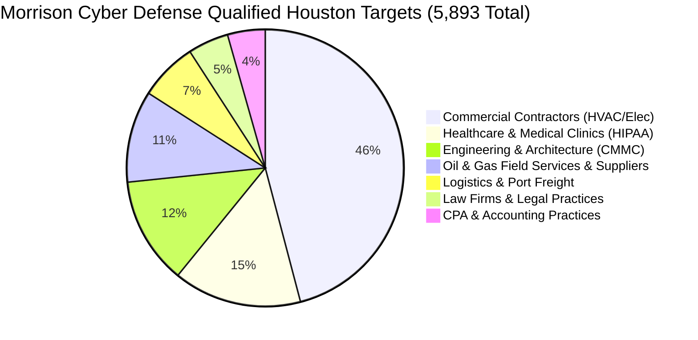

# 1. Houston Target Verticals & Lead Intelligence
## Morrison Cyber Defense LLC: Sales Outreach Playbook

[← Back to Sales Index](README.md) | [Next: Outreach Scripts →](02_cold_outreach_scripts.md)

---

### The Houston Market Opportunity

Selling cybersecurity to small businesses fails when you pitch abstract concepts like "firewalls," "antivirus," or "zero-trust." Houston business owners cut checks when you solve one of three acute, non-discretionary panics:
1. **Cyber Insurance Renewal Denial:** Underwriters require EDR, 24/7 threat isolation, and immutable backups—or drop their policy.
2. **Regulatory & Audit Fines:** Mandatory compliance enforcement (HIPAA, FTC Safeguards Rule, CMMC 2.0).
3. **Upstream Vendor Vendor-Risk Reviews:** Major Houston operators (Exxon, Shell, CenterPoint, general contractors) requiring third-party security audits from all subcontractors.

---

### The 7 Qualified Verticals (5,893 Houston Accounts)

| Vertical | Lead Count | Pre-Sliced Lead CSV File | Primary Pain & Sales Angle | Average Retainer |
| :--- | :---: | :--- | :--- | :---: |
| **Commercial Contractors** | `2,705` | [`commercial_contractors.csv`](../market-intelligence/leads/commercial_contractors.csv) | BEC wire fraud, fake supplier invoices, insurance renewal checklist panic. | **$1,750 – $3,500/mo** |
| **Healthcare & Clinics** | `882` | [`healthcare_hipaa.csv`](../market-intelligence/leads/healthcare_hipaa.csv) | Mandatory HIPAA compliance, unencrypted backups, ransomware patient downtime. | **$2,000 – $4,500/mo** |
| **Engineering & CAD** | `736` | [`engineering_cmmc.csv`](../market-intelligence/leads/engineering_cmmc.csv) | CMMC 2.0 DoD requirements, municipal bid audits, proprietary CAD/IP theft. | **$2,500 – $6,000/mo** |
| **Oil & Gas Suppliers** | `631` | [`oil_gas_energy.csv`](../market-intelligence/leads/oil_gas_energy.csv) | Passing vendor security questionnaires from supermajors (Chevron, ExxonMobil). | **$3,000 – $7,500/mo** |
| **Logistics & Maritime** | `400` | [`logistics_maritime.csv`](../market-intelligence/leads/logistics_maritime.csv) | Port of Houston supply chain downtime, dispatch disruption, ransomware recovery. | **$2,000 – $5,000/mo** |
| **Law Firms** | `280` | [`law_firms_legal.csv`](../market-intelligence/leads/law_firms_legal.csv) | Trust/escrow account wire fraud, client confidentiality, Texas State Bar ethics. | **$1,800 – $4,000/mo** |
| **CPA & Accounting** | `259` | [`cpa_accounting.csv`](../market-intelligence/leads/cpa_accounting.csv) | Strict FTC Safeguards Rule compliance (MFA, annual pen tests, continuous monitoring). | **$1,750 – $3,000/mo** |

---
[← Back to Sales Index](README.md) | [Next: Outreach Scripts →](02_cold_outreach_scripts.md)
