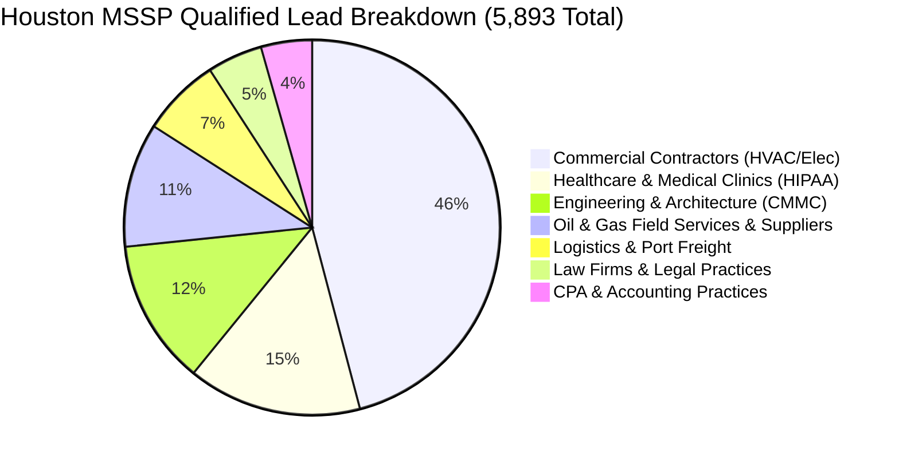

# Houston MSSP Battlecard & Sales Outreach Playbook
## Converting 5,893 Houston SMBs into High-Margin Managed Cybersecurity Retainers

**Practice:** Morrison Cyber Defense LLC  
**Principals:** Principal Cybersecurity Architect (Senior Partner) & Keenan Morrison (Associate Analyst)  
**Territory:** Greater Houston, Harris County, and Fort Bend County, Texas  
**Lead Repository:** [`market-intelligence/leads/`](file:///home/keenan/Projects/MorrisonCyberDefense/market-intelligence/leads/)

---

## 1. Executive Summary & The Houston Opportunity

Selling cybersecurity to generic small businesses fails when you pitch abstract concepts like "firewalls," "antivirus," or "zero-trust." Houston business owners cut checks when you solve one of three acute, non-discretionary panics:
1. **Cyber Insurance Renewal Denial:** Their insurance underwriter requires EDR, 24/7 log monitoring, and immutable backups—or drops their policy.
2. **Regulatory & Audit Fines:** Mandatory compliance enforcement (HIPAA, FTC Safeguards Rule, CMMC 2.0).
3. **Upstream Vendor Vendor-Risk Reviews:** Major Houston enterprise operators (Exxon, Shell, Memorial Hermann, large general contractors) requiring third-party cybersecurity audits from all subcontractors.

---

## 2. The 7 Houston MSSP Target Verticals (5,893 Qualified Accounts)



| Vertical | Lead Count | Lead CSV File | Primary Pain & Sales Angle | Average Retainer |
| :--- | :--- | :--- | :--- | :--- |
| **Commercial Contractors** | `2,705` | [`commercial_contractors.csv`](file:///home/keenan/Projects/MorrisonCyberDefense/market-intelligence/leads/commercial_contractors.csv) | Business Email Compromise (BEC), fake invoice wire fraud, cyber insurance questionnaire panic. | **$1,500 – $3,500/mo** |
| **Healthcare & Clinics** | `882` | [`healthcare_hipaa.csv`](file:///home/keenan/Projects/MorrisonCyberDefense/market-intelligence/leads/healthcare_hipaa.csv) | Mandatory HIPAA compliance, unencrypted backups, ransomware patient downtime. | **$2,000 – $4,500/mo** |
| **Engineering & CAD** | `736` | [`engineering_cmmc.csv`](file:///home/keenan/Projects/MorrisonCyberDefense/market-intelligence/leads/engineering_cmmc.csv) | CMMC 2.0 DoD requirements, municipal bid audits, proprietary CAD/IP theft. | **$2,500 – $6,000/mo** |
| **Oil & Gas Suppliers** | `631` | [`oil_gas_energy.csv`](file:///home/keenan/Projects/MorrisonCyberDefense/market-intelligence/leads/oil_gas_energy.csv) | Passing vendor security questionnaires from supermajors (Chevron, ExxonMobil, ConocoPhillips). | **$3,000 – $7,500/mo** |
| **Logistics & Maritime** | `400` | [`logistics_maritime.csv`](file:///home/keenan/Projects/MorrisonCyberDefense/market-intelligence/leads/logistics_maritime.csv) | Port of Houston supply chain downtime, dispatch disruption, ransomware recovery. | **$2,000 – $5,000/mo** |
| **Law Firms** | `280` | [`law_firms_legal.csv`](file:///home/keenan/Projects/MorrisonCyberDefense/market-intelligence/leads/law_firms_legal.csv) | Trust/escrow account wire fraud, client confidentiality, Texas State Bar ethics. | **$1,800 – $4,000/mo** |
| **CPA & Accounting** | `259` | [`cpa_accounting.csv`](file:///home/keenan/Projects/MorrisonCyberDefense/market-intelligence/leads/cpa_accounting.csv) | Strict FTC Safeguards Rule compliance (MFA, annual pen tests, continuous monitoring). | **$1,500 – $3,000/mo** |

---

## 3. High-Conversion Cold Outreach Scripts

### 3.1 The Commercial Contractor Pitch (2,705 Leads)
> *"Hi [Owner/GM Name],*  
> 
> *I’m Keenan with Morrison Cyber Defense here in Houston. Quick question: are your commercial general contractors or insurance broker hitting you with a 5-page cybersecurity audit checklist this quarter?*  
> 
> *Most commercial mechanical and electrical contractors we work with in Harris County are seeing their cyber insurance rates double unless they have 24/7 endpoint monitoring and multi-factor authentication locked down.*  
> 
> *We offer a complimentary 15-minute Cyber Insurance Readiness Review to make sure your coverage won't get denied in an audit. Do you have 5 minutes this Thursday morning?"*

### 3.2 The Medical Clinic & Healthcare Pitch (882 Leads)
> *"Hi [Practice Administrator / Dr. Name],*  
> 
> *With HHS stepping up random HIPAA audits across Texas outpatient clinics, most practice managers we speak with have IT support, but zero dedicated cybersecurity monitoring.*  
> 
> *If an employee clicks a phishing email, traditional IT doesn't stop ransomware before patient charts get encrypted. We deploy 24/7 managed threat detection and handle your annual HIPAA Technical Safeguards documentation so you pass every state audit.*  
> 
> *Mind if I send over our 1-page HIPAA Security Checklist?"*

### 3.3 The CPA & Accounting Pitch (259 Leads)
> *"Hi [Managing Partner Name],*  
> 
> *Reaching out because the FTC Safeguards Rule now holds accounting and tax practices legally liable for multi-factor authentication, endpoint monitoring, and documented risk assessments.*  
> 
> *We act as the outsourced security officer for Houston CPA firms, getting you 100% compliant without interrupting your tax season workflow. Would you be open to a 10-minute review before your next filing cycle?"*

---

## 4. The 3-Tier Packaging & Pricing Model

```
                    +------------------------------------+
                    |       MSSP Pricing Architecture    |
                    +-----------------+------------------+
                                      |
         +----------------------------+----------------------------+
         |                                                         |
         v                                                         v
+-----------------------------+                           +-----------------------------+
|     Essential Defense       |                           |     Compliance & Co-SOC     |
|   $125 / user / month       |                           |    $195 / user / month      |
| • 24/7 Managed EDR (MDR)    |                           | • Full Essential Tier +     |
| • Next-Gen DNS & Web Filter |                           | • HIPAA / FTC / CMMC Audit  |
| • Cloud Email Security      |                           | • 24/7 SOC Log Ingestion    |
| • Managed Backup Monitoring |                           | • Annual Vulnerability Scan |
| • Minimum $1,500 / month    |                           | • Minimum $3,000 / month    |
+-----------------------------+                           +-----------------------------+
```

---

## 5. Next Steps for You & Your Dad

1. **Pick One Beachhead Vertical:** Start with **Commercial Contractors** (`2,705` leads) or **Medical Clinics** (`882` leads).
2. **Execute In-Person Office Drops:** Use the 7:30 AM coffee protocol from the SaaS Roadmap to visit commercial contractors in Northwest Houston (`77041`) or Willowbrook (`77070`).
3. **Offer the Free "Cyber Insurance Readiness Audit":** Never try to sell security on Call 1. Offer to review their insurance questionnaire for free. When you find 3 missing controls, they hire you to implement and monitor them.
